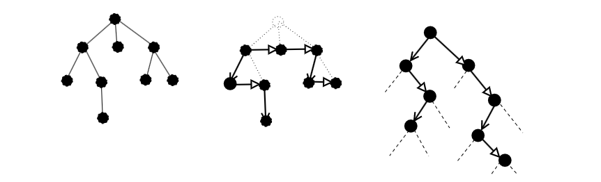
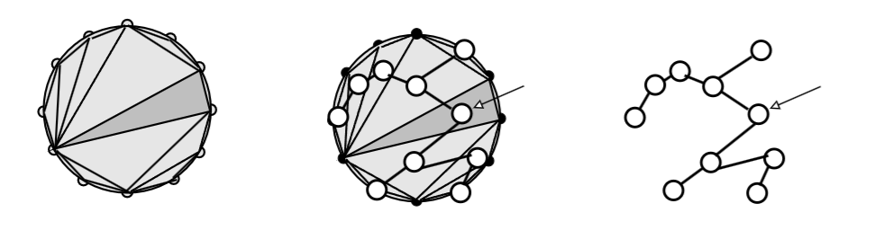
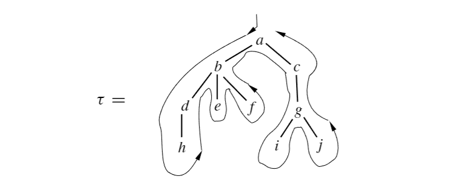
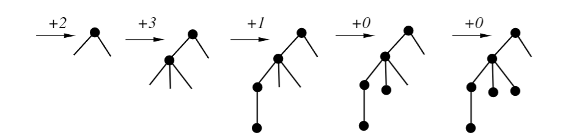
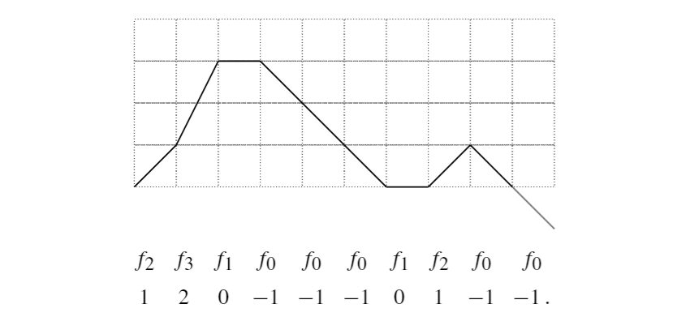
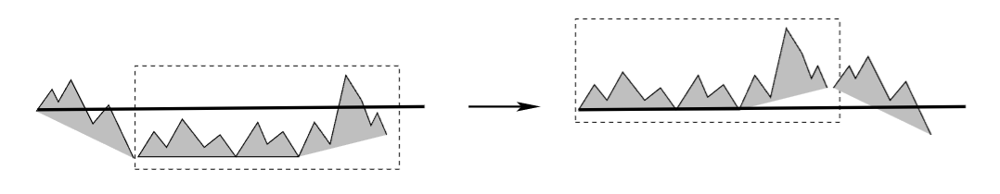
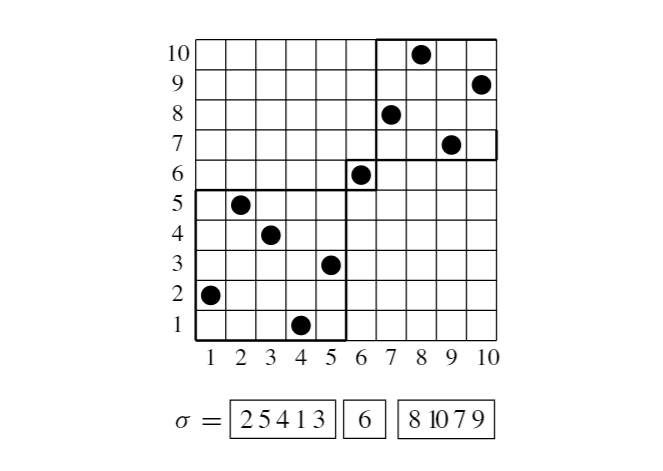

本章我们继续研究无编号类的计数。在上一章，我们分别考察了整数的组合拆分和正则语言，它们分别对应了迭代式的规范以及线性递归式的规范。本章的第一节我们来考察树结构，它对应的则是非线性的递归式规范。

# Section 1: 树结构

## 平面树

在上一章中我们简要地提到了平面树：子树有序的树结构，这种结构精确地对应了序列的构造。

回顾一下一般平面树的构造，我们有

$$
\begin{gather}
\mathcal{G}\cong \mathcal{Z}\times \mathrm{Seq}(\mathcal{G}) \implies G(z)= \dfrac{z}{1-G(z)}
\end{gather}
$$

这给出 $G(z)= \dfrac{1-\sqrt{ 1-4z }}{2}$，从而一般平面树的数量由平移的 Catalan 数给出：

$$
\begin{gather}
G_{n}=C_{n-1}= \dfrac{1}{n}\binom{ 2n-2 }{ n-1 } 
\end{gather}
$$

在计算机科学中，我们通常会对树结构做各种各样的限制。我们将树中一个节点的子节点数量称作这个节点的**出度**（outdegree），设 $\Omega$ 是一个包含 $0$ 的自然数子集，我们定义 $\mathcal{T}^{\Omega}$ 为节点的出度被限制在 $\Omega$ 中的树构成的类，这一限制被下面的特征函数精确地表示了出来：

$$
\begin{gather}
\phi(u)=\sum_{\omega \in\Omega} u^{\omega}
\end{gather}
$$

于是，当 $\Omega=\{ 0,2 \}$ 时，我们就得到了**二叉树**；$\Omega=\{ 0,1,2 \}$ 给出了单叉-二叉树：它允许单分支的出现；一般平面树则对应于 $\Omega=\mathbb{N}$，它的特征函数是 $\phi(u)=(1-u)^{-1}$.

**定理 2.1.1**

节点的出度被限制在 $\Omega$ 中的树构成的类 $\mathcal{T}^{\Omega}$ 的生成函数 $T^{\Omega}(z)$ 满足以下函数方程：

$$
\begin{gather}
T^{\Omega}(z)=z \phi(T^{\Omega}(z))
\end{gather}
$$

其中 $\phi(u)=\sum_{\omega \in\Omega}u^{\omega}$ 是 $\Omega$ 的特征函数，节点数为 $n$ 的树的数量为

$$
\begin{gather}
T_{n}^{\Omega}= \dfrac{1}{n} [u^{n-1}] \phi(u)^{n}
\end{gather}
$$

**证明**

根据符号计数方法，我们立即得到：

$$
\begin{gather}
\mathcal{T}^{\Omega}\cong \mathcal{Z}\times \mathrm{Seq}_{\Omega}(\mathcal{T}^{\Omega}) \implies T^{\Omega}(z)=z \phi(T^{\Omega}(z))
\end{gather}
$$

根据 Lagrange 反演定理，我们就得到了所要的结果。

**定理 2.1.2** Lagrange 反演定理（Lagrange inversion theorem）

设 $\phi(u)=\sum_{k\geq 0}\phi_{k}u^{k}$ 是 $\mathbb{C}[[u]]$ 中的幂级数，满足 $\phi_{0}\neq 0$，则在 $\mathbb{C}[[z]]$ 中存在唯一的幂级数 $y(z)$ 满足函数方程 $y=z\phi(y)$，并且其系数由以下表达式给出：

$$
\begin{gather}
y(z)=\sum_{n=1}^{\infty} y_{n}z^{n}, \quad y_{n}= \dfrac{1}{n}[u^{n-1}] \phi(u)^{n}
\end{gather}
$$

进一步，对于 $k\geq 1$ 有

$$
\begin{gather}
y(z)^{k}=\sum_{n=1}^{\infty} y_{n}^{(k)}z^{n}, \quad y_{n}^{(k)}= \dfrac{k}{n} [u^{n-k}] \phi(u)^{n}
\end{gather}
$$

这个定理的证明利用了复分析中的概念，我们将在后续章节中进行证明。

Lagrange 反演定理在 $k>1$ 的情形被称为“Burmann 形式”，其中 $T^{k}$ 计数的是有序 $k$-森林的数量，也就是树的 $k$-序列 $\mathrm{Seq}_{k}(\mathcal{T})$. 特别地，对于一般的 $k$-森林（$\Omega=\mathbb{N}$），其数量

$$
[z^{n}]\left( \dfrac{1-\sqrt{ 1-4z }}{2} \right)^{k}=\dfrac{k}{n}[u^{n-k}] (1-u)^{-n}=\dfrac{k}{n}\binom{ 2n-k-1 }{ n-1 } 
$$

称为“ballot 数”。

此外，上述讨论可以直接推广到 $\Omega$ 是一个多重集的情况：比如 $\Omega=\{ 0,1,1,2 \}$ 就表示具有两种单分支节点的单叉-二叉树，在这种情况下，特征函数就是

$$
\begin{gather}
\phi(u)=1+2u+u^{2}
\end{gather}
$$

在树结构中，$\Omega$ 只有两个元素的种类非常重要，下面我们给出几个例子。

考虑具有特征 $\Omega=\{ 0,2 \}$ 的二叉树构成的类 $\mathcal{B}$，通常，我们把二叉树的大小定义为它的“内部点”，即存在子节点的点的数量。因此，一个大小为 $n$ 的二叉树一共有 $2n+1$ 个节点（根据归纳法可证外部点有 $n+1$ 个），从而 $\mathcal{B}$ 的递归式规范为

$$
\begin{gather}
\mathcal{B}\cong \mathcal{E}+(\mathcal{B}\times \mathcal{Z}\times \mathcal{B})\implies B(z)=1+zB(z)^{2}
\end{gather}
$$

从而有

$$
\begin{gather}
B(z)= \dfrac{1-\sqrt{ 1-4z }}{2z}, \quad B_{n}=\dfrac{1}{n+1}\binom{ 2n }{ n } =C_{n}
\end{gather}
$$

注意到二叉树的数量与三角划分的数量是相同的，这说明 $\mathcal{B}$ 与三角划分类 $\mathcal{T}$ 之间有一种对应关系，我们将在之后进行说明。

如果我们将二叉树的大小定义为其所有节点的数量，那么我们就回到了定理 2.1.1，这给出：

$$
\begin{gather}
\widehat{\mathcal{B}}\cong \mathcal{Z}\times \mathrm{Seq}_{\{ 0,2 \}}(\widehat{\mathcal{B}}) \implies \widehat{B}(z)=z(1+\widehat{B}(z)^{2})
\end{gather}
$$

应用 Lagrange 反演，其中 $\phi(u)=1+u^{2}$ 即得 $\widehat{B}_{2n+1}=B_{n}$，这与我们之前的分析一致。

另一方面，我们也可以考虑所谓的“剪枝二叉树”，这是通过将一个二叉树的所有外部点去除所得到的树 $\overline{\mathcal{B}}$，它具有以下规范：

$$
\begin{gather}
\overline{\mathcal{B}}\cong \mathcal{Z}+(\mathcal{Z}\times  \overline{\mathcal{B}})+(\overline{\mathcal{B}}\times \mathcal{Z})+(\overline{\mathcal{B}}\times \mathcal{Z}\times  \overline{\mathcal{B}}) \implies \overline{B}(z)=z(1+\overline{B}(z))^{2}
\end{gather}
$$

应用 Lagrange 反演，其中 $\phi(u)=(1+u)^{2}$，可得 $\overline{B}_{n}=B_{n}(n\geq 1)$. 事实上，根据其构造过程，这一等式是显然的。

上述讨论可以容易地推广到特征为 $\Omega=\{ 0,t \}$ 的树上。定义 $\mathcal{A}=\mathcal{T}^{\{ 0,t \}}$，则根据定理 2.1.1 有

$$
\begin{gather}
A_{n}=\dfrac{1}{n}[u^{n-1}](1+u^{t})^{n}=\dfrac{1}{n}\binom{ n }{ \frac{n-1}{t} } , \quad n\equiv 1 \pmod t
\end{gather}
$$

该公式表明，只有节点数为 $n=t\nu+1$ 的树存在（这也可以通过归纳法证明），并且有

$$
\begin{gather}
A_{t\nu+1}=\dfrac{1}{t\nu+1}\binom{ t\nu+1 }{ \nu } =\dfrac{1}{(t-1)\nu+1}\binom{ t\nu }{ \nu } 
\end{gather}
$$

像二叉树一样，我们可以考虑剪枝后的树 $\overline{\mathcal{A}}$，它同构于一种特征 $\Omega$ 为多重集的树，其节点的出度至多为 $t$，且出度为 $j$ 的节点有 $\binom{ t }{ j }$ 种：对应于 $\binom{ t }{ j }$ 种被剪枝的子树的位置，因此特征函数为

$$
\begin{gather}
\phi(u)=\sum_{j=0}^{t} \binom{ t }{ j } u^{j}=(1+u)^{t}
\end{gather}
$$

应用 Lagrange 反演即可得到

$$
\begin{gather}
\overline{A}_{\nu}=\dfrac{1}{\nu}\binom{ t\nu }{ \nu-1 } =\dfrac{1}{(t-1)\nu+1}\binom{ t\nu }{ \nu } = A_{t\nu+1}
\end{gather}
$$

最后我们简要提及一下单叉-二叉树 $\mathcal{M}$，它的计数公式如下：

$$
\begin{gather}
M(z)=\dfrac{1-z-\sqrt{ 1-2z-3z^{2} }}{2z}, \quad M_{n}=\dfrac{1}{n}\sum_{k} \binom{ n }{ k } \binom{ n-k }{ k-1 } 
\end{gather}
$$

系数 $M_{n}$ 被称为“Motzkin 数”。

## 非平面树

下面我们来看非平面树，也称为**无序树**，就是一般图论意义上的树：一个节点的子树是无序的，从而可以随意排列，这精确地对应了多重集的构造。因此，一般的有根无序树构成的类 $\mathcal{H}$ 具有规范

$$
\begin{align}
\mathcal{H}\cong\mathcal{Z}\times \mathrm{MSet}(\mathcal{H}) \implies H(z)&=z \prod_{m=1}^{\infty} (1-z^{m})^{-H_{m}} \\
&=z \exp\left( \sum_{k=1}^{\infty} \dfrac{1}{k}H(z^{k}) \right)
\end{align}
$$

与平面树不同，对于无序树的数量，我们没有一种精确的表示方法，尽管其生成函数允许我们递归地确定所有 $H_{m}$.

特征为 $\Omega$ 的无序树的规范也可以同样地确定：

**定理 2.1.3**

设 $\Omega \subset \mathbb{N}$ 是一个包含 $0$ 的有限集，则节点的出度被限制在 $\Omega$ 中的无序树构成的类 $\mathcal{U}$ 的生成函数满足函数方程

$$
\begin{gather}
U(z)=z \Phi(U(z),U(z^{2}),U(z^{3}),\dots)
\end{gather}
$$

其中 $\Phi$ 是一个可计算的多项式。

**证明**

类 $\mathcal{U}$ 具有规范

$$
\begin{gather}
\mathcal{U}\cong \mathcal{Z}\times \mathrm{MSet}_{\Omega}(\mathcal{U})=\mathcal{Z}\times \sum_{\omega \in\Omega} \mathrm{MSet}_{\omega}(\mathcal{U})
\end{gather}
$$

利用我们之后给出的具有限制的可容许性定理，我们可得

$$
\begin{gather}
U(z)=z \sum_{\omega \in\Omega} [u^{\omega}] \exp\left( \sum_{k=1}^{\infty} \dfrac{1}{k}U(z^{k}) \right)=z\Phi(U(z),U(z^{2}),\dots)
\end{gather}
$$

由于 $\Omega$ 是有限集，故 $\Phi$ 是一个多项式，其计算方式由上式给出。

在无序树的计数中，没有显式公式，而只有由函数方程隐式确定的生成函数。因此，到目前为止，我们没有多少方法来进一步研究无序树的计数问题。然而，在本系列的下半部分，我们将使用奇点分析的技术来给出它的一个渐近公式，我们将看到，所有树结构（平面或非平面的）的生成函数都具有一种共性，即一种与平方根相关的奇点，它可以转化为渐近公式

$$
\begin{gather}
U_{n}\sim C A^{n} n^{-3/2}
\end{gather}
$$

其中因子 $n^{-3/2}$ 的出现被视为树结构的一种普遍规律。

## 递归结构与 Catalan 计数

树结构是各种递归结构的基础。为说明这一点，我们首先来看 Catalan 数 $C_{n}$：它计数了节点数为 $n+1$ 的一般树（$\mathcal{G}$），内部点为 $n$ 的二叉树（$\mathcal{B}$），以及包含 $n$ 个三角形的三角划分（$\mathcal{T}$），以及其它至少 200 种组合对象。为说明 Catalan 数的重要性，下面我们将给出一系列基本的同构关系，它们部分地解释了 Catalan 数在组合学中各个领域出现的原因。

首先我们来看平面树 $\mathcal{G}$ 与二叉树 $\mathcal{B}$ 的同构（尽管在大小上存在一个平移），它是计算机科学中的一种常用技术。具体来说，对于一棵平面树，它可以这样来表示：其每个节点有两种连接方式，一种指向该节点的最左边的子节点，另一种指向它右边第一个同级节点，如图所示：

于是，如果我们把平面树的根节点去除（这对应了大小的平移），那么我们就得到了一棵剪枝二叉树，这就给出了同构关系

$$
\begin{gather}
\mathcal{G}_{n}\cong\mathcal{B}_{n-1} \implies G_{n}=B_{n-1}=\dfrac{1}{n}\binom{ 2n-2 }{ n-1 } 
\end{gather}
$$

这一对应关系通常被称为“旋转对应”。

三角划分与二叉树的同构也同样简单：给定一个三角划分，选择一个三角形作为它的“根”，它就对应到一个剪枝二叉树的根节点上，与之相邻的两个三角形就对应于根节点的两个子节点，如图所示：

这给出了同构关系

$$
\begin{gather}
\mathcal{T}_{n}\cong \mathcal{B}_{n} \implies T_{n}=B_{n}=\dfrac{1}{n+1}\binom{ 2n }{ n } 
\end{gather}
$$

接下来我们转到另一种与树结构和 Catalan 数相关的对象上来，它们可以被解释为与树的遍历相关的字符串，或者 $\mathbb{Z}^{2}$ 上的格点路径。

在计算机科学中，遍历一颗平面树有两种方法：先序与后序，分别表示一颗子树的根节点在遍历序列中的位置在其子节点之前（之后），这里我们考虑先序遍历，它的遍历方式如下：

其先序遍历序列为 $a,b,d,h,e,f,c,g,i,j$.

对于一棵平面树，我们可以写出它的先序出度序列，例如上图中的平面树具有序列

$$
\begin{gather}
\sigma=(2,3,1,0,0,0,1,2,0,0)
\end{gather}
$$

一个重要的事实是，先序出度序列与平面树是一一对应的：根据 $\sigma$，我们可以在可用的最左端添加相应出度的节点，进而一步一步地构造出一棵树来，如下图所示：

于是，我们就将平面树与字符表为 $\mathcal{F}=\{ f_{0},f_{1},\dots \}$ 的字符串联系了起来：

$$
\begin{gather}
\sigma \mapsto f_{2}f_{3}f_{1}f_{0}f_{0}f_{0}f_{1}f_{2}f_{0}f_{0}
\end{gather}
$$

这可以被解释为一种函数的嵌套结构，其中 $f_{j}$ 反映了其参数的数量。事实上，如果我们加上辅助的括号，这种对应将变得更明显：

$$
\begin{gather}
\sigma \mapsto f_{2}(f_{3}(f_{1}(f_{0}),f_{0},f_{0}),f_{1}(f_{2}(f_{0},f_{0})))
\end{gather}
$$

这样的字符串称为“Lucasiewicz 编码”，或称为“波兰前缀表示法”。相应地，树的后序出度序列就对应了后缀表示法，或称“逆波兰表示法”，它们在计算机与编译器的设计中起到了很大作用。

最后，一个 Lucasiewicz 编码可以转换为格 $\mathbb{Z}^{2}$ 上的一条路径：$f_{j}$ 对应于位移 $(1,j-1)$，并画出从原点开始的轨迹。在上面的例子中，我们有

这一轨迹被称为“Lucasiewicz 路径”。这样的路径由以下两条性质定义：竖向的位移属于 $\{ -1,0,1,2,\dots \}$；除最后一个点外，其余所有点都位于上半平面。根据上面的讨论，长度为 $n$ 的 Lucasiewicz 路径的数量由平移 Catalan 数给出，即

$$
\begin{gather}
L_{n}=G_{n}=\dfrac{1}{n}\binom{ 2n-2 }{ n-1 } 
\end{gather}
$$

我们还可以考虑一种广义的 Lucasiewicz 路径：它的竖向坐标从 $0$ 开始，以 $-1$ 结束，但在中间可以经过下半平面，将这种路径构成的类记作 $\mathcal{M}$. 则每条这样的路径可以在其最左边的最低点处通过剪切与移动得到唯一的一条 Lucasiewicz 路径：

显然，一条长度为 $\nu$ 的 Lucasiewicz 路径对应了 $\nu$ 种不同的广义 Lucasiewicz 路径（考虑将一条 Lucasiewicz 路径分成两部分的方法），这给出 $M_{\nu}=\nu L_{\nu}$. 由于这种对应保持 Lucasiewicz 编码中各 $f_{j}$ 的数量不变，因此含有 $\nu_{j}$ 个 $f_{j}$ 型位移的 Lucasiewicz 路径的数量 $L_{\nu}$ 为

$$
\begin{gather}
\dfrac{1}{\nu}[z^{-1}u_{0}^{\nu_{0}}u_{1}^{\nu_{1}}\cdots](z^{-1}u_{0}+u_{1}+zu_{2}+z^{2}u_{3}+\cdots)^{\nu}=\dfrac{1}{\nu} \binom{ \nu }{ \nu_{0},\nu_{1},\dots } 
\end{gather}
$$

其中 $(-1)\nu_{0}+0\nu_{1}+1\nu_{2}+2\nu_{3}+\cdots=-1$，$\binom{ \nu }{ \nu_{0},\nu_{1},\dots }$ 是多项式系数。像这样求解精细的 Catalan 统计量的方法称为“共轭原理”或“循环引理”，Raney 证明了上述方法与 Lagrange 反演定理在逻辑上是等价的。

二叉树对应的 Lucasiewicz 路径具有特殊的性质：其中的竖向位移只能是 $+1$ 或 $-1$，从而我们可以用一个序列 $(x_{0},x_{1},\dots,x_{2n+1})$ 来表示它，其中 $x_{j}$ 满足

$$
\begin{gather}
x_{0}=0,\quad x_{j}\geq 0(1\leq j\leq 2n), \quad |x_{j+1}-x_{j}|=1, \quad x_{2n+1}=-1
\end{gather}
$$

习惯上，我们只考虑位于上半平面的路径，这就对应了满足上面的前三个条件以及 $x_{2n}=0$ 的序列 $(x_{0},\dots,x_{2n})$，这样的路径被称为“Dyck 路径”。根据其构造方法，我们知道长度为 $2n$ 的 Dyck 路径同构于有 $n$ 个内部点的二叉树，从而其数量由 Catalan 数给出。通过一个直接的规范也可以验证这一点：

$$
\begin{gather}
\mathcal{D}\cong \mathcal{E}+(\mathcal{Z}\times \mathcal{D}\times \mathcal{Z})\times \mathcal{D} \implies D(z)=1+z^{2}D(z)^{2}
\end{gather}
$$

即得 $\displaystyle D_{2n}=B_{n}=\dfrac{1}{n+1}\binom{ 2n }{ n }$，正如预期的那样。

Dyck 路径在括号配对问题中也有出现。对于一个含有括号的表达式，我们可以通过下面两条性质来确定括号是否正确配对：左括号与右括号的数量相等；从最左端数起到任意位置，左括号的数量必须大于等于右括号的数量。这一同构是非常明显的：只需把左括号换成 $+1$，右括号换成 $-1$，那么括号配对的性质就完全等价于 Dyck 路径的定义，这也启发我们给出 $\mathcal{D}$ 的另一种规范方法：

$$
\begin{gather}
\mathcal{D}\cong \mathrm{Seq}(\mathcal{Z}\times \mathcal{D}\times \mathcal{Z}) \implies D(z)=\dfrac{1}{1-z^{2}D(z)}
\end{gather}
$$

同样地，我们得到了 Catalan 数。

对于其它特征的树，例如单叉-二叉树，可以将 Dyck 路径定义中的 $|x_{j+1}-x_{j}|=1$ 换成 $\leq 1$，此时的路径数量就由 Motzkin 数给出，原因同上，这里就不再赘述了。

## 上下文无关结构

本节中的许多结构都可以被组织在同一个框架中，这在形式语言学和计算机科学领域非常重要。

**定义 2.1.4** 上下文无关的（context-free）

一个组合类 $\mathcal{C}$ 是**上下文无关的**，如果它与方程组

$$
\begin{gather}
\begin{cases}
\mathcal{S}_{1}=\mathfrak{F}_{1}(\mathcal{Z},\mathcal{S}_{1},\dots,\mathcal{S}_{r}) \\
\dots \\
\mathcal{S}_{r}=\mathfrak{F}_{r}(\mathcal{Z},\mathcal{S}_{1},\dots,\mathcal{S}_{r})
\end{cases}
\end{gather}
$$

中的第一项同构（$\mathcal{C}\cong\mathcal{S}_{1}$），其中 $\mathfrak{F}_{j}$ 是一个仅包含无交并、直积和单位类的构造。

一个语言 $\mathcal{L}$ 是一个**无歧义的**上下文无关语言，如果它与一个由树构成的上下文无关类同构：$\mathcal{L}\cong\mathcal{T}$.

大多数树结构都是上下文无关的。例如对于平面树 $\mathcal{G}$ 和二叉树 $\mathcal{B}$，我们有如下规范：

$$
\begin{gather}
\begin{cases}
\mathcal{G}=\mathcal{Z}\times \mathcal{F} \\
\mathcal{F}=\mathcal{E}+(\mathcal{G}\times \mathcal{F})
\end{cases},\quad \mathcal{B}=\mathcal{E}+(\mathcal{B}\times \mathcal{Z}\times \mathcal{B})
\end{gather}
$$

其中 $\mathcal{F}$ 由有序的平面树森林构成。上下文无关类可以用来表示各种组合对象，比如由非空的三角划分构成的类 $\mathcal{U}=\mathcal{T}\setminus\mathcal{T}_{0}$ 具有规范

$$
\begin{gather}
\mathcal{U}\cong \mathcal{Z}+(\mathcal{Z}\times \mathcal{U})+(\mathcal{U}\times \mathcal{Z})+(\mathcal{U}\times \mathcal{Z}\times \mathcal{U})
\end{gather}
$$

另外，Lucasiewicz 语言以及 Dyck 路径也是上下文无关的，因为它们分别与 $\mathcal{G}$ 和 $\mathcal{B}$ 同构。

由于上下文无关类的定义中只包含无交并和直积，因此其生成函数满足一个多项式方程组，因此其形式是相对简单的，如下所示：

**定理 2.1.5**

一个上下文无关的组合类 $\mathcal{C}$ 的生成函数是一个代数函数，即，存在一个二元多项式 $P(z,y)\in \mathbb{C}[z,y]$ 使得

$$
\begin{gather}
P(z,C(z))=0
\end{gather}
$$

**证明**

根据可容许性定理，存在多项式 $\Phi_{j}$ 使得

$$
\begin{gather}
\begin{cases}
S_{1}(z)=\Phi_{1}(z,S_{1}(z),\dots,S_{r}(z)) \\
\dots \\
S_{r}(z)=\Phi_{r}(z,S_{1}(z),\dots,S_{r}(z))
\end{cases}
\end{gather}
$$

一个众所周知的事实是，在多项式系统中进行消元是可能的（一个常用的方法是 Grobner 基算法），从而我们可以一步一步地消去 $S_{2},\dots,S_{r}$，进而得到 $C(z)=S_{1}(z)$ 满足的一个多项式方程 $P(z,C(z))=0$.

术语“上下文无关”来源于形式语言学：它表示所要考察的对象可以“自由地”从给定的规则 $\mathfrak{F}_{j}$ 中生成出来，而无需受到外部语境的影响（与之相对的是“上下文敏感”语言，其中每条规则都有其使用的语境，因此它们无法用一种全局的生成函数进行形式化）。

在语言学中，通常我们会将上下文无关语言中的句子看成一棵上下文无关平面树的叶子序列，尽管语言与树之间的一一对应并不成立，但每当存在这样的对应，此时的语言就是无歧义的：句子和树可以唯一地相互对应，“语法树”的名字由此而来。

# Section 2: 具有限制的构造

现在我们来考虑具有部分数量限制的构造 $\mathrm{Seq}_{k},\mathrm{MSet}_{k},\mathrm{PSet}_{k},\mathrm{Cyc}_{k}$，当 $k$ 较小时，我们可以考虑一个乘积的**对角线**

$$
\begin{gather}
\mathcal{A}=\Delta(\mathcal{B}\times \mathcal{B})=\{ (\beta,\beta) \mid \beta \in \mathcal{B} \}
\end{gather}
$$

于是，根据 $A_{2n}=B_{n}$，我们就有 $A(z)=B(z^{2})$.

对角线构造允许我们给出 $\mathcal{A}=\mathrm{PSet}_{2}(\mathcal{B})$，即 $\mathcal{B}$ 的不同元素的无序对的构造，根据如下的同构关系

$$
\begin{gather}
\mathrm{PSet}_{2}(\mathcal{B})+\mathrm{PSet}_{2}(\mathcal{B})+\Delta(\mathcal{B}\times \mathcal{B})\cong \mathcal{B}\times \mathcal{B}
\end{gather}
$$

我们立即得到

$$
\begin{gather}
2A(z)+B(z^{2})=B(z)^{2} \implies A(z)=\dfrac{1}{2}B(z)^{2}-\dfrac{1}{2}B(z^{2})
\end{gather}
$$

类似地，我们也可以求出 $\mathrm{MSet}_{2}\cong\mathrm{Cyc}_{2}$ 的生成函数：

$$
\begin{gather}
\mathcal{A}=\mathrm{MSet}_{2}(\mathcal{B}) \implies A(z)=\dfrac{1}{2}B(z)^{2}+\dfrac{1}{2}B(z^{2})
\end{gather}
$$

这样的规范在理论上可以被推广至三元组、四元组，以此类推，但是这样的计算将很快变得极为复杂，从而是不现实的。这里，我们采用一种基于多元生成函数的方法来一次性地解决这一问题。

**定理 2.2.1** 成分数量受限的构造

成分数量限制为 $k$ 的构造 $\mathrm{Seq}_{k},\mathrm{MSet}_{k},\mathrm{PSet}_{k},\mathrm{Cyc}_{k}$ 都是可容许的，并且其生成函数是关于 $B(z),\dots,B(z^{k})$ 的一个多项式，由以下表达式给出：

$$
\begin{align}
\mathcal{A}=\mathrm{Seq}_{k}(\mathcal{B}) &\implies A(z)=B(z)^{k} \\
\mathcal{A}=\mathrm{MSet}_{k}(\mathcal{B}) &\implies A(z)=[u^{k}] \exp\left( \sum_{\ell=1}^{\infty} \dfrac{u^{\ell}}{\ell} B(z^{\ell}) \right) \\
\mathcal{A}=\mathrm{PSet}_{k}(\mathcal{B}) &\implies A(z)=[u^{k}]\exp\left( \sum_{\ell=1}^{\infty} (-1)^{\ell-1} \dfrac{u^{\ell}}{\ell}B(z^{\ell}) \right) \\
\mathcal{A}=\mathrm{Cyc}_{k}(\mathcal{B}) &\implies A(z)=[u^{k}] \sum_{\ell=1}^{\infty} \dfrac{\varphi(\ell)}{\ell} \ln \dfrac{1}{1-u^{\ell}B(z^{\ell})}
\end{align}
$$

其中 $\varphi$ 是 Euler $\varphi$ 函数。

**证明**

序列构造是显然的：$\mathrm{Seq}_{k}(\mathcal{B})=\mathcal{B}^{k}$，从而根据乘法的可容许性即证。对于剩下的三种构造，我们将使用一种二元生成函数 $A(z,u)$，其中 $z$ 指示了对象的大小，而 $u$ 指示了成分的数量。

具体来说，对于 $\alpha \in \mathcal{A}=\mathscr{C}(\mathcal{B})$，其中 $\mathscr{C}$ 是 $\mathrm{Seq},\mathrm{MSet},\mathrm{PSet},\mathrm{Cyc}$ 中的一个，我们定义 $\chi(\alpha)$ 为 $\alpha$ 的成分的数量，即，当 $\alpha=(\beta_{1},\dots,\beta_{k})$ 时有 $\chi(\alpha)=k$，下面定义

$$
\begin{gather}
A_{n,k}=\lvert \{ \alpha \in \mathcal{A} \mid |\alpha|=n,\chi(\alpha)=k \} \rvert \\
A(z,u)=\sum_{n,k\geq 0} A_{n,k}z^{n}u^{k}=\sum_{\alpha \in \mathcal{A}} z^{|\alpha|}u^{\chi(\alpha)} 
\end{gather}
$$

于是，成分数量限制为 $k$ 的 $\alpha$ 构成的类 $\mathscr{C}_{k}(\mathcal{B})$ 的生成函数就是

$$
\begin{gather}
\sum_{n=0}^{\infty} A_{n,k}z^{n}=[u^{k}]\sum_{n,k\geq 0}A_{n,k}z^{n}u^{k}=[u^{k}]A(z,u)
\end{gather}
$$

例如，对于序列构造我们有

$$
\begin{gather}
A(z,u)=\sum_{k=0}^{\infty} u^{k}B(z)^{k}=\dfrac{1}{1-uB(z)}
\end{gather}
$$

类似地，重复定理 1.2.8 中的论证，对于多重集和幂集构造我们有

$$
\begin{gather}
A(z,u)=\prod_{n\geq 0} (1-uz^{n})^{-B_{n}}, \quad A(z,u)=\prod_{n\geq 0} (1+uz^{n})^{B_{n}}
\end{gather}
$$

利用 exp-log 转换并取 $u^{k}$ 项的系数，即得相应的生成函数。对于循环构造，我们将其放在附录中进行证明。

传统上，此类构造的计数是由 Polya 理论完成的，这里我们做简要的介绍。

考虑一个有限集 $\mathcal{M}$，通常取为 $[m]=\{ 1,\dots,m \}$，和一个作用在 $\mathcal{M}$ 上的群 $G$（即 $\mathcal{M}$ 到自身的双射构成的群），以及一个组合类 $\mathcal{B}$，考虑集合 $\mathcal{B}^{\mathcal{M}}$，其中两个映射 $\phi_{1},\phi_{2}\in \mathcal{B}^{\mathcal{M}}$ 被视为等价的，如果存在 $g \in G$ 使得 $\phi_{1}\circ g=\phi_{2}$，我们的目标就是给出等价类 $\mathcal{B}^{\mathcal{M}} / G$ 的数量。

在通常的设定中，类 $\mathcal{B}$ 中的元素被解释为“颜色”，而 $\phi \in \mathcal{B}^{\mathcal{M}}$ 就可以看成对 $\mathcal{M}$ 中的元素进行染色的方法。此时，问题就转换为：在群 $G$ 的作用下，有多少种本质上不同的染色方案？这一问题的解决方法如下所示：

**定义 2.2.2** 循环指示器（cycle indicator）

设群 $G$ 作用在有限集 $\mathcal{M}$ 上，则其**循环指示器**定义为 $m$ 元多项式

$$
\begin{gather}
Z(G;x_{1},\dots,x_{m})=\dfrac{1}{|G|} \sum_{g \in G} x_{1}^{c_{1}(g)}\cdots x_{m}^{c_{m}(g)}
\end{gather}
$$

其中 $c_{k}(g)$ 是置换 $g$ 中长度为 $k$ 的循环的数量。

例如，对于平凡群 $I_{m}=\{ e \}$，对称群 $S_{m}$，循环群 $C_{m}$，以及包含 $e$ 和“镜像对称置换” $\begin{pmatrix}1 & \dots &  m \\ m & \dots &  1\end{pmatrix}$ 的反射群 $R_{m}$，其循环指示器分别为

$$
\begin{gather}
Z(I_{m})=x_{1}^{m}, \quad Z(S_{m})=\sum_{1c_{1}+\dots+mc_{m}=m} \dfrac{x_{1}^{c_{1}}\cdots x_{m}^{c_{m}}}{1^{c_{1}}c_{1}!\cdots m^{c_{m}}c_{m}!} \\
Z(C_{m})=\dfrac{1}{m}\sum_{d\ \mid\ m} \varphi(d)x_{d}^{m / d} \\
Z(R_{m})=\begin{cases}
\dfrac{1}{2}x_{2}^{\nu}+\dfrac{1}{2}x_{1}^{2\nu} & ,m=2\nu \\
\dfrac{1}{2}x_{1}x_{2}^{\nu}+\dfrac{1}{2}x_{1}^{2\nu+1} & ,m=2\nu+1
\end{cases}
\end{gather}
$$

（关于置换与循环的讨论，详见下一章的置换部分。）

现在我们赋予每种颜色 $\beta \in \mathcal{B}$ 一个权重 $w(\beta)$，并且定义一种染色方法的权重是颜色的权重之积：$w(\phi)=\prod_{k\in \mathcal{M}}w(\phi(k))$，于是 Polya 计数理论给出了以下结果：

**定理 2.2.3** Polya-Redfield 定理

设群 $G$ 作用在有限集 $\mathcal{M}$ 上，$\mathcal{B}$ 是一个组合类，并赋予权重函数 $w$，则所有 $\phi \in(\mathcal{B}^{\mathcal{M}} / G)$ 构成的类的加权计数生成函数为

$$
\begin{gather}
\sum_{\phi \in(\mathcal{B}^{\mathcal{M}} / G)} w(\phi)=Z\left( G; \sum_{\beta \in \mathcal{B}}w(\beta),\dots,\sum_{\beta \in \mathcal{B}} w(\beta)^{m} \right)
\end{gather}
$$

在上述定理中取 $w(\beta)=z^{|\beta|}$，则我们可得类 $\mathcal{B}^{\mathcal{M}} / G$ 的生成函数

$$
\begin{gather}
\sum_{\phi \in(\mathcal{B}^{\mathcal{M}} / G)} z^{|\phi|}=Z(G;B(z),\dots,B(z^{m}))
\end{gather}
$$

我们以一个例子来说明其使用方法。例如，假设我们要求 $\mathcal{A}=\mathrm{MSet}_{3}(\mathcal{B})$ 的生成函数，那么我们可以取 $\mathcal{M}=\{ 1,2,3 \}$，作用群为 $S_{3}$，其循环指示器为

$$
\begin{gather}
Z(S_{3})=\dfrac{1}{6}(x_{1}^{3}+3x_{1}x_{2}+2x_{3})
\end{gather}
$$

从而

$$
\begin{gather}
A(z)=Z(S_{3};B(z),B(z^{2}),B(z^{3}))=\dfrac{1}{6}B(z)^{3}+\dfrac{1}{2}B(z)B(z^{2})+\dfrac{1}{3}B(z^{3})
\end{gather}
$$

这与定理 2.2.1 给出的结果一致。

# Section 3: 其它构造

除了前面提到的构造以外，我们还有一些其它的构造，它们在部分问题中可以方便地解决问题。

**定义 2.3.1** 指示构造（pointing construction）

设 $\{ \varepsilon_{1},\varepsilon_{2},\dots \}$ 为各不相同的单位对象，$\mathcal{B}$ 是一个组合类，则 $\mathcal{B}$ 的**指示构造**定义为

$$
\begin{gather}
\Theta \mathcal{B}=\sum_{n\geq 0} \mathcal{B}_{n}\times \{ \varepsilon_{1},\dots,\varepsilon_{n} \}
\end{gather}
$$

指示构造，根据其名字所表示的，意味着“指向某个原子”，这就是说，将一个单位对象 $\varepsilon$ 附着在 $\beta \in \mathcal{B}$ 的一个原子上，使其被区分出来。进一步，我们可以将这一被指向的原子替换为另一种结构，而保持 $\mathcal{B}$ 的总体结构不变，这就给出了下面的定义：

**定义 2.3.2** 复合构造（composition construction）

组合类 $\mathcal{B}$ 与 $\mathcal{C}$ 的**复合构造**或称**替换构造**定义为

$$
\begin{gather}
\mathcal{B}\circ \mathcal{C}=\mathcal{B}[\mathcal{C}]=\sum_{k\geq 0}\mathcal{B}_{k}\times \mathrm{Seq}_{k}(\mathcal{C})
\end{gather}
$$

事实上，上面对于指示和复合的直观解释依赖于一个隐含的假设，即 $\beta \in \mathcal{B}$ 的每个原子最终都是可以相互区分的。这可以通过给出一种规范化的表示方式来证明这一点：首先，我们递归地按照字典序来为无交并和直积排序；下面对于多重集和幂集，我们将其成分按字典序升序排列；最后，每个循环都有唯一的规范记号，我们可以使用它来作为循环构造的规范表示。通过这种方法，我们就将指示与复合的形式定义与其直观解释联系了起来。

**定理 2.3.3**

指示构造与复合构造是可容许的，其生成函数如下：

$$
\begin{align}
\mathcal{A}=\Theta \mathcal{B} &\implies A(z)=z \dfrac{\mathrm{d} }{\mathrm{d} z} B(z)=z\partial_{z}B(z) \\
\mathcal{A}=\mathcal{B}\circ \mathcal{C} &\implies A(z)=B(C(z))
\end{align}
$$

其中 $\mathcal{C}_{0}=\varnothing$.

**证明**

根据指示的定义，我们有

$$
\begin{gather}
A_{n}=nB_{n} \implies A(z)=z\partial_{z}B(z)
\end{gather}
$$

另一边，根据基本的加法和乘法构造，我们有

$$
\begin{gather}
A(z)=\sum_{k\geq 0} B_{k} C(z)^{k}=B(C(z))
\end{gather}
$$

由于 $C_{0}=0$，故上面的级数收敛，这就完成了证明。

作为指示构造的一个例子，我们来看排列构成的类 $\mathcal{P}$. 要得到一个大小为 $n$ 的排列，我们可以从一个大小为 $n-1$ 的排列出发，然后选择一个“间隔”将数字 $n$ 放入，这就给出了规范

$$
\begin{gather}
\mathcal{P}\cong\mathcal{E}+\Theta(\mathcal{Z}\times \mathcal{P}) \implies P(z)=1+z \dfrac{\mathrm{d} }{\mathrm{d} z}(zP(z))
\end{gather}
$$

提取出等式左右两边的系数，我们有 $P_{n}=nP_{n-1}$，即 $P_{n}=n!$，正如所期望的那样。

复合构造的一个例子是单叉-二叉树 $\mathcal{M}$，它可以被视为从一棵二叉树 $\mathcal{B}$ 出发，将其中的一些节点替换为一条线性长链得到的，因此我们有

$$
\begin{gather}
\mathcal{M}=\mathcal{B}\circ \mathrm{Seq}_{\geq 1}(\mathcal{Z}) \implies M(z)=B\left( \dfrac{z}{1-z} \right)
\end{gather}
$$

根据已知的函数 $B(z)=\dfrac{1-\sqrt{ 1-4z }}{2z}$，我们可得

$$
\begin{gather}
M(z)=\dfrac{1-z-\sqrt{ 1-2z-3z^{2} }}{2z}
\end{gather}
$$

这与我们前面关于 Motzkin 数的讨论一致。

有时候，我们所要考察的组合类没有明显的规范，而只满足一种隐式的方程。比如 $\mathcal{A}\cong\mathcal{B}+\mathcal{X}$，这一问题在上一章中计算包含模式 $\mathfrak{p}$ 的类的生成函数 $L(z)$ 时出现过。更加技术性的构造包括序列和多重集也可以用这种方式得到，如下所示：

**定理 2.3.4** 隐式构造

由隐式构造确定的组合类 $\mathcal{X}$ 的生成函数如下：

$$
\begin{align}
\mathcal{A}=\mathcal{B}+\mathcal{X} &\implies X(z)=A(z)-B(z) \\
\mathcal{A}=\mathcal{B}\times \mathcal{X} &\implies X(z)=\dfrac{A(z)}{B(z)} \\
\mathcal{A}=\mathrm{Seq}(\mathcal{X}) &\implies X(z)=1- \dfrac{1}{A(z)} \\
\mathcal{A}=\mathrm{MSet}(\mathcal{X}) &\implies X(z)=\sum_{k\geq 1} \dfrac{\mu(k)}{k} \ln A(z^{k})
\end{align}
$$

其中对于序列和多重集构造有 $\mathcal{X}_{0}=\varnothing$，$\mu$ 是 Mobius 函数，当 $n$ 是 $r$ 个不同素数的乘积时有 $\mu(n)=(-1)^{r}$，在其余情况下有 $\mu(n)=0$.

**证明**

前两个构造是显然的。对于序列构造，我们有

$$
\begin{gather}
A(z)=\dfrac{1}{1-X(z)} \implies X(z)=1- \dfrac{1}{A(z)}
\end{gather}
$$

对于多重集，根据可容许性定理我们有

$$
\begin{gather}
\ln A(z)=\sum_{k\geq 1} \dfrac{1}{k} X(z^{k})
\end{gather}
$$

令 $L(z)=\ln A(z)$ 且 $L_{n}=[z^{n}]L(z)$，则有

$$
\begin{gather}
n L_{n}=\sum_{d\ \mid\ n} d X_{d}
\end{gather}
$$

利用 Mobius 反演（见附录），我们可得

$$
\begin{gather}
X_{n}=\sum_{d\ \mid\ n} \dfrac{\mu(d)}{d} L_{n / d} \implies X(z)=\sum_{k\geq 1} \dfrac{\mu(k)}{k} L(z^{k})
\end{gather}
$$

这就完成了证明。

最后一个例子，我们来看所谓的“不可分解置换”。一个置换 $\sigma=\sigma_{1}\dots\sigma_{n}$ 被称为是“可分解的”，如果存在某个 $k<n$，使得 $\sigma_{1}\dots\sigma_{k}$ 是 $[k]$ 上的置换。任何一个置换都可以写成不可分解置换的一个序列，如图所示：

这给出

$$
\begin{gather}
\mathcal{P}\cong\mathrm{Seq}(\mathcal{I}) \implies I(z)=1- \dfrac{1}{P(z)}
\end{gather}
$$

其中 $P(z)=\sum_{n\geq 0}n!z^{n}$. 这也显示了形式幂级数的作用：即使 $P(z)$ 不收敛，我们也可以从代数的角度从中提取信息。从而有

$$
\begin{gather}
I_{n}=n!-\sum_{n_{1}+n_{2}=n} n_{1}!n_{2}!+\sum_{n_{1}+n_{2}+n_{3}=n} n_{1}!n_{2}!n_{3}!-\cdots, \quad n_{j}\geq 1
\end{gather}
$$

这一系数也可以使用容斥原理得到：事实上，我们可以直接从每一项中读出其组合意义，即含有 $k$ 个不可分解部分的置换。