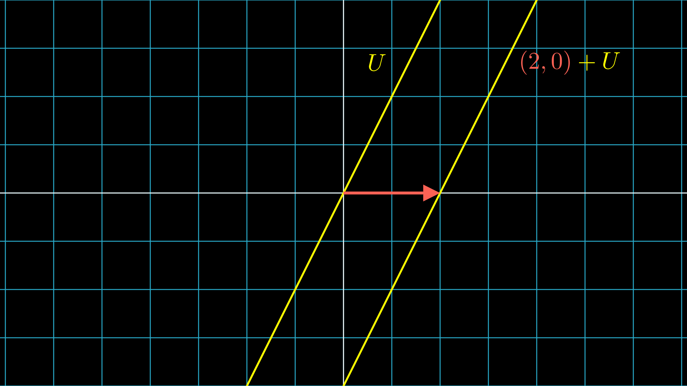

[[Chapter-1 矩阵是什么]]

在上一章，我们介绍了向量空间的定义，向量空间的基与维数，然后研究了线性映射的表示。我们提到，在给定了一组基的情况下，向量$v$与数组$(a_1,\dots,a_n)$是等价的，同样，一个线性映射在给定一对基时，与一个矩阵是等价的。接下来我们将使这种等价精确化（利用所谓的**同构**），并给出有限维向量空间同构的条件。

# Section 1: 同构向量空间

**定义 2.1.1** 同构（Isomorphism），同构的（Isomorphic）

一个线性映射$T\colon V\to W$是一个**同构**如果$T$是双射。这时称两个向量空间是**同构的**。

我们说映射$T\colon V\to W$是一个双射，就是说$T$同时具备**单性**和**满性**。所谓**单性**，就是指$u\ne v \Longrightarrow Tu\ne Tv$，或者反过来说，$Tu=Tv\Longrightarrow u=v$。所谓**满性**，就是指对任意$w\in W$都存在$v\in V$使得$Tv=w$。

因此，如果一个映射是双射，那么每个$w\in W$都有唯一的$v\in V$与之对应，即$V$和$W$中的元素是一一对应的。这也表明存在映射$S\colon W\to V$使得$TS=I,ST=I$即恒等映射，称为$T$的**逆**。

对于向量空间来说，同构不仅是一一对应，而且也保持了元素的线性结构：$T(au+bv)=aTu+bTv$。这表明，同构的向量空间除了元素的名字，其本质没有任何不同。

例如，上一章定义的$\mathcal M$就是向量空间$V$到$n$元组的集合$\mathbb F^n$的同构，也是$V\to W$的线性映射构成的集合$\mathcal L(V,W)$到$m\times n$的矩阵构成的集合$\mathbb F^{m,n}$的同构。

不过，事实上，上面的一些结论只有在向量空间是有限维的情况下才能成立，这也是我们研究的重点，因此一个严格的定义是必要的。

**定义 2.1.2** 有限维向量空间

如果向量空间能够被有限个向量张成，就称该向量空间是**有限维**的。

我们知道，所有张成组都可以化简成一个基，所以有限维向量空间一定有基。此外，对于有限维向量空间，我们还可以证明：每个线性无关组都可以扩充成一个基。

**证明**

设$u_1,\dots,u_m$线性无关，取张成组$v_1,\dots,v_n$添加到线性无关组的后面，得到的向量组线性相关。于是使用线性相关性引理，可以将其化简成一个基。

对于多个有限维向量空间，其同构性也有特殊的判定方法，如下定理所示。

**定理 2.1.3**

如果$\dim V=\dim W$，那么$V$和$W$同构。

此定理的证明只需注意到$V$和$W$有相同长度的基，取$Tv_j=w_j$即可。读者可以自行验证$T$是一个同构。

通过上述定理，我们自然地得到$\dim \mathcal L(V,W)=mn=(\dim V)(\dim W)$。

# Section 2: 线性映射的核与像

接下来我们要研究与线性映射紧密相关的两个子空间，子空间是向量空间的子集使得它自身也是一个向量空间。事实上，如果一个子集$U$满足以下条件，就能够推出它是一个子空间：

- $U$非空
- 封闭性：对$u,v\in U,a\in\mathbb F$，有$u+v\in U,au\in U$

这是因为子空间的运算（以及数乘单位元"1"）继承自更大的空间，因而交换性，结合性，分配性在更小的空间上也成立，而单位元和加法逆元可以通过数乘实现。

现在我们给出线性映射的核与像的定义：

**定义 2.2.1** 核（Kernel）与像（Image）

线性映射$T\colon V\to W$的**核**定义为
$$\ker T=\{u\in V\colon Tu=0\}$$

**像**定义为
$$T(V)=\{Tv\in W\colon v\in V\}$$

可以验证，$\ker T$是$V$的一个子空间，而$T(V)$是$W$的一个子空间。

由映射的单性和满性的定义，以下的定理是显然的。

**定理 2.2.2**

设$T\colon V\to W$是线性的，则：

1. $T$是单射当且仅当$\ker T=\{0\}$
2. $T$是满射当且仅当$T(V)=W$

这个定义看起来抽象，但不要忘记每个线性映射$T$都对应于一个矩阵$A$，那么线性映射的作用就对应于矩阵乘以列向量：
$$
Ax=\begin{bmatrix}
A_{11} & \dots & A_{1n}\\
\vdots & \ddots & \vdots\\
A_{m1} & \dots & A_{mn}
\end{bmatrix}\begin{bmatrix}
x_1\\
\vdots\\
x_n
\end{bmatrix}=\begin{bmatrix}
A_{11}x_1+\dots+A_{1n}x_n\\
\vdots\\
A_{m1}x_1+\dots+A_{mn}x_n
\end{bmatrix}=\begin{bmatrix}
b_1\\
\vdots\\
b_m
\end{bmatrix}
$$

因此，线性映射的核对应于齐次线性方程组的解集，而线性映射的像反映了使得方程组有解的常数项的范围。

接下来，我们给出本章最重要的一个定理。

**定理 2.2.3** 线性映射基本定理

设$V$是有限维的，线性映射$T\colon V\to W$，则$T(V)$是有限维的，且
$$\dim V=\dim \ker T+\dim T(V)$$

**证明**

我们从$\ker T$的基$(u_1,\dots,u_k)$入手，将其扩充为$V$的基$(u_1,\dots,u_k,v_1,\dots,v_m)$，我们想证明$(Tv_1,\dots,Tv_m)$是$T(V)$的基，从而有$\dim T(V)=m$。

设$w\in T(V)$，则
$$
w=T(a_1u_1+\dots+a_ku_k+b_1v_1+\dots+b_mv_m)=b_1Tv_1+\dots+b_mTv_m
$$

故$(Tv_1,\dots,Tv_m)$张成$T(V)$，故其是有限维的。

现设$b_1Tv_1+\dots+b_mTv_m=T(b_1v_1+\dots+b_mv_m)=0$，则$b_1v_1+\dots+b_mv_m\in \ker T$，即
$$b_1v_1+\dots+b_mv_m=c_1u_1+\dots+c_ku_k$$

从而$b_1=\dots=b_m=c_1=\dots=c_k=0$，即$(Tv_1,\dots,Tv_m)$线性无关，因此是$T(V)$的一个基。

从这个定理出发，我们可以证明很多非平凡的结果，例如：

**定理 2.2.4**

设$T\in \mathcal L(V,W)$，则

1. 若$\dim V>\dim W$，则$T$不是单射。（到更小的空间的映射不是单的）
2. 若$\dim V<\dim W$，则$T$不是满射。（到更大的空间的映射不是满的）

**证明**

使用线性映射基本定理即得：

1. $\dim \ker T\ge\dim V-\dim W>0$，从而$\ker T\ne \{0\}$
2. $\dim T(V)\le \dim V<\dim W$，从而$T(V)\ne W$

对应到矩阵上来，$\dim V$对应于矩阵的列，$\dim W$对应于矩阵的行。因此，上面的定理用方程组的语言表示就是：

1. 若未知数的个数多于方程的个数，则齐次方程组必定有非零解。
2. 若方程的个数多于未知数的个数，则存在一组常数项使得方程组无解。

原本这个定理的证明需要用到消元法（亦称行变换），但通过分析，我们得以绕过繁琐而不直观的行变换，从一个更高的视角审视线性方程组，这也正是我们引入抽象的向量空间和线性映射的意义。

根据上面的定理，只有当$\dim V=\dim W$是才有可能同时满足单性和满性，又因为此时$V,W$同构，故$T\in\mathcal L(V,W)$与$T\in\mathcal L(V,V)=\mathcal L(V)$是等价的。后者我们称之为$V$上的**算子**。比起一般的线性映射，算子有着更好的性质，如下所示：

**定理 2.2.5**

设$V$是有限维的，$T\in\mathcal L(V)$，则$T$是单射当且仅当$T$是满射。（从而$T$是可逆的）

由线性映射基本定理可立即得证。

从矩阵和方程组的角度来看，此时矩阵的行数等于列数，未知数个数等于方程个数，并且下面三个命题均等价：

1. 齐次线性方程组只有平凡解（无非零解）。
2. 对任意的一组常数项，方程组都有解（并且解是唯一的）。
3. 方程组的系数矩阵可逆。

这是线性方程组理论中的一个非常重要的结论，而我们借助线性算子成功绕过了消元法与行列式，轻易且快速地证明了该结论。

# Section 3: 子空间的平移与解的结构

迄今为止，我们只研究了齐次线性方程组的解，而对于非齐次的方程组，我们目前只知道它是否有解，因此接下来我们将深入研究非线性方程组解的结构。

非齐次方程组对应于线性映射方程$Tv=w$，我们知道$T(v+u)=w,u\in\ker T$，因此对于我们研究的问题来说$v$和$v+u$是相等的，加上一个$u$并不能帮助我们找到其他不同的解。为了严格化这种相等关系，我们提出如下定义：

**定义 2.3.1** 等价关系（Equivalence Relation）

$V$上的一个关系$\sim$是一个**等价关系**如果对$u,v,w\in V$有：

- 自反性：$u\sim u$
- 对称性：如果$u\sim v$那么$v\sim u$
- 传递性：如果$u\sim v,v\sim w$那么$u\sim w$

等价关系是相等关系的一个自然推广，例如，在整数上可以定义等价关系：若两个数除以5的余数相同，那么这两个数等价。从而在这个等价关系下，有本质上区别的整数只剩下5个：$0,1,2,3,4$。然而，这里的每个数都可以替换成与它等价的数（0换成5，10，等等），因此为了说明这种“本质上不同”的关系，我们必须使用**等价类**
$$[v]=\{u\in V\colon u\sim v\}$$

并说等价类$[0],[1],[2],[3],[4]$是不相交的。我们把不相交的等价类放在一个集合中，就成为集合$V$在等价关系$\sim$下的**商集**，记作$V/\sim$。换言之，商集中的元素就是在等价关系下有“本质上不同”的各元素。

现在回到线性映射上来，我们可以定义等价关系：如果$v,w\in V$只相差一个$u\in U$，即$w=v+u$，那么$v\sim w$。这样得到的等价类有特殊的意义，因此我们给它一个特殊的符号：
$$v+U=\{v+u\colon u\in U\}$$

称为$V$的**仿射子集**，并称$v+U$与$U$**平行**。从而商集$V/U$就是所有与$U$平行的仿射子集构成的集合：
$$V/U=\{v+U\colon v\in V\}$$

直观来看，$v+U$就是$U$向着$v$的方向平移了$v$的长度个单位，因此“平行”一词用在这里是恰当的。

读者可以验证，在如下定义的加法和数乘下，$V/U$是一个向量空间：
$$(v+U)+(w+U)=(v+w)+U,\lambda(v+U)=(\lambda v)+U$$

从而每个线性映射$T\colon V\to W$都诱导了$V/\ker T\to W$的线性映射$\tilde T$使得
$$\tilde T(v+\ker T)=Tv$$

满足$\ker \tilde T=\{0\}=\{0+\ker T\},\tilde T(V/\ker T)=T(V)$，因此$\tilde T$是$V/\ker T\to T(V)$的同构。这表明，如果$Tv=w$，那么$v+\ker T$是使得$\tilde T(v'+\ker T)=w$的唯一解。

下面我们给出本章的最后一个定理：

**定理 2.3.2**

设$U$是$V$的子空间使得$V/U$是有限维的，则$V$同构于$U\times (V/U)=\{(u,v+U)\colon u\in U,v+U\in V/U\}$

**证明**

$V/U$是有限维的，从而有一个基$v_1+U,\dots,v_m+U$。设$v\in V$，则$v+U\in V/U$，即
$$v+U=(a_1v_1+\dots+a_mv_m)+U$$

令$u=v-(a_1v_1+\dots+a_mv_m)\in U$，定义映射$\varphi\colon V\to U\times (V/U),\varphi(v)=(u,v+U)$，则$\varphi$是线性的，且是单的。为了证明满性，设$(u,v+U)\in U\times (V/U)$，令$w=(a_1v_1+\dots+a_mv_m)+u\in V$，则$\varphi(w)=(u,v+U)$，即证。

以上定理表明，对于线性映射$T\colon V\to W$，每个$v$都自然地对应到$(u,v+\ker T)$，并且存在$v_p\in v+\ker T$使得$v=u+v_p$，其中$u,v_p$分别被称为方程$Tv=w$的**通解**和**特解**。此外，特解（在等价关系的意义下）是唯一的。

综上所述，我们现在已经知道，一个线性方程组何时有解，以及当方程组有解的时候解的结构，**而我们甚至都还没有动手解过一个方程组**。不仅如此，上面的定理还有更深刻的内涵：无论是线性微分方程
$$ay''+by'+cy=f(x)$$

还是线性递归方程
$$af(n+2)+bf(n+1)+cf(n)=g(n)$$

只要是存在线性结构的领域，都存在“通解”，“特解”以及与线性映射相关的一切，从而我们就能够使用线性代数的方法研究数学的各个领域。

话说回来，对于一个方程组，怎么得到具体的解呢？这就是消元法和初等行变换要做的事了。

# Section 4: 总结

在本章中，我们使用线性映射以及和线性映射相关的子空间研究了线性方程组的可解性以及解的结构。在下一章，我们将研究向量空间的对偶和矩阵的转置，最终证明矩阵的行秩等于列秩。

本期内容就是这样，感谢观看！