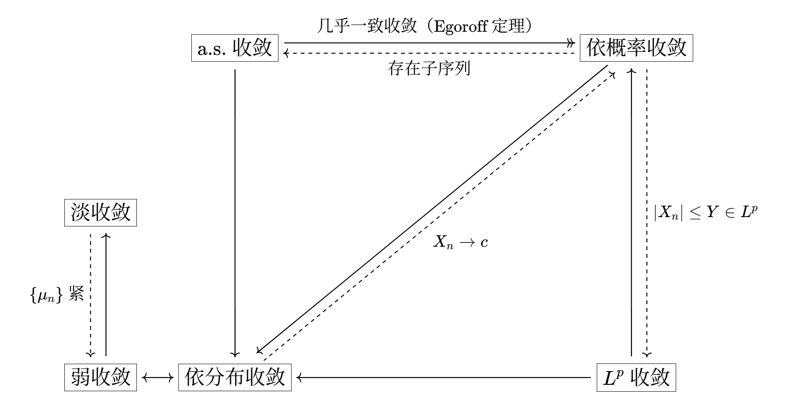

在进入概率论的主题之前，我们首先来讨论一下概率论与泛函分析中常用的一些收敛性概念。它们构成了后续定理证明的基石。

# Section 1: 收敛性概述

有多种收敛性概念可以直接从测度论中迁移而来，我们以最常用的几乎处处（a.e.）收敛以及依测度收敛开始：

**定义 2.1.1** 几乎必然收敛（almost sure convergence）

设 $(\Omega,\mathcal{F},\mathbb{P})$ 是概率空间，$X_{n},X$ 是随机变量，称 $X_{n}$ **几乎必然收敛于** $X$，如果存在零概率集 $N$，使得在 $\Omega \setminus N$ 上有 $X_{n}\to X$.

**定义 2.1.2** 依概率收敛（convergence in probability）

设 $(\Omega,\mathcal{F},\mathbb{P})$ 是概率空间，$X_{n},X$ 是随机变量，称 $X_{n}$ **依概率收敛于** $X$，如果对任意 $\varepsilon>0$，有

$$
\begin{gather}
\lim_{ n \to \infty } \mathbb{P}(|X_{n}-X|\geq\varepsilon)=0
\end{gather}
$$

对于上述两种收敛性，在实分析中有一个非常有用的定理表明了它们之间的关系。

**定理 2.1.3** Egoroff 定理

设 $(X,\mathcal{M},\mu)$ 是测度空间，$\mu(X)<\infty$，$f_{n},f$ 是可测的，且 $f_{n}\to f$ a.e.，那么对任意 $\varepsilon>0$，存在 $E \in \mathcal{M}$ 使得 $\mu(E)<\varepsilon$，并且 $(f_{n})$ 在 $E^{c}$ 上一致收敛于 $f$.

对于概率空间来说，$\mathbb{P}(\Omega)=1$，条件 $\mu(X)<\infty$ 总是成立，因此，我们总是有如下结论：

**定理 2.1.4**

a.s. 收敛蕴含依概率收敛。

反之，我们同样也有如下结论：

**定理 2.1.5**

设 $(X,\mathcal{M},\mu)$ 是测度空间，如果 $(f_{n})$ 是依测度 Cauchy 的，那么存在可测函数 $f$ 使得 $(f_{n})$ 依测度收敛于 $f$，并且存在子序列 $f_{n_{j}}\to f$ a.e. 此外，如果 $(f_{n})$ 也依测度收敛于 $g$，那么 $f=g$ a.e.

显然如果 $(f_{n})$ 依概率收敛，那么 $(f_{n})$ 也是依概率 Cauchy 的，从而我们有：

**定理 2.1.6**

依概率收敛蕴含存在子序列 a.s. 收敛。

接下来，我们引入随机变量的期望，即 $L^{p}$ 空间：

**定义 2.1.7** $L^{p}$ 收敛（convergence in $L^{p}$）

设 $(\Omega,\mathcal{F},\mathbb{P})$ 是概率空间，$0<p<\infty$，$X_{n},X$ 是随机变量，称 $X_{n}$ **按** $L^{p}$ **范数收敛于** $X$，如果 $X_{n},X \in L^{p}$ 且

$$
\begin{gather}
\lim_{ n \to \infty } \mathbb{E}(|X_{n}-X|^{p})=\lim_{ n \to \infty } \lVert X_{n}-X \rVert _{p}^{p}=0
\end{gather}
$$

在上面所介绍的定义中，$X_{n}$ 收敛于 $X$（无论以何种方式）当且仅当 $X_{n}-X$ 收敛于 $0$. 因此，在下面的讨论中，我们可以不失一般性的假设 $X=0$，只要我们保证所有相关的假设是相容的。下面给出一例。

**定理 2.1.8**

设 $(\Omega,\mathcal{F},\mathbb{P})$ 是概率空间，$X_{n},X$ 是随机变量，如果 $X_{n}$ 按 $L^{p}$ 范数收敛于 $X$，那么 $X_{n}$ 依概率收敛于 $X$. 如果 $(X_{n})$ 由某个 $Y \in L^{p}$ 控制（$|X_{n}|\leq Y$ a.s.），那么反之也成立。

**证明**

如果 $X_{n}$ 按 $L^{p}$ 范数收敛于 $X$ 且 $(X_{n})$ 由 $Y$ 控制，那么 $(X_{n}-X)$ 由 $Y+|X| \in L^{p}$ 控制，因此我们可以不失一般性地假设 $X=0$.

设按 $L^{p}$ 范数有 $X_{n}\to 0$，根据 Chebyshev 不等式，我们有

$$
\begin{gather}
\mathbb{P}(|X_{n}|\geq\varepsilon)\leq \dfrac{\mathbb{E}(|X_{n}|^{p})}{\varepsilon^{p}}
\end{gather}
$$

对任意 $\varepsilon>0$ 成立。令 $n\to 0$，即证依概率有 $X_{n}\to 0$.

现在设 $|X_{n}|\leq Y$ a.s.，$\mathbb{E}(Y^{p})<\infty$，则有

$$
\begin{align}
\mathbb{E}(|X_{n}|^{p})&=\int_{|X_{n}|<\varepsilon}|X_{n}|^{p}\mathrm{d} \mathbb{P}+\int_{|X_{n}|\geq\varepsilon}|X_{n}|^{p}\mathrm{d} \mathbb{P} \\
&\leq \varepsilon^{p} + \int_{|X_{n}|\geq\varepsilon} Y^{p}\mathrm{d} \mathbb{P}
\end{align}
$$

由于 $\mathbb{P}(|X_{n}|\geq\varepsilon)\to 0$，根据控制收敛定理，积分项的极限为 $0$，即证 $\mathbb{E}(|X_{n}|^{p})\to 0$.

作为上述定理的推论，如果 $(X_{n})$ 是一致有界的（控制函数 $Y$ 是常值函数），那么依概率收敛与依 $L^{p}$ 范数收敛是等价的。更一般地，我们有：

**定理 2.1.9**

设 $(\Omega,\mathcal{F},\mathbb{P})$ 是概率空间，$X_{n}$ 是随机变量，则 $X_{n}$ 依概率收敛于 $0$ 当且仅当

$$
\begin{gather}
\mathbb{E}\left( \dfrac{|X_{n}|}{1+|X_{n}|} \right)\to 0
\end{gather}
$$

此外，定义在随机变量构成的空间上的函数

$$
\begin{gather}
\rho(X,Y)=\mathbb{E}\left( \dfrac{|X-Y|}{1+|X-Y|} \right)
\end{gather}
$$

是一个度量，只要我们将 a.s. 相等的随机变量等同。

**证明**

如果 $\rho(X,Y)=0$，那么 $\mathbb{E}(|X-Y|)=0$，即 $X=Y$ a.s. 为了证明 $\rho$ 是一个度量，下面我们只需证明三角不等式，根据实数上的不等式

$$
\begin{gather}
\dfrac{|x+y|}{1+|x+y|}\leq \dfrac{|x|}{1+|x|}+\dfrac{|y|}{1+|y|}
\end{gather}
$$

即可证明 $\rho(X,Z)\leq \rho(X,Y)+\rho(Y,Z)$.

对任意 $(X_{n})$，序列 $\dfrac{|X_{n}|}{1+|X_{n}|}$ 都由 $1 \in L^{p}(\Omega)$ 控制，因此根据 2.1.8，我们只需证明依概率 $X_{n}\to 0$ 当且仅当 $\dfrac{|X_{n}|}{1+|X_{n}|}\to 0$. 又由于 $|x|<\varepsilon$ 当且仅当 $\dfrac{|x|}{1+|x|}< \dfrac{\varepsilon}{1+\varepsilon}$，这就完成了证明。

最后，我们简要介绍一种泛函分析中常用的收敛模式。为此，我们考虑 $L^{1}$ 上的随机变量 $X_{n},X$. 根据 $L^{p}$ 空间上的对偶性理论，每个 $L^{1}$ 上的泛函 $\phi$ 都可以表示为 $\phi(X)=\int XY\mathrm{d}\mathbb{P}$，其中 $Y \in L^{\infty}$，即 $Y<\infty$ a.s.，从而我们有：

**定义 2.1.10** 弱收敛（weak convergence）

设 $(\Omega,\mathcal{F},\mathbb{P})$ 是概率空间，$X_{n},X$ 是随机变量，称 $X_{n}$ 在 $L^{1}$ 中**弱收敛于** $X$，如果 $X_{n}\in L^{1}$ 且对任意有界随机变量 $Y$ 有 $\mathbb{E}(|XY|)<\infty$，并且

$$
\begin{gather}
\mathbb{E}(X_{n}Y)\to \mathbb{E}(XY)
\end{gather}
$$

弱收敛与上面定义的几个收敛性没有蕴含关系，我们可以找到一些反例来证明这一点。

# Section 2: Borel-Cantelli 引理

在集合论与测度论中，我们可以对一列集合取上确界与下确界：

$$
\begin{gather}
\limsup_{ n \to \infty } E_{n}=\bigcap_{n=1}^{\infty} \bigcup_{k=n}^{\infty} E_{k},\quad \liminf_{ n \to \infty } E_{n}=\bigcup_{n=1}^{\infty} \bigcap_{k=n}^{\infty} E_{k}
\end{gather}
$$

其中 $x \in \limsup_{ n \to \infty }E_{n}$ 当且仅当 $x$ 属于无限多个 $E_{n}$，或者更“概率化”地说：事件 $\limsup_{ n \to \infty }E_{n}$ 发生当且仅当 $E_{n}$ 发生了无穷多次（infinity often, i.o.）。从而我们有如下的重要引理：

**定理 2.2.1** Borel-Cantelli 引理

设 $(\Omega,\mathcal{F},\mathbb{P})$ 是概率空间，$(E_{n})\subset \mathcal{F}$，则如果 $\sum_{n=1}^{\infty}\mathbb{P}(E_{n})<\infty$，那么 $\mathbb{P}(E_{n}\ \text{i.o.})=0$.

当事件 $E_{n}$ 独立时，我们可以进一步得到：

**定理 2.2.2**

设 $(\Omega,\mathcal{F},\mathbb{P})$ 是概率空间，$(E_{n})\subset \mathcal{F}$ 是独立的，则如果 $\sum_{n=1}^{\infty}\mathbb{P}(E_{n})=\infty$，那么 $\mathbb{P}(E_{n}\ \text{i.o.})=1$.

**证明**

根据定义我们可得 $(\limsup_{ n \to \infty }E_{n})^{c}=\liminf_{ n \to \infty }E_{n}^{c}$，由于 $(E_{n})$ 独立，则 $(E_{n}^{c})$ 也独立，从而

$$
\begin{align}
\mathbb{P}(\liminf_{ n \to \infty } E_{n}^{c})&= \lim_{ n \to \infty } \mathbb{P}\left( \bigcap_{k=n}^{\infty} E_{k}^{c} \right) \\
&= \lim_{ n \to \infty } \lim_{ N \to \infty } \mathbb{P}\left( \bigcap_{k=n}^{N} E_{k}^{c} \right) \\
&= \lim_{ n \to \infty } \lim_{ N \to \infty } \prod_{k=n}^{N} (1-\mathbb{P}(E_{k}))
\end{align}
$$

当 $x\geq 0$ 时，我们有 $e^{-x}\geq 1-x$，因此有

$$
\begin{align}
\prod_{k=n}^{N} (1-\mathbb{P}(E_{k}))\leq \exp\left( -\sum_{k=n}^{N} \mathbb{P}(E_{k}) \right)
\end{align}
$$

令 $N\to \infty$，则右边趋于 $0$，从而 $\mathbb{P}(\liminf_{ n \to \infty }E_{n}^{c})=0$，即证 $\mathbb{P}(E_{n}\ \text{i.o.})=1$.

定理 2.2.1 和 2.2.2 有时也合称为 Borel-Cantelli 引理，前者是“收敛部分”，而后者是“发散部分”。对于后者，我们可以把这一结果推广到两两独立的事件上，尽管结论本身没有太多用处，但其证明过程是概率论中的一个典型技巧。

**定理 2.2.3**

设 $(\Omega,\mathcal{F},\mathbb{P})$ 是概率空间，$(E_{n})\subset \mathcal{F}$ 是两两独立的，则如果 $\sum_{n=1}^{\infty}\mathbb{P}(E_{n})=\infty$，那么 $\mathbb{P}(E_{n}\ \text{i.o.})=1$.

**证明**

令 $I_{n}=1_{E_{n}}$ 为 $E_{n}$ 的指示函数，则由条件知当 $m\neq n$ 时有

$$
\begin{gather}
\mathbb{E}(I_{n}I_{m})=\mathbb{E}(I_{n})\mathbb{E}(I_{m})
\end{gather}
$$

考虑随机变量 $\sum_{n=1}^{\infty}I_{n}$，则它发散至 $\infty$ 当且仅当有无限多个 $E_{n}$ 发生，从而命题中的条件和结论等价于

$$
\begin{gather}
\sum_{n=1}^{\infty} \mathbb{E}(I_{n})=\infty \implies \mathbb{P}\left( \sum_{n=1}^{\infty} I_{n}=\infty \right)=1
\end{gather}
$$

考虑部分和 $J_{k}=\sum_{n=1}^{k}I_{n}$，应用 Chebyshev 不等式得

$$
\begin{gather}
\mathbb{P}(|J_{k}-\mathbb{E}(J_{k})|\leq A\sigma(J_{k}))\geq 1- \dfrac{\sigma^{2}(J_{k})}{A^{2}\sigma^{2}(J_{k})}=1- \dfrac{1}{A^{2}}
\end{gather}
$$

对任意 $A>0$ 成立，其中 $\sigma(J_{k})$ 是 $J_{k}$ 的标准差。令 $p_{n}=\mathbb{E}(I_{n})=\mathbb{P}(E_{n})$，则有

$$
\begin{align}
\mathbb{E}(J_{k}^{2}) &= \mathbb{E}\left( \sum_{n=1}^{k} I_{n}^{2}+2\sum_{1\leq m<n\leq k} I_{m}I_{n} \right) \\
&= \sum_{n=1}^{k} \mathbb{E}(I_{n}^{2})+2\sum_{1\leq m<n\leq k} \mathbb{E}(I_{m})\mathbb{E}(I_{n}) \\
&= \sum_{n=1}^{k} \mathbb{E}(I_{n})^{2}+2 \sum_{1\leq m<n\leq k}\mathbb{E}(I_{m})\mathbb{E}(I_{n})+\sum_{n=1}^{k} (\mathbb{E}(I_{n})-\mathbb{E}(I_{n})^{2}) \\
&= \left( \sum_{n=1}^{k} p_{n} \right)^{2}+\sum_{n=1}^{k} (p_{n}-p_{n}^{2})
\end{align}
$$

于是

$$
\begin{align}
\sigma^{2}(J_{k})=\mathbb{E}(J_{k}^{2})-\mathbb{E}(J_{k})^{2}=\sum_{n=1}^{k} (p_{n}-p_{n}^{2})
\end{align}
$$

由于 $\sum_{n=1}^{k}p_{n}=\mathbb{E}(J_{k})\to \infty$，故

$$
\begin{gather}
\sigma(J_{k})\leq \mathbb{E}(J_{k})^{1/2}=o(\mathbb{E}(J_{k}))
\end{gather}
$$

因此当 $k$ 足够大时有

$$
\begin{gather}
\mathbb{P}\left( J_{k}> \dfrac{1}{2}\mathbb{E}(J_{k}) \right)\geq 1- \dfrac{1}{A^{2}}
\end{gather}
$$

由于 $J_{k}$ 递增，因此将上述公式中第一个 $J_{k}$ 换成 $\lim_{ k \to \infty }J_{k}$，不等式仍然成立，再令 $\mathbb{E}(J_{k})$ 中的 $k\to \infty$，即得

$$
\mathbb{P}(\lim_{ k \to \infty } J_{k}=\infty)\geq 1-\dfrac{1}{A^{2}}
$$

根据 $A$ 的任意性即证。

# Section 3: 淡收敛

如果一列随机变量 $X_{n}$ 收敛于 $X$，那么按照我们的直观，其对应的概率测度 $\mu_{n}$ 也应该收敛于某个极限。那么，是否对于 $A \in \mathcal{B}_{\mathbb{R}}$ 有 $\lim_{ n \to \infty }\mu_{n}(A)$ 存在？或者退一步，对有界区间 $A$ 成立？答案是否定的，我们以一个例子来说明这一点。

设 $X_{n}=c_{n}$ 是常数，$c_{n}\to 0$，于是 $X_{n}\to 0$. 则对任意区间 $I$，如果 $0 \not\in \overline{I}$，那么 $\lim_{ n \to \infty }\mu_{n}(I)=0=\mu(I)$；如果 $0 \in \mathrm{Int}(I)$，那么 $\lim_{ n \to \infty }\mu_{n}(I)=1=\mu(I)$. 然而，如果 $c_{n}$ 在正数和负数之间震荡，并且 $I=(a,0)$ 或 $(0,b)$，那么 $\mu_{n}(I)$ 在 $0$ 和 $1$ 之间震荡，而 $\mu(I)=0$；此外，如果 $I=(a,0]$ 或 $[0,b)$，那么 $\mu_{n}(I)$ 同样在 $0,1$ 之间震荡，而 $\mu(I)=1$. 可见，$0$ 是 $\mu$ 的一个**原子**（$\mu(\{ 0 \})\neq 0$），并且也是问题的根源。

即使 $\mu_{n}$ 在一种更弱的条件下收敛，其极限同样也是一个概率测度吗？答案同样是否定的。由此，我们给出以下定义：

**定义 2.3.1** 次概率测度（subprobability measure）

$(\mathbb{R},\mathcal{B}_{\mathbb{R}})$ 上的测度 $\mu$ 是一个**次概率测度**，如果 $\mu(\mathbb{R})\leq 1$.

**定义 2.3.2** 淡收敛（vague convergence）

设 $\mu_{n},\mu$ 是次概率测度，称 $(\mu_{n})$ **淡收敛于** $\mu$，如果存在稠密集 $D\subset \mathbb{R}$ 使得对任意 $a,b \in D$ 有 $\mu_{n}((a,b])\to \mu((a,b])$.

下面我们给出淡收敛的一些基本性质。称区间 $(a,b)$ 是 $\mu$ 的一个**连续区间**，如果 $a,b$ 都不是 $\mu$ 的原子，即 $\mu((a,b))=\mu([a,b])$.

**定理 2.3.3**

设 $\mu_{n},\mu$ 是次概率测度，则以下命题等价：

1. 对任意有界区间 $(a,b)$ 和 $\varepsilon>0$，存在 $N$ 使得对任意 $n>N$ 有 $\mu((a+\varepsilon,b-\varepsilon))-\varepsilon\leq \mu_{n}((a,b))\leq \mu((a-\varepsilon,b+\varepsilon))+\varepsilon$.
2. 对任意 $\mu$ 的连续区间 $I$，有 $\mu_{n}(I)\to \mu(I)$.
3. $(\mu_{n})$ 淡收敛于 $\mu$.

**证明**

首先设 1 成立，$(a,b)$ 是 $\mu$ 的连续区间，则根据测度的连续性有

$$
\begin{gather}
\lim_{ \varepsilon \to 0+ } \mu((a+\varepsilon,b-\varepsilon))=\mu((a,b))=\mu([a,b])=\lim_{ \varepsilon \to 0+ } \mu((a-\varepsilon,b+\varepsilon))
\end{gather}
$$

在 1 中令 $n\to \infty$ 且 $\varepsilon\to 0+$，则有

$$
\begin{gather}
\mu((a,b))\leq \liminf_{ n \to \infty } \mu_{n}((a,b))\leq \limsup_{ n \to \infty } \mu_{n}((a,b))\leq \mu([a,b])=\mu((a,b))
\end{gather}
$$

即证 $\mu_{n}((a,b))\to \mu((a,b))$.

下面设 2 成立，由于 $\mu$ 的原子构成的集合是至多可数的，故其补集 $D$ 在 $\mathbb{R}$ 中稠密。如果 $a,b \in D$，那么 $(a,b)$ 就是 $\mu$ 的连续区间，这就证明了 3.

最后，假设 3 成立。给定 $(a,b)$ 和 $\varepsilon>0$，存在 $a_{1},a_{2},b_{1},b_{2}\in D$ 使得

$$
\begin{gather}
a-\varepsilon<a_{1}<a<a_{2}<a+\varepsilon, \quad b-\varepsilon<b_{1}<b<b_{2}<b+\varepsilon
\end{gather}
$$

并且根据定义，存在 $N$ 使得对任意 $n>N$ 有

$$
\begin{gather}
\lvert \mu_{n}((a_{i},b_{j}])-\mu((a_{i},b_{j}]) \rvert <\varepsilon
\end{gather}
$$

于是有

$$
\begin{align}
\mu((a+\varepsilon,b-\varepsilon))-\varepsilon &\leq \mu((a_{2},b_{1}])-\varepsilon \leq \mu_{n}((a_{2},b_{1}])\leq \mu_{n}((a,b)) \\
&\leq \mu_{n}((a_{1},b_{2}])\leq \mu((a_{1},b_{2}])+\varepsilon \leq \mu((a-\varepsilon,b+\varepsilon))+\varepsilon
\end{align}
$$

这就证明了 1.

根据上述定理，我们立即得到了淡收敛极限的唯一性：如果 $\mu_{n}$ 淡收敛于 $\mu$ 和 $\mu'$，令 $A$ 是 $\mu$ 和 $\mu'$ 的原子构成的集合，则 $A^{c}$ 在 $\mathbb{R}$ 中稠密，并且对任意 $a,b \in A^{c}$，$(a,b)$ 是 $\mu,\mu'$ 的连续区间，从而

$$
\begin{gather}
\mu((a,b])=\mu'((a,b])=\lim_{ n \to \infty } \mu_{n}((a,b])
\end{gather}
$$

由于 $\{ (a,b] \}$ 是 $\mathcal{B}_{\mathbb{R}}$ 的生成集，故 $\mu=\mu'$ 在 $\mathcal{B}_{\mathbb{R}}$ 上成立。

接下来我们把 $\mu_{n}$ 限制为概率测度，我们可以进一步得到以下结论：

**定理 2.3.4**

设 $\mu_{n},\mu$ 是 $(\mathbb{R},\mathcal{B}_{\mathbb{R}})$ 上的概率测度，则 2.3.3 中的 1, 2, 3 等价于以下命题：

- 对任意 $\delta>0$ 和 $\varepsilon>0$，存在 $N$ 使得对任意 $n>N$ 和任意区间 $(a,b)$ 有 $\mu((a+\delta,b-\delta))-\varepsilon\leq \mu_{n}((a,b))\leq \mu((a-\delta,b+\delta))+\varepsilon$.

**证明**

显然上述命题蕴含 1，因此下面我们只需证明 2 蕴含该命题即可。设 $A$ 是 $\mu$ 的原子构成的集合，则存在整数 $\ell$ 和 $a_{j}\in A^{c}$ 使得

$$
\begin{gather}
a_{j}<a_{j+1}\leq a_{j}+\delta, \quad 1\leq j\leq\ell-1
\end{gather}
$$

且

$$
\begin{gather}
\mu((a_{1},a_{\ell})^{c})< \dfrac{\varepsilon}{4}
\end{gather}
$$

由于 $(a_{j},a_{j+1})$ 是连续区间，故存在 $N$ 使得对任意 $n>N$ 有

$$
\begin{gather}
\sup_{1\leq j\leq\ell-1} \lvert \mu((a_{j},a_{j+1}])-\mu_{n}((a_{j}-a_{j+1}]) \rvert < \dfrac{\varepsilon}{4\ell}
\end{gather}
$$

根据测度的可加性得

$$
\begin{gather}
\lvert \mu((a_{1},a_{\ell}])-\mu_{n}((a_{1},a_{\ell}]) \rvert < \dfrac{\varepsilon}{4}
\end{gather}
$$

从而

$$
\begin{gather}
\mu_{n}((a_{1},a_{\ell})^{c})< \dfrac{\varepsilon}{2}
\end{gather}
$$

因此，对任意区间 $(a,b)$，如果去除 $(a_{1},a_{\ell})$ 以外的部分，最终结果的偏差值最多为 $\varepsilon / 2$，故我们只需对 $(a,b)\subset(a_{1},a_{\ell})$ 以及 $\delta,\varepsilon / 2$ 证明即可。设 $a_{j}\leq a< a_{j+1}$，$a_{k}\leq b< a_{k+1}$，则当 $n>N$ 时有

$$
\begin{align}
\mu((a+\delta,b-\delta))- \dfrac{\varepsilon}{4}&\leq \mu((a_{j+1},a_{k}))- \dfrac{\varepsilon}{4}\leq \mu_{n}((a_{j+1},a_{k}))\leq \mu_{n}((a,b)) \\
&\leq \mu_{n}((a_{j},a_{k+1}))\leq \mu((a_{j},a_{k+1}))+ \dfrac{\varepsilon}{4} \\
&\leq \mu(a-\delta,b+\delta)+ \dfrac{\varepsilon}{4}
\end{align}
$$

这就完成了证明。

$\mathbb{R}$ 上的次概率测度与区间 $[0,1]$ 是紧密相关的。回顾一下，Heine-Borel 定理表明 $[0,1]$ 是序列紧致的：其上的每个序列都有收敛于 $[0,1]$ 中元素的子序列。对于次概率测度，我们也有类似的结论。

**定理 2.3.5**

给定任意次概率测度序列，存在它的子序列淡收敛于某个次概率测度。

**证明**

设 $\mu_{n}$ 是次概率测度，考虑其对应的**次分布函数**

$$
\begin{gather}
F_{n}(x)=\mu_{n}((-\infty,x])
\end{gather}
$$

则 $F_{n}$ 是递增且右连续的，并且 $F_{n}(-\infty)=0$，$F_{n}(\infty)=\mu_{n}(\mathbb{R})\leq 1$.

令 $D=\{ r_{k} \}_{k=1}^{\infty}\subset \mathbb{R}$ 是一个可数稠密集，则序列 $(F_{n}(r_{1}))$ 是有界的，根据 $[0,1]$ 的紧致性，存在子序列 $(F_{1k}(r_{1}))$ 收敛于 $\ell_{1}\in[0,1]$.

接下来，由于序列 $(F_{1k}(r_{2}))$ 也是有界的，故存在子序列 $(F_{2k}(r_{2}))$ 收敛于 $\ell_{2}$. 由于 $(F_{2k})$ 是 $(F_{1k})$ 的子序列，故 $(F_{2k})$ 在 $r_{1}$ 处也收敛。以此类推，我们得到了

$$
\begin{align}
& F_{11},F_{12},\dots,F_{1k},\dots \quad \text{在} r_{1} \text{处收敛}; \\
& F_{21},F_{22},\dots,F_{2k},\dots \quad \text{在} r_{1},r_{2} \text{处收敛}; \\
& \dots \\
& F_{j 1},F_{j 2},\dots,F_{jk},\dots \quad \text{在} r_{1},\dots,r_{j} \text{处收敛}; \\
& \dots
\end{align}
$$

现在考虑对角线序列 $(F_{kk})$，则对任意 $j$，除了前 $j-1$ 项，其余项构成了 $(F_{jk})$ 的一个子序列，从而 $F_{kk}(r_{j})\to \ell_{j}$，因此 $(F_{kk})$ 在 $D$ 上收敛。令 $G(r)=\lim_{ k \to \infty }F_{kk}(r)$，其中 $r \in D$，定义

$$
\begin{gather}
F(x)=\inf_{x<r \in D} G(r), \quad x \in \mathbb{R}
\end{gather}
$$

则 $F$ 是递增且右连续的。设 $C$ 是 $F$ 的连续点构成的集合，则 $C$ 在 $\mathbb{R}$ 上稠密，下面我们要证

$$
\begin{gather}
\lim_{ k \to \infty } F_{kk}(x)=F(x), \quad x \in C
\end{gather}
$$

给定 $x \in C$ 和 $\varepsilon>0$，存在 $r,r',r'' \in D$ 使得 $r<r'<x<r''$ 且 $F(r'')-F(r)<\varepsilon$，于是我们有

$$
\begin{gather}
F(r)\leq G(r')\leq F(x)\leq G(r'')\leq F(r'')\leq F(r)+\varepsilon
\end{gather}
$$

且

$$
\begin{gather}
G(r') \leftarrow F_{kk}(r')\leq F_{kk}(x)\leq F_{kk}(r'') \to G(r'')
\end{gather}
$$

由 $\varepsilon$ 的任意性即证 $F_{kk}(x)\to F(x)$.

根据 Lebesgue-Stieltjes 测度理论，存在唯一的次概率测度 $\mu$ 使得 $\mu((a,b])=F(b)-F(a)$，于是根据 $F_{kk}(x)=F_{n_{k}}(x)\to F(x)$，$x \in C$ 即证

$$
\begin{gather}
\lim_{ k \to \infty } \mu_{n_{k}}((a,b])=\mu((a,b]), \quad a,b \in C
\end{gather}
$$

从而有 $(\mu_{n_{k}})$ 淡收敛于 $\mu$.

根据 $\mu$ 与其分布函数 $F$ 的一一对应性，我们有时也把 $\mu_{n}$ 淡收敛于 $\mu$ 记作 $F_{n}$ 淡收敛于 $F$.

另一个相关的定理如下：一个实数序列 $(x_{n})$ 收敛当且仅当它的所有子序列收敛于同一个极限。对于次概率测度，我们同样有以下结论：

**定理 2.3.6**

设 $\mu_{n},\mu$ 是次概率测度，如果 $(\mu_{n})$ 的所有淡收敛的子序列都有同一极限 $\mu$，那么 $(\mu_{n})$ 也淡收敛于 $\mu$.

**证明**

我们使用反证法。如果 $(\mu_{n})$ 不收敛于 $\mu$，那么存在 $\mu$ 的一个连续区间 $(a,b)$ 使得 $\mu_{n}((a,b))$ 不收敛于 $\mu((a,b))$. 根据 $[0,1]$ 的紧致性，存在 $(\mu_{n})$ 的子序列 $(\mu_{n_{k}})$ 使得 $\mu_{n_{k}}((a,b))$ 收敛于 $L\neq \mu((a,b))$. 再根据定理 2.3.5，存在 $(\mu_{n_{k}})$ 的子序列 $(\mu_{n_{k}'})$ 淡收敛于 $\mu$，从而有

$$
\begin{gather}
L=\lim_{ k \to \infty } \mu_{n_{k}'}((a,b))=\mu((a,b))
\end{gather}
$$

这与 $L\neq \mu((a,b))$ 矛盾，这就完成了证明。

# Section 4: 连续延拓

接下来，我们来给出淡收敛的另一个等价定义，它与 $\mathbb{R}$ 上的连续函数有关：

- $C_{c}$：在某个紧致集外消失的连续函数空间；
- $C_{0}$：所有满足 $\lim_{ |x| \to \infty }f(x)=0$ 的连续函数 $f$ 构成的空间；
- $C_{b}$：有界连续函数空间；
- $C$：连续函数空间。

我们有 $C_{c}\subset C_{0}\subset C_{b}\subset C$，并且一个众所周知的事实是 $C_{0}$ 是 $C_{c}$ 在一致范数下的闭包。此外，我们还有以下的逼近引理：

**引理 2.4.1**

对任意 $\varepsilon>0$，设 $f \in C_{c}$ 支撑在有界区间 $[a,b]$ 上，则存在 $(a,b)$ 上的简单函数 $\phi$ 使得 $\lVert f-\phi \rVert_{\infty}<\varepsilon$. 如果 $f \in C_{0}$，那么存在 $\mathbb{R}$ 上的简单函数 $\phi$ 使得 $\lVert f-\phi \rVert_{\infty}<\varepsilon$.

上述引理是 Stone-Weierstrass 定理的一个特例，读者可以自行验证。

根据泛函分析中的结论，$\mathbb{R}$ 上的次概率测度构成的集合可以等距地嵌入 $C_{0}^{*}$，即 $C_{0}$ 上的有界线性泛函空间。在 $C_{0}^{*}$ 上也有淡收敛的概念，也就是 $C_{0}^{*}$ 上的弱$^{*}$收敛，这两者的等价性由以下定理给出：

**定理 2.4.2**

设 $\mu_{n},\mu$ 是次概率测度，则 $(\mu_{n})$ 淡收敛于 $\mu$ 当且仅当对任意 $f \in C_{c}$ 或 $C_{0}$，有

$$
\begin{gather}
\int f \mathrm{d} \mu_{n} \to \int f \mathrm{d} \mu
\end{gather}
$$

**证明**

设 $(\mu_{n})$ 淡收敛于 $\mu$，则当 $f$ 是 $(a,b]$，$a,b \in D$ 的指示函数时有 $\int f\mathrm{d}\mu_{n}\to \int f\mathrm{d}\mu$ 成立，从而当 $f\colon \mathbb{R}\to D$ 是简单函数时成立。现设 $f \in C_{0}$，则根据引理 2.4.1，存在简单函数 $\phi\colon \mathbb{R}\to D$ 使得 $\lVert f-\phi \rVert_{\infty}<\varepsilon$，从而有

$$
\begin{align}
\left\lvert  \int f\mathrm{d} \mu_{n}-\int f\mathrm{d} \mu  \right\rvert &\leq \left\lvert  \int f\mathrm{d} \mu_{n}-\int \phi \mathrm{d} \mu_{n}  \right\rvert +\left\lvert  \int \phi \mathrm{d} \mu_{n}-\int \phi \mathrm{d} \mu  \right\rvert  \\
&+ \left\lvert  \int \phi \mathrm{d} \mu -\int f\mathrm{d} \mu  \right\rvert  \\
&\leq \left\lvert  \int \phi \mathrm{d} \mu_{n}-\int \phi \mathrm{d} \mu  \right\rvert +2\varepsilon
\end{align}
$$

当 $n\to \infty$ 时，右边第一项收敛于 $0$，因此有 $\int f \mathrm{d} \mu_{n} \to \int f \mathrm{d} \mu$ 成立。

反之，假设对 $f \in C_{c}$ 有 $\int f \mathrm{d} \mu_{n} \to \int f \mathrm{d} \mu$，令 $A$ 为 $\mu$ 的原子构成的集合，则 $A^{c}$ 是稠密的。设 $g=1_{(a,b]}$，其中 $a,b \in A^{c}$，则对任意 $\varepsilon>0$，存在 $\delta$ 使得 $a+\delta<b-\delta$，且

$$
\begin{gather}
\mu(U)=\mu((a-\delta,a+\delta)\cup (b-\delta,b+\delta))<\varepsilon
\end{gather}
$$

现在定义 $g_{1}$ 使其在 $(-\infty,a]\cup[a+\delta,b-\delta]\cup[b,\infty)$ 上与 $g$ 相等，在其余位置线性；$g_{2}$ 使其在 $(-\infty,a-\delta]\cup[a,b]\cup[b+\delta,\infty)$ 上与 $g$ 相等，其余位置线性，则 $g_{1},g_{2} \in C_{c}$ 且 $g_{1}\leq g\leq g_{2}\leq g_{1}+1$，于是有

$$
\begin{gather}
\int g_{1}\mathrm{d} \mu_{n}\leq \int g\mathrm{d} \mu_{n}\leq \int g_{2}\mathrm{d} \mu_{n}
\end{gather}
$$

且

$$
\begin{gather}
\int g_{1}\mathrm{d} \mu\leq \int g\mathrm{d} \mu\leq \int g_{2}\mathrm{d} \mu
\end{gather}
$$

由于

$$
\begin{gather}
\int g_{2}\mathrm{d} \mu-\int g_{1}\mathrm{d} \mu\leq \int 1_{U} \mathrm{d} \mu=\mu(U)<\varepsilon
\end{gather}
$$

故由挤压定理得 $\int g\mathrm{d}\mu_{n}\to \int g\mathrm{d}\mu$，即 $\mu_{n}((a,b])\to \mu((a,b])$，这就完成了证明。

结合上述定理与第 3 节的讨论，我们可以得到推论：

**定理 2.4.3**

如果 $(\mu_{n})$ 是一列次概率测度，且对任意 $f \in C_{c}$，极限

$$
\begin{gather}
\lim_{ n \to \infty } \int f \mathrm{d} \mu_{n}
\end{gather}
$$

都存在，那么 $(\mu_{n})$ 淡收敛。

由于 $(\mu_{n})$ 有淡收敛的子序列，记其极限为 $\mu$，那么根据定理 2.4.2 就有

$$
\begin{gather}
\lim_{ k \to \infty } \int f \mathrm{d} \mu_{n_{k}}=\int f\mathrm{d} \mu
\end{gather}
$$

再根据定理的条件可知上式对任意收敛的子序列都成立，由定理 2.3.6 即证。

下面我们考虑概率测度的收敛性，我们有以下定理成立：

**定理 2.4.4**

设 $\mu_{n},\mu$ 是 $(\mathbb{R},\mathcal{B}_{\mathbb{R}})$ 上的概率测度，则 $(\mu_{n})$ 淡收敛于 $\mu$ 当且仅当对任意 $f \in C_{b}$ 有

$$
\begin{gather}
\int f\mathrm{d} \mu_{n}\to \int f\mathrm{d} \mu
\end{gather}
$$

**证明**

设 $(\mu_{n})$ 淡收敛于 $\mu$，则对任意 $\varepsilon>0$，存在 $a,b \in D$ 使得

$$
\begin{gather}
\mu((a,b]^{c})=1-\mu((a,b])<\varepsilon
\end{gather}
$$

于是存在 $N$ 使得对任意 $n>N$ 有

$$
\begin{gather}
\mu_{n}((a,b]^{c})<\varepsilon
\end{gather}
$$

令 $f \in C_{b}$ 满足 $\lVert f \rVert_{\infty}\leq M<\infty$，考虑函数 $g$：在 $[a,b]$ 上等于 $f$，在 $(-\infty,a-1)\cup(b+1,\infty)$ 上为 $0$，在其余位置线性，则 $g \in C_{c}$，从而根据定理 2.4.2 得

$$
\begin{gather}
\int g\mathrm{d} \mu_{n} \to \int g\mathrm{d} \mu
\end{gather}
$$

此外，还有

$$
\begin{gather}
\int |f-g| \mathrm{d} \mu_{n}\leq \int_{(a,b]^{c}} 2M\mathrm{d} \mu_{n}=2M\varepsilon
\end{gather}
$$

把 $\mu_{n}$ 替换为 $\mu$ 同样成立，于是我们有

$$
\begin{align}
\left\lvert  \int f\mathrm{d} \mu_{n}-\int f\mathrm{d} \mu  \right\rvert &\leq \left\lvert  \int f\mathrm{d} \mu_{n}-\int g \mathrm{d} \mu_{n}  \right\rvert +\left\lvert  \int g \mathrm{d} \mu_{n}-\int g \mathrm{d} \mu  \right\rvert  \\
&+ \left\lvert  \int g \mathrm{d} \mu -\int f\mathrm{d} \mu  \right\rvert  \\
&\leq \left\lvert  \int g \mathrm{d} \mu_{n}-\int g \mathrm{d} \mu  \right\rvert +4M\varepsilon
\end{align}
$$

即证 $\int f\mathrm{d}\mu_{n}\to \int f\mathrm{d}\mu$. 反方向的蕴含与 2.4.2 中的证明是相同的，这就完成了证明。

上述定理中的收敛性有时被称为概率测度的**弱收敛**，注意不要与泛函分析中的弱收敛（依弱拓扑的收敛）混淆。

我们之前提到，即使 $\mu_{n}$ 都是概率测度，其极限 $\mu$ 也不一定是概率测度。因此，一个显然的问题是：在什么情况下，淡收敛可以加强为弱收敛？下面的定理给出了一个充要条件。

**定理 2.4.4**

设 $\{ \mu_{\alpha} \}_{\alpha \in A}$ 是 $(\mathbb{R},\mathcal{B}_{\mathbb{R}})$ 上的一族概率测度，则使得其中的每一个序列都包含一个淡收敛于某个概率测度的子序列的一个充要条件是：对任意 $\varepsilon>0$，存在有界区间 $I$ 使得

$$
\begin{gather}
\inf_{\alpha \in A} \mu_{\alpha}(I)>1-\varepsilon
\end{gather}
$$

**证明**

首先证明充分性。任取一个序列 $(\mu_{n})$，存在一个淡收敛于 $\mu$ 的子序列 $(\mu_{n_{k}})$，我们要证 $\mu$ 是一个概率测度。令 $J\supset I$ 是 $\mu$ 的连续区间，则有

$$
\begin{gather}
\mu(\mathbb{R})\geq \mu(J)=\lim_{ k \to \infty } \mu_{n_{k}}(J)\geq \limsup_{ k \to \infty } \mu_{n_{k}}(I)\geq 1-\varepsilon
\end{gather}
$$

根据 $\varepsilon$ 的任意性即证 $\mu(\mathbb{R})=1$.

反之，假设 $\inf_{\alpha \in A} \mu_{\alpha}(I)>1-\varepsilon$ 对某个 $\varepsilon$ 不成立，则存在一列概率测度 $(\mu_{n})$，以及一列递增收敛于 $\mathbb{R}$ 的有界区间 $(I_{n})$，使得对任意 $n$ 有

$$
\begin{gather}
\mu_{n}(I_{n})\leq 1-\varepsilon
\end{gather}
$$

任取 $\mu$ 的连续区间 $J$，则当 $n$ 足够大时有 $J\subset I_{n}$，从而

$$
\begin{gather}
\mu(J)=\lim_{ k \to \infty } \mu_{n_{k}}(J)\leq \liminf_{ k \to \infty } \mu_{n_{k}}(I_{n_{k}})\leq 1-\varepsilon
\end{gather}
$$

因此 $\mu(\mathbb{R})\leq 1-\varepsilon$，从而不是一个概率测度，这就完成了证明。

满足上述定理中的条件的概率测度族 $\{ \mu_{\alpha} \}$ 称为是**紧的**（tight），于是上述定理可以这样表述：一族概率测度是**相对紧致的**当且仅当它是紧的。“相对”表明淡收敛的极限不一定在集合中，“紧致”则是借用了拓扑学中的序列紧致的概念，即每个序列都有淡收敛于概率测度的子序列。

定理 2.4.2 中给出的淡收敛定义可以被推广至更一般的 LCH 空间，在那里没有区间的概念，但 $C_{c},C_{0}$ 等空间是可定义的。因此，在一定程度上，这一定义比原始的定义更一般且本质。此外，该定义也给出了另一个弱收敛的准则。

回忆一下，我们称 $f\colon \mathbb{R}\to(-\infty,\infty]$ 是下半连续的，如果对任意 $a \in \mathbb{R}$，$f^{-1}[(a,\infty]]$ 是开集。下半连续性有许多等价定义，对我们来说，最有用的条件如下：如果 $f$ 是有界且下半连续的，那么存在一列 $f_{n}\in C_{b}$ 使得 $f_{n}$ 递增收敛于 $f$，并且称 $f$ 上半连续当且仅当 $-f$ 下半连续。

**定理 2.4.5**

设 $\mu_{n},\mu$ 是 $(\mathbb{R},\mathcal{B}_{\mathbb{R}})$ 上的概率测度，则 $(\mu_{n})$ 淡收敛于 $\mu$ 当且仅当下面的两个命题之一成立：

1. 对任意有界下半连续函数 $f$，有 $\displaystyle \liminf_{ n \to \infty }\int f\mathrm{d}\mu_{n}\geq \int f\mathrm{d}\mu$
2. 对任意有界上半连续函数 $g$，有 $\displaystyle \limsup_{ n \to \infty }\int g\mathrm{d}\mu_{n}\leq \int g\mathrm{d}\mu$

**证明**

通过取 $f=-g$，我们可以立即得到两个条件的等价性。下面设 $(\mu_{n})$ 淡收敛于 $\mu$，令 $f_{k}\in C_{b}$ 且递增收敛于 $f$，则有

$$
\begin{gather}
\liminf_{ n \to \infty } \int f\mathrm{d} \mu_{n}\geq \lim_{ n \to \infty } \int f_{k}\mathrm{d} \mu_{n}=\int f_{k}\mathrm{d} \mu
\end{gather}
$$

令 $k\to \infty$，则由单调收敛定理得 $\int f_{k}\mathrm{d}\mu\to \int f\mathrm{d}\mu$，即证 1.

反之，设 $\phi \in C_{b}$，则 $\phi$ 同时是下半连续且上半连续的，从而有

$$
\begin{gather}
\int \phi \mathrm{d} \mu\leq \liminf_{ n \to \infty } \int \phi \mathrm{d} \mu_{n}\leq \limsup_{ n \to \infty } \int \phi \mathrm{d} \mu_{n}\leq \int \phi \mathrm{d} \mu
\end{gather}
$$

于是

$$
\begin{gather}
\lim_{ n \to \infty } \int \phi \mathrm{d} \mu_{n}=\int \phi \mathrm{d} \mu
\end{gather}
$$

即证 $(\mu_{n})$ 淡收敛于 $\mu$，这就完成了证明。

事实上，由于每个下半连续函数都可以表示为简单函数 $\sum_{j=1}^{n}a_{j}1_{U_{j}}$，其中 $U_{j}$ 是开集，的递增逐点极限，因此上述定理的条件可以弱化为：

**定理 2.4.6**

设 $\mu_{n},\mu$ 是 $(\mathbb{R},\mathcal{B}_{\mathbb{R}})$ 上的概率测度，则 $(\mu_{n})$ 淡收敛于 $\mu$ 当且仅当下面的两个命题之一成立：

1. 对任意开集 $U$，有 $\liminf_{ n \to \infty }\mu_{n}(U)\geq \mu(U)$
2. 对任意闭集 $F$，有 $\limsup_{ n \to \infty }\mu_{n}(F)\leq \mu(F)$

最后，我们回到随机变量与其分布上来。在 Radon 测度理论中，我们有一个连接测度与其分布函数的定理，如下所示：

**定理 2.4.7**

设 $\mu,\mu_{1},\mu_{2},\dots \in M(\mathbb{R})$，定义 $F(x)=\mu((-\infty,x])$，$F_{n}(x)=\mu_{n}((-\infty,x])$，则：

1. 如果 $\sup_{n}\lVert \mu_{n} \rVert<\infty$ 且在 $F$ 的连续点上有 $F_{n}(x)\to F(x)$，那么 $\mu_{n}$ 淡收敛于 $\mu$.
2. 如果 $\mu_{n}$ 淡收敛于 $\mu$，那么 $\sup_{n}\lVert \mu_{n} \rVert<\infty$. 如果进一步有 $\mu_{n}$ 是正测度，那么在 $F$ 的连续点上有 $F_{n}(x)\to F(x)$.

当 $\mu_{n},\mu$ 是概率测度时，我们有 $\sup_{n}\lVert \mu_{n} \rVert=1$，且 $\mu_{n}$ 都是正测度，因此 $(\mu_{n})$ 淡收敛于 $\mu$ 当且仅当 $F_{n}$ 在 $F$ 的连续点上收敛于 $F$. 这里出现了一种新的收敛性，它有一个特殊的名字：

**定义 2.4.8** 依分布收敛（convergence in distribution）

设 $(\Omega,\mathcal{F},\mathbb{P})$ 是概率空间，$X_{n},X$ 是随机变量，$F_{n},F$ 是对应的分布函数，称 $(X_{n})$ **依分布收敛于** $X$，如果在 $F$ 的连续点上有 $F_{n}(x)\to F(x)$.

于是，根据定理 2.4.7，我们有：

**定理 2.4.9**

概率测度的弱收敛等价于依分布收敛。

此外，我们还有以下结论：

**定理 2.4.10**

依概率收敛蕴含依分布收敛。

**证明**

设 $X_{n},X$ 是随机变量，其概率测度为 $\mu_{n},\mu$，且 $(X_{n})$ 依概率收敛于 $X$，我们利用定理 2.4.9 来证明这一结论。设 $f \in C_{c}$，我们来证明 $f(X_{n})$ 依概率收敛于 $f(X)$. 假设结论不成立，则存在 $\varepsilon_{0}>0$ 和 $\delta_{0}>0$ 以及 $(X_{n})$ 的子序列 $(X_{n_{k}})$ 使得对任意 $k$ 有

$$
\begin{gather}
\mathbb{P}(|f(X_{n_{k}})-f(X)|>\varepsilon_{0})\geq \delta_{0}
\end{gather}
$$

又因为 $X_{n_{k}}$ 依概率收敛于 $X$，故存在它的子序列 $(X_{n_{k}}')$ 收敛于 $X$ a.s.，由 $f$ 的连续性知 $f(X_{n_{k}}')$ 收敛于 $f(X)$ a.s.，从而 $f(X_{n_{k}}')$ 依概率收敛于 $f(X)$，但这与 $\mathbb{P}(|f(X_{n_{k}}')-f(X)|>\varepsilon_{0})\geq \delta_{0}$ 矛盾，因此 $f(X_{n})$ 依概率收敛于 $f(X)$.

此外，根据最值定理，$f$ 是有界的，因此由定理 2.1.8 知 $f(X_{n})$ 依 $L^{1}$ 范数收敛于 $f(X)$，即

$$
\begin{gather}
\int f\mathrm{d} \mu_{n}=\mathbb{E}(f(X_{n}))\to \mathbb{E}(f(X))=\int f\mathrm{d} \mu
\end{gather}
$$

这就完成了证明。

上面的定理表明，依分布收敛是比依概率收敛更弱的收敛性条件，因此，收敛性的一些常见性质它并不满足。例如，如果 $X_{n},Y_{n}$ 分别依分布收敛于 $X,Y$，那么通常不一定有 $X_{n}+Y_{n}$ 依分布收敛于 $X+Y$. 不过，我们可以有以下的弱化结果：

**定理 2.4.11**

设 $(\Omega,\mathcal{F},\mathbb{P})$ 是概率空间，$X_{n},Y_{n}$ 是随机变量，分别依分布收敛于 $X$ 和 $0$，那么有：

1. $X_{n}+Y_{n}$ 依分布收敛于 $X$
2. $X_{n}Y_{n}$ 依分布收敛于 $0$

**证明**

我们首先证明 $Y_{n}$ 依概率收敛于 $0$. 令 $F_{n}$ 为 $Y_{n}$ 的分布函数，则在 $\mathbb{R}\setminus\{ 0 \}$ 上有 $F_{n}(y)\to \delta_{0}(y)$，其中

$$
\begin{gather}
\delta_{0}(y)=\begin{cases}
0 &, y<0 \\
1 &, y\geq 0
\end{cases}
\end{gather}
$$

考虑 $\mathbb{P}(|Y_{n}|\geq\varepsilon)=\mathbb{P}(Y_{n}\geq\varepsilon)+\mathbb{P}(Y_{n}\leq -\varepsilon)$，对于第二项，有

$$
\begin{align}
\mathbb{P}(Y_{n}\leq -\varepsilon)= F_{n}(-\varepsilon)\to \delta_{0}(-\varepsilon)=0
\end{align}
$$

对于第一项，有

$$
\begin{align}
\mathbb{P}(Y_{n}\geq\varepsilon)&=1-\mathbb{P}(Y_{n}<\varepsilon)=1-F_{n}(\varepsilon-) \\
&\leq 1-F_{n}(\varepsilon / 2)\to 1-\delta_{0}(\varepsilon / 2)=0
\end{align}
$$

因此当 $n\to \infty$ 时，有 $\mathbb{P}(|Y_{n}|\geq\varepsilon)\to 0$，即证 $Y_{n}$ 依概率收敛于 $0$.

为证 1，取 $f \in C_{c}$，则 $f$ 是有界且一致连续的，故 $|f|\leq M$，且对任意 $\varepsilon>0$，存在 $\delta>0$ 使得当 $|x-y|<\delta$ 时有 $|f(x)-f(y)|<\varepsilon$，因此有

$$
\begin{align}
&\mathbb{E}(|f(X_{n}+Y_{n})-f(X_{n})|) \\
&\leq \varepsilon \mathbb{P}(|f(X_{n}+Y_{n})-f(X_{n})|<\varepsilon)+2M \mathbb{P}(|f(X_{n}+Y_{n})-f(X_{n})|\geq\varepsilon) \\
&\leq \varepsilon+2M \mathbb{P}(|Y_{n}|\geq\delta)\to \varepsilon
\end{align}
$$

于是就有

$$
\begin{gather}
\lim_{ n \to \infty } \mathbb{E}(f(X_{n}+Y_{n}))=\lim_{ n \to \infty } \mathbb{E}(f(X_{n}))=\mathbb{E}(f(X))
\end{gather}
$$

即证 1. 对于 2，对任意 $\varepsilon>0$，取 $A_{0}>0$ 使得 $\pm A_{0}$ 是 $X$ 的分布函数的连续点，且

$$
\begin{gather}
\lim_{ n \to \infty } \mathbb{P}(|X_{n}|>A_{0})=\mathbb{P}(|X|>A_{0})<\varepsilon
\end{gather}
$$

这表明存在 $N$ 使得对任意 $n>N$ 有 $\mathbb{P}(|X_{n}|>A_{0})<\varepsilon$. 再取 $A>A_{0}$ 使得相同的不等式对 $n\leq N$ 也成立，于是有

$$
\begin{gather}
\mathbb{P}(|X_{n}Y_{n}|>\varepsilon)\leq \mathbb{P}(|X_{n}|>A)+\mathbb{P}(|Y_{n}|>\varepsilon / A)\leq \varepsilon+\mathbb{P}(|Y_{n}|>\varepsilon / A)\to\varepsilon
\end{gather}
$$

因此 $X_{n}Y_{n}$ 依概率收敛于 $0$，这就完成了证明。

由此，我们得到推论：

**定理 2.4.12**

设 $(\Omega,\mathcal{F},\mathbb{P})$ 是概率空间，$X_{n},\alpha_{n},\beta_{n}$ 是随机变量，依分布收敛于 $X,\alpha,\beta$，其中 $\alpha,\beta$ 是常数，则 $\alpha_{n}X_{n}+\beta_{n}$ 依分布收敛于 $\alpha X+\beta$.

# Section 5: 一致可积性

本节我们考虑随机变量的矩 $\mathbb{E}(|X|^{r})$. 与之相关的是依 $L^{r}$ 范数收敛，然而，即使 $X_{n}\to X$ a.s. 也无法推出 $X_{n}$ 依 $L^{r}$ 范数收敛，更不用说其它更弱的收敛性了。因此，研究在什么条件下 a.s. 收敛可以推出 $L^{r}$ 收敛是有用的，我们以一个简单的定理开始。

**定理 2.5.1**

设 $(\Omega,\mathcal{F},\mathbb{P})$ 是概率空间，随机变量 $X_{n}\to X$ a.s.，则对任意 $r>0$ 有

$$
\begin{gather}
\mathbb{E}(|X|^{r})\leq \liminf_{ n \to \infty } \mathbb{E}(|X_{n}|^{r})
\end{gather}
$$

如果 $X_{n}$ 按 $L^{r}$ 范数收敛于 $X$，那么 $\mathbb{E}(|X_{n}|^{r})\to \mathbb{E}(|X|^{r})$.

**证明**

第一个结论只是 Fatou 引理的一个特例：

$$
\begin{gather}
\int |X|^{r}\mathrm{d} \mathbb{P}=\int \lim_{ n \to \infty } |X_{n}|^{r}\mathrm{d} \mathbb{P}\leq \liminf_{ n \to \infty } \int|X_{n}|^{r}\mathrm{d} \mathbb{P}
\end{gather}
$$

对于第二个结论，当 $r>1$ 时，应用 Minkowski 不等式，则有

$$
\begin{align}
\mathbb{E}(|X_{n}|^{r})^{1/r}-\mathbb{E}(|X_{n}-X|^{r})^{1/r}&\leq \mathbb{E}(|X|^{r})^{1/r} \\
&\leq \mathbb{E}(|X_{n}|^{r})^{1/r}+\mathbb{E}(|X-X_{n}|^{r})^{1/r}
\end{align}
$$

当 $n\to \infty$ 时，有 $\mathbb{E}(|X_{n}-X|^{r})^{1/r}\to 0$，即证。当 $0<r\leq 1$ 时，利用不等式 $|x+y|^{r}\leq|x|^{r}+|y|^{r}$ 就有

$$
\begin{gather}
\mathbb{E}(|X_{n}|^{r})-\mathbb{E}(|X_{n}-X|^{r})\leq \mathbb{E}(|X|^{r})\leq \mathbb{E}(|X_{n}|^{r})+\mathbb{E}(|X_{n}-X|^{r})
\end{gather}
$$

当 $n\to \infty$ 时同样有结论成立，这就完成了证明。

**定理 2.5.2**

设 $(\Omega,\mathcal{F},\mathbb{P})$ 是概率空间，随机变量 $X_{n}$ 依分布收敛于 $X$，且存在 $p>0$ 使得 $\sup_{n}\mathbb{E}(|X_{n}|^{p})=M<\infty$，那么对任意 $0<r<p$ 有

$$
\begin{gather}
\lim_{ n \to \infty } \mathbb{E}(|X_{n}|^{r})=\mathbb{E}(|X|^{r})<\infty
\end{gather}
$$

如果 $r$ 是一个正整数，那么在上述等式中可以将 $|X_{n}|^{r}$ 和 $|X|^{r}$ 替换为 $X_{n}^{r}$ 和 $X^{r}$.

**证明**

我们来证明第二个结论，第一个结论是类似的。设 $F_{n},F$ 是 $X_{n},X$ 的分布函数，对任意 $A>0$，定义

$$
\begin{gather}
f_{A}(x)=\begin{cases}
x^{r} & , |x|\leq A \\
A^{r} & , x>A \\
(-A)^{r} & , x<-A
\end{cases}
\end{gather}
$$

则 $f_{A}\in C_{b}$，从而根据淡收敛的定义得

$$
\begin{gather}
\int f_{A}(x) \mathrm{d} F_{n}(x) \to \int f_{A}(x)\mathrm{d} F(x)
\end{gather}
$$

此外我们还有

$$
\begin{align}
\int |f_{A}(x)-x^{r}|\mathrm{d} F_{n}(x)&\leq \int_{|x|>A} |x|^{r}\mathrm{d} F_{n}(x)= \int_{|X_{n}|>A} |X_{n}|^{r} \mathrm{d} \mathbb{P} \\
&\leq \dfrac{1}{A^{p-r}} \int |X_{n}|^{p} \mathrm{d} \mathbb{P}\leq \dfrac{M}{A^{p-r}}
\end{align}
$$

最后一项在 $A\to \infty$ 时趋于 $0$，且不依赖于 $n$，这表明 $\int f_{A}\mathrm{d}F_{n}$ 关于 $n$ 一致收敛于 $\int f_{A}\mathrm{d}F$，从而有

$$
\begin{align}
\int x^{r}\mathrm{d} F &= \lim_{ A \to \infty } \int f_{A}\mathrm{d} F=\lim_{ A \to \infty } \lim_{ n \to \infty } \int f_{A}\mathrm{d} F_{n} \\
&=\lim_{ n \to \infty } \lim_{ A \to \infty } \int f_{A}\mathrm{d} F_{n}=\lim_{ n \to \infty } \int x^{r}\mathrm{d} F_{n}
\end{align}
$$

即证 $\mathbb{E}(X^{r})=\lim_{ n \to \infty }\mathbb{E}(X_{n}^{r})$.

现在我们引入一致可积的概念，它是一些收敛性问题的必要假设。

**定义 2.5.3** 一致可积（uniformly integrable）

设 $(\Omega,\mathcal{F},\mathbb{P})$ 是概率空间，一族随机变量 $\{ X_{t} \}_{t \in T}$ 称为是**一致可积的**，如果对任意 $\varepsilon>0$，存在 $A>0$ 使得对任意 $t \in T$ 有

$$
\begin{gather}
\int_{|X_{t}|>A} |X_{t}| \mathrm{d} \mathbb{P}<\varepsilon
\end{gather}
$$

换言之，$\{ X_{t} \}$ 一致可积如果

$$
\begin{gather}
\lim_{ A \to \infty } \int_{|X_{t}|>A} |X_{t}|\mathrm{d} \mathbb{P}=0
\end{gather}
$$

关于 $t \in T$ 是一致的。

**定理 2.5.4**

设 $(\Omega,\mathcal{F},\mathbb{P})$ 是概率空间，一族随机变量 $\{ X_{t} \}_{t \in T}$ 是一致可积的当且仅当以下两个命题成立：

1. $\mathbb{E}(|X_{t}|)$ 关于 $t \in T$ 是一致有界的。
2. 对任意 $\varepsilon>0$，存在 $\delta>0$ 使得对任意 $E \in \mathcal{F}$ 有

$$
\mathbb{P}(E)<\delta \implies \forall t \in T, \int_{E} |X_{t}|\mathrm{d} \mathbb{P}<\varepsilon
$$

**证明**

显然一致收敛性蕴含 1. 下面，设 $E \in \mathcal{F}$ 且 $E_{t}=\{ |X_{t}|>A \}$，则有

$$
\begin{gather}
\int_{E} |X_{t}|\mathrm{d} \mathbb{P}=\int_{E\cap E_{t}}|X_{t}|\mathrm{d} \mathbb{P}+\int_{E\setminus E_{t}}|X_{t}|\mathrm{d} \mathbb{P}\leq \int_{E_{t}}|X_{t}|\mathrm{d} \mathbb{P}+A\mathbb{P}(E)
\end{gather}
$$

对任意 $\varepsilon>0$，我们可以选取 $A$ 使得右边第一项积分小于 $\varepsilon / 2$ 对任意 $t \in T$ 成立，于是令 $\delta= \varepsilon / 2A$ 即证 2.

反之，如果 1 和 2 成立，则由 Chebyshev 不等式得

$$
\begin{gather}
\mathbb{P}(E_{t})\leq \dfrac{\mathbb{E}(|X_{t}|)}{A}\leq \dfrac{M}{A}
\end{gather}
$$

于是对任意 $\varepsilon>0$，取 $A> M / \delta$，即得 $\mathbb{P}(E_{t})<\delta$，从而由 2 得

$$
\begin{gather}
\int_{E_{t}}|X_{t}|\mathrm{d} \mathbb{P}<\varepsilon
\end{gather}
$$

这就完成了证明。

**定理 2.5.5**

设 $(\Omega,\mathcal{F},\mathbb{P})$ 是概率空间，$0<r<\infty$，随机变量 $X_{n}\in L^{r}$，且依概率收敛于 $X$，则以下命题等价：

1. $\{ |X_{n}|^{r} \}$ 是一致可积的。
2. $(X_{n})$ 依 $L^{r}$ 范数收敛于 $X$.
3. $\mathbb{E}(|X_{n}|^{r})\to \mathbb{E}(|X|^{r})<\infty$.

**证明**

设 1 成立，由于 $X_{n}$ 依概率收敛于 $X$，故存在子序列 $X_{n_{k}}\to X$ a.s.，再根据定理 2.5.1 和 2.5.4，$X \in L^{r}$. 根据不等式

$$
\begin{gather}
|X_{n}-X|^{r}\leq 2^{r} (|X_{n}|^{r}+|X|^{r})
\end{gather}
$$

以及定理 2.5.4，我们可以证明 $\{ |X_{n}-X|^{r} \}$ 也是一致可积的。从而对任意 $\varepsilon>0$，有

$$
\begin{align}
\int|X_{n}-X|^{r}\mathrm{d} \mathbb{P}&=\int_{|X_{n}-X|>\varepsilon}|X_{n}-X|^{r}\mathrm{d} \mathbb{P}+\int_{|X_{n}-X|\leq\varepsilon} |X_{n}-X|^{r}\mathrm{d} \mathbb{P} \\
&\leq \int_{|X_{n}-X|>\varepsilon}|X_{n}-X|^{r}\mathrm{d} \mathbb{P}+\varepsilon^{r}
\end{align}
$$

由于 $\mathbb{P}(|X_{n}-X|>\varepsilon)\to 0$，再次应用 2.5.4 可得右边第一项积分趋于 $0$，即证 2.

利用定理 2.5.1 的第二个结论即证 $2\implies 3$.

最后，假设 3 成立。设 $A>0$，我们可以构造 $f_{A}\in C_{c}$ 使其满足

$$
\begin{gather}
f_{A}\begin{cases}
= |x|^{r} & , |x|^{r}\leq A \\
\text{线性且}\leq |x|^{r} & , A<|x|^{r}\leq A+1 \\
=0 & , |x|^{r}>A+1
\end{cases}
\end{gather}
$$

于是有

$$
\begin{gather}
\liminf_{ n \to \infty } \int_{|X_{n}|^{r}\leq A+1}|X_{n}|^{r}\mathrm{d} \mathbb{P}\geq \lim_{ n \to \infty } \mathbb{E}(f_{A}(X_{n}))=\mathbb{E}(f_{A}(X))\geq \int_{|X|^{r}\leq A}|X|^{r}\mathrm{d} \mathbb{P}
\end{gather}
$$

将不等式两端从 $\lim_{ n \to \infty }\mathbb{E}(|X_{n}|^{r})=\mathbb{E}(|X|^{r})$ 中减去，则有

$$
\begin{gather}
\limsup_{ n \to \infty } \int_{|X_{n}|>A+1} |X_{n}|^{r}\mathrm{d} \mathbb{P}\leq \int_{|X|^{r}>A}|X|^{r}\mathrm{d} \mathbb{P}\to 0
\end{gather}
$$

因此对任意 $\varepsilon>0$，存在 $A_{0}>0$ 和 $N$ 使得当 $A>A_{0}$ 时有

$$
\begin{gather}
\sup_{n>N} \int_{|X_{n}|>A+1} |X_{n}|^{r}\mathrm{d} \mathbb{P}<\varepsilon
\end{gather}
$$

由于 $|X_{n}|^{r}$ 是可积的，故存在 $A_{1}>0$ 使得当 $A>\max(A_{0},A_{1})$ 时，上述不等式中的上确界范围可以扩张至 $n\geq 1$，即证 $\{ |X_{n}|^{r} \}$ 的一致可积性。这就完成了证明。

最后，我们给出概率论中的一个常用方法，通常称为“矩量法”（method of moments）。这里我们主要考虑正整数阶的矩

$$
\begin{gather}
m_{r}=\mathbb{E}(X^{r})=\int x^{r} \mathrm{d} F(x), \quad r\geq 1
\end{gather}
$$

其中 $F$ 是 $X$ 的分布函数。各阶矩包含了分布函数的大量信息，并且在一些特殊情况下，正整数阶的矩可以唯一地确定一个分布函数。更精确地说，称 $(m_{r})_{r=1}^{\infty}$ 唯一地确定了一个分布函数，如果存在分布函数 $F$ 使得对任意 $r$ 有

$$
\begin{gather}
m_{r}=\int x^{r} \mathrm{d} F(x)
\end{gather}
$$

并且如果分布函数 $F_{1},F_{2}$ 满足对任意 $r$ 有

$$
\begin{gather}
\int x^{r}\mathrm{d} F_{1}(x)=\int x^{r}\mathrm{d} F_{2}(x)
\end{gather}
$$

那么 $F_{1}=F_{2}$.

**定理 2.5.6**

设 $(\Omega,\mathcal{F},\mathbb{P})$ 是概率空间，分布函数 $F$ 由有限矩 $(m^{(r)})_{r=1}^{\infty}$ 唯一地确定，并且分布函数 $F_{n}$ 也具有有限矩：

$$
\begin{gather}
m_{n}^{(r)}=\int x^{r}\mathrm{d} F_{n}(x)<\infty
\end{gather}
$$

此外，对任意 $r$ 有

$$
\begin{gather}
\lim_{ n \to \infty } m_{n}^{(r)}=m^{(r)}
\end{gather}
$$

那么 $F_{n}$ 淡收敛于 $F$.

**证明**

设 $\mu_{n}$ 是 $F_{n}$ 对应的概率测度，则存在一个子序列 $(\mu_{n_{k}})$ 淡收敛于次概率测度 $\mu$，我们要证 $\mu$ 是 $F$ 对应的概率测度。根据 Chebyshev 不等式，对任意 $A>0$ 有

$$
\begin{gather}
\mu_{n_{k}}((-A,A))\geq 1- \dfrac{m_{n_{k}}^{(2)}}{A^{2}}
\end{gather}
$$

由于 $m_{n_{k}}^{(2)}\to m^{(2)}<\infty$，因此存在 $M$ 使得对任意 $k$ 有

$$
\begin{gather}
\mu_{n_{k}}((-A,A))\geq 1- \dfrac{M}{A^{2}}
\end{gather}
$$

设 $\pm A$ 不是 $\mu$ 的原子，则由淡收敛的定义有

$$
\begin{gather}
\mu((-A,A))=\lim_{ k \to \infty } \mu_{n_{k}}((-A,A))\geq 1- \dfrac{M}{A^{2}}
\end{gather}
$$

令 $A\to \infty$ 即得 $\mu(\mathbb{R})=1$，即 $\mu$ 是一个概率测度。

另一方面，对任意 $r$，令 $p$ 为大于 $r$ 的最小偶数，则我们有

$$
\begin{gather}
\int x^{p}\mathrm{d} \mu_{n_{k}}=m_{n_{k}}^{(p)}\to m^{(p)}
\end{gather}
$$

因此 $m_{n_{k}}^{(p)}$ 关于 $k$ 是一致有界的，于是根据定理 2.5.2 得

$$
\begin{gather}
\int x^{r} \mathrm{d} \mu_{n_{k}} \to \int x^{r}  \mathrm{d} \mu
\end{gather}
$$

但左边同时也收敛于 $m^{(r)}$，因此由唯一性可知 $\mu$ 就是 $F$ 的概率测度。使用同样的方法，我们可以证明 $(\mu_{n})$ 的所有淡收敛的子序列都有极限 $\mu$，因此根据定理 2.3.6 得 $\mu_{n}$ 淡收敛于 $\mu$，这就完成了证明。

# Appendix: 收敛性总结

下图显示了概率论中常用的收敛性概念以及它们之间的蕴含关系：

其中：

- 实线表示无条件蕴含（仅在概率空间中）；
- 虚线表示有条件蕴含；
- 几乎一致收敛蕴含 a.s. 收敛以及依概率收敛；
- 弱收敛指对任意 $f \in C_{b}$ 有 $\displaystyle \int f\mathrm{d}\mu_{n}\to \int f\mathrm{d}\mu$；
- 淡收敛中 $\mu_{n}$ 均为概率测度。