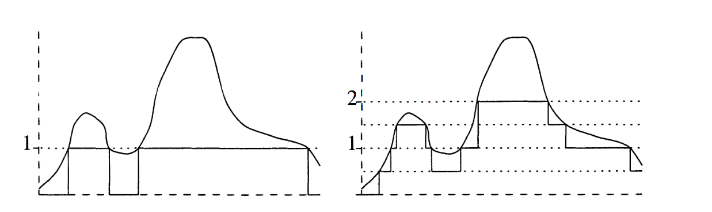

利用测度，我们就可以建立一种新的积分理论，它能够对更大的一类函数，即**可测函数**求积分。在 Riemann 积分理论中，我们首先考虑了分段常值函数的积分，然后使用分段常值函数来逼近一般函数，进而定义了一般 Riemann 可积函数的积分。这里我们也将按照同样的方法，先从一些简单的、在某种意义上常值的函数开始，逐步扩展至更多的函数上。

我们首先将考虑定义在抽象测度空间上的函数，最后我们会将注意力转向 $\mathbb{R}$ 上的 Lebesgue 测度与 Lebesgue 积分，以及它在 $\mathbb{R}^{n}$ 上的扩展。

# Section 1: 可测函数

**定义 21.1.1** 可测函数（measurable function）

设 $(X,\mathcal{M}),(Y,\mathcal{N})$ 是可测空间，函数 $f\colon X\to Y$ 是 $(\mathcal{M},\mathcal{N})$**-可测的**，如果对任意 $E \in \mathcal{N}$ 有 $f^{-1}[E]\in \mathcal{M}$.

换言之，一个函数是可测的当且仅当可测集的原像是可测的。显然可测函数的复合是可测的：如果 $f$ 是 $(\mathcal{M},\mathcal{N})$-可测的，$g$ 是 $(\mathcal{N},\mathcal{O})$-可测的，那么 $g\circ f$ 是 $(\mathcal{M},\mathcal{O})$-可测的。

**定理 21.1.2**

设 $(X,\mathcal{M}),(Y,\mathcal{N})$ 是可测空间，$\mathcal{N}$ 由 $\mathcal{E}\subset \mathscr{P}(Y)$ 生成，那么函数 $f\colon X\to Y$ 是 $(\mathcal{M},\mathcal{N})$-可测的当且仅当对任意 $E \in \mathcal{E}$ 有 $f^{-1}[E]\in \mathcal{M}$.

**证明**

$f$ 可测显然可以推出后面的命题，现设对任意 $E \in \mathcal{E}$ 有 $f^{-1}[E]\in \mathcal{M}$，那么 $\{ E \subset Y \mid f^{-1}[E] \in \mathcal{M} \}$ 是一个包含 $\mathcal{E}$ 的 $\sigma$-代数，自然也包含 $\mathcal{N}$，即证。

回顾一下，一个度量空间（或拓扑空间）的 Borel $\sigma$-代数是由开集生成的，因此根据上面的定理我们有推论：

**定理 21.1.3**

设 $X,Y$ 是度量空间（拓扑空间），那么连续函数 $f\colon X\to Y$ 是 $(\mathcal{B}_{X},\mathcal{B}_{Y})$-可测的。

对于实值函数也是一样：

**定理 21.1.4**

设 $(X,\mathcal{M})$ 是可测空间，函数 $f\colon X\to \mathbb{R}$，那么以下命题等价：

1. $f$ 是 $(\mathcal{M},\mathcal{B}_{\mathbb{R}})$-可测的。
2. 对任意 $a \in \mathbb{R}$ 有 $f^{-1}[(a,+\infty)]\in \mathcal{M}$
3. 对任意 $a \in \mathbb{R}$ 有 $f^{-1}[[a,+\infty)]\in \mathcal{M}$
4. 对任意 $a \in \mathbb{R}$ 有 $f^{-1}[(-\infty,a)]\in \mathcal{M}$
5. 对任意 $a \in \mathbb{R}$ 有 $f^{-1}[(-\infty,a]]\in \mathcal{M}$

对于实值函数或者复值函数，其陪域的 $\sigma$-代数将总是取为 $\mathcal{B}_{\mathbb{R}}$ 或者 $\mathcal{B}_{\mathbb{C}}$，除非特殊指定。称定义在 $(X,\mathcal{M})$ 上的实值或者复值函数是 $\mathcal{M}$**-可测的**，如果它是 $(\mathcal{M},\mathcal{B}_{\mathbb{R}})$-可测的或者 $(\mathcal{M},\mathcal{B}_{\mathbb{C}})$-可测的。特别地，称函数 $f\colon \mathbb{R}\to \mathbb{R}$ 是 **Lebesgue 可测的**或者 **Borel 可测的**，如果 $f$ 是 $(\mathcal{L},\mathcal{B}_{\mathbb{R}})$-可测的或者 $(\mathcal{B}_{\mathbb{R}},\mathcal{B}_{\mathbb{R}})$-可测的，对复值函数也是一样。

显然，Borel 可测函数一定是 Lebesgue 可测的。然而，两个 Lebesgue 可测函数 $f,g$ 的复合 $f\circ g$ 不一定是 Lebesgue 可测的：对于 $E \in \mathcal{B}_{\mathbb{R}}$ 我们有 $f^{-1}[E]\in \mathcal{L}$，但除非 $f^{-1}[E]\in \mathcal{B}_{\mathbb{R}}$ 否则 $g^{-1}[f^{-1}[E]]$ 不一定属于 $\mathcal{L}$. 不过，Borel 可测函数的复合的确是 Borel 可测的。

有时我们需要考虑函数在 $X$ 的子集上的可测性，设 $f$ 是定义在 $(X,\mathcal{M})$ 上的函数，$E \in \mathcal{M}$，我们说 $f$ **在** $E$ **上可测**，如果对任意 Borel 集 $B$ 有 $f^{-1}[B]\cap E \in \mathcal{M}$. 另一种等价的说法是，函数 $f|_{E}$ 是 $\mathcal{M}_{E}$-可测的，其中 $\mathcal{M}_{E}=\{ F\cap E \mid F \in \mathcal{M} \}$.

**定理 21.1.5**

设 $(X,\mathcal{M})$ 是可测空间，$X=Y\cup Z$，其中 $Y,Z \in \mathcal{M}$，那么函数 $f$ 在 $X$ 上 $\mathcal{M}$-可测当且仅当 $f$ 在 $Y$ 上和 $Z$ 上 $\mathcal{M}$-可测。

**证明**

如果 $f$ 在 $X$ 上可测，那么对任意 Borel 集 $B$ 有 $f^{-1}[B]\in \mathcal{M}$，从而 $f^{-1}[B]\cap Y \in \mathcal{M}$，$f^{-1}[B]\cap Z\in \mathcal{M}$，即 $f$ 在 $Y,Z$ 上可测。反之，对任意 $B$ 有 $f^{-1}[B]\cap Y \in \mathcal{M},f^{-1}[B]\cap Z \in \mathcal{M}$，其并集为 $f^{-1}[B]\in \mathcal{M}$，即证。

下面我们来回答一个上一章出现的问题，即乘积 $\sigma$-代数的定义中为什么要使用 $\pi_{\alpha}^{-1}[E_{\alpha}]$ 来生成。我们考虑以下问题：设 $(X,\mathcal{M})$ 和 $(Y_{\alpha},\mathcal{N}_{\alpha})$ 是可测空间，对每个 $\alpha$，都有一个函数 $f_{\alpha}\colon X\to Y_{\alpha}$，那么在 $X$ 上存在一个最小的 $\sigma$-代数使得所有的 $f_{\alpha}$ 都是可测的，即由 $f_{\alpha}^{-1}[E_{\alpha}]$ 生成的 $\sigma$-代数。到这一步就很清楚了：我们取 $f=(f_{\alpha})_{\alpha \in A}$ 是从 $X$ 到直积集合的函数，那么有 $f_{\alpha}=\pi_{\alpha}\circ f$，从而 $f_{\alpha}^{-1}[E_{\alpha}]=f^{-1}[\pi_{\alpha}^{-1}[E_{\alpha}]]$，这里就出现了乘积 $\sigma$-代数。

**定理 21.1.6**

设 $(X,\mathcal{M}),(Y_{\alpha},\mathcal{N}_{\alpha}),\alpha \in A$ 是可测空间，$Y=\prod_{\alpha \in A}Y_{\alpha},\mathcal{N}=\bigotimes_{\alpha \in A}\mathcal{N}_{\alpha}$，那么 $f\colon X\to Y$ 是 $(\mathcal{M},\mathcal{N})$-可测的当且仅当每个 $f_{\alpha}=\pi_{\alpha}\circ f$ 是 $(\mathcal{M},\mathcal{N}_{\alpha})$-可测的。

**证明**

设 $f$ 是可测的，由于 $\pi_{\alpha}$ 是可测的，故 $f_{\alpha}=\pi_{\alpha}\circ f$ 是可测的。反之，对任意 $E_{\alpha}\in \mathcal{N}_{\alpha}$，有 $f^{-1}[\pi_{\alpha}^{-1}[E_{\alpha}]]=f_{\alpha}^{-1}[E_{\alpha}]\in \mathcal{M}$，根据定理 21.1.2 得 $f$ 是可测的。

上述定理使我们能够专注于单个维度 $f_{\alpha}$ 的可测性研究，一个例子是复值函数，由于 $\mathcal{B}_{\mathbb{C}}=\mathcal{B}_{\mathbb{R}^{2}}=\mathcal{B}_{\mathbb{R}}\otimes \mathcal{B}_{\mathbb{R}}$，故有：

**定理 21.1.7**

设 $(X,\mathcal{M})$ 是可测空间，函数 $f\colon X\to \mathbb{C}$ 是可测的当且仅当 $\mathrm{Re}\ f$ 和 $\mathrm{Im}\ f$ 是可测的。

上述定理也可以推广至 $X$ 到 $\mathbb{R}^{n}$ 的函数。下面我们考虑 $f\colon X\to \mathbb{R}^{*}$ 的函数，我们定义 $\mathbb{R}^{*}$ 上的 Borel $\sigma$-代数为 $\mathcal{B}_{\mathbb{R}^{*}}=\{ E\subset \mathbb{R}^{*}\mid E\cap \mathbb{R} \in \mathcal{B}_{\mathbb{R}} \}$，也就是说，$\mathbb{R}^{*}$ 上的 Borel 集就是 $\mathbb{R}$ 上的 Borel 集添加上 $\{ -\infty,+\infty \}$ 两个元素构成的，从而射线 $(a,+\infty]$ 或者 $[-\infty,a)$ 可以生成 $\mathcal{B}_{\mathbb{R}^{*}}$，进而得到与定理 21.1.4 类似的结果。

**定理 21.1.8**

设 $(X,\mathcal{M})$ 是可测空间，如果 $f\colon X\to \mathbb{C},g\colon X\to \mathbb{C}$ 是 $\mathcal{M}$-可测的，那么 $f+g,fg$ 都是 $\mathcal{M}$-可测的。如果对任意 $x \in X$ 有 $g(x)\neq 0$，那么函数 $\dfrac{1}{g}$ 也是 $\mathcal{M}$-可测的。

**证明**

$f+g,fg$ 分别是直和 $f\oplus g$ 与加法函数、乘法函数的复合，加法和乘法函数是连续的，从而 $(\mathcal{B}_{\mathbb{C}},\mathcal{B}_{\mathbb{C}})$-可测，根据定理 21.1.6，$f\oplus g$ 是 $\mathcal{M}$-可测的，故 $f+g,fg$ 是 $\mathcal{M}$-可测的。由于倒数函数 $x\mapsto \dfrac{1}{x}$ 在 $x\neq 0$ 处连续，从而 $\dfrac{1}{g}$ 作为 $g$ 和倒数函数的复合是 $\mathcal{M}$-可测的。

上述定理对 $X$ 到 $\mathbb{R}^{*}$ 的函数也成立，只要我们避开诸如 $\infty-\infty$ 或者 $0\cdot \infty$ 这样的未定式即可。

下面我们考虑函数序列的逐点极限与可测性的联系。

**定理 21.1.9**

设 $(X,\mathcal{M})$ 是可测空间，对任意 $j$，函数 $f_{j}\colon X\to \mathbb{R}^{*}$ 是 $\mathcal{M}$-可测的，那么函数

$$
\begin{gather}
g_{1}(x)=\sup_{j\geq 0} f_{j}(x), g_{2}(x)=\inf_{j\geq 0} f_{j}(x) \\
g_{3}(x)=\limsup_{ j \to \infty } f_{j}(x),g_{4}(x)=\liminf_{ j \to \infty } f_{j}(x)
\end{gather}
$$

都是 $\mathcal{M}$-可测的。如果对任意 $x \in X$，极限 $f(x)=\lim_{ j \to \infty }f_{j}(x)$ 都存在，那么 $f$ 也是 $\mathcal{M}$-可测的。

**证明**

我们有

$$
g_{1}^{-1}[(a,+\infty]]=\bigcup_{j=0}^{\infty} f_{j}^{-1}[(a,+\infty]],g_{2}^{-1}[[-\infty,a)]=\bigcup_{j=0}^{\infty} f_{j}^{-1}[[-\infty,a)]
$$

从而 $g_{1},g_{2}$ 都是 $\mathcal{M}$-可测的。设 $h_{k}(x)=\sup_{j\geq k}f_{j}(x)$，则根据上面的论述，$h_{k}$ 都是可测的，从而 $g_{3}(x)=\inf_{k\geq 0}h_{k}(x)$ 是可测的，同理 $g_{4}$ 也是可测的。如果 $f$ 存在，那么 $f=g_{3}=g_{4}$ 是可测的，这就完成了证明。

由上述定理可知，如果函数 $f,g$ 都是可测的，那么 $\max(f,g),\min(f,g)$ 也是可测的，从而实值函数 $f$ 的正数部分 $f^{+}$ 和负数部分 $f^{-}$ 都是可测的。

此外，对于复值函数，我们也有极分解：$f=(\mathrm{sgn}\ f)|f|$，其中

$$
\mathrm{sgn}\ z=\begin{cases}
\dfrac{z}{|z|} &, z\neq 0 \\
0 &, z=0
\end{cases}
$$

从而 $\mathrm{sgn}$ 在 $z\neq 0$ 处连续，如果 $U\subset \mathbb{C}$ 是开集，那么 $\mathrm{sgn}^{-1}[U]$ 或者是开集 $V$，或者是 $V\cup \{ 0 \}$，其中 $V$ 是开集，这些都是 Borel 集，故 $\mathrm{sgn}$ 是 Borel 可测的，从而如果 $f$ 是可测的，那么 $|f|,\mathrm{sgn}\ f$ 都是可测的。

**定理 21.1.10**

如果函数 $f\colon \mathbb{R}\to \mathbb{R}$ 是单调的，那么 $f$ 是 Borel 可测的。

**证明**

不妨设 $f$ 是单调递增的，那么对任意 $a \in \mathbb{R}$，$f^{-1}[(a,+\infty)]$ 或者是 $\varnothing$，或者是 $(b,+\infty)$，或者是 $[b,+\infty)$，又或者是 $\mathbb{R}$，这些都是 Borel 集，因此 $f$ 是 Borel 可测的。

# Section 2: 简单函数的积分

现在我们介绍积分理论的基础结构，即**简单函数**，它与 Riemann 积分中的分段常值函数起到相同的作用。

**定义 21.2.1** 特征函数（characteristic function），指示函数（indicator function）

设 $X$ 是一个集合，$E\subset X$ 的**特征函数**或**指示函数**定义为

$$
\chi_{E}(x)=\begin{cases}
1 &, x \in E \\
0 &, x \in X\setminus E
\end{cases}
$$

有时也记作 $1_{E}$.

显然，特征函数是可测的当且仅当 $E$ 是可测的。

**定义 21.2.2** 简单函数（simple function）

设 $(X,\mathcal{M})$ 是可测空间，$X$ 上的一个**简单函数**是函数 $f\colon X\to \mathbb{C}$ 满足

$$
f=\sum_{j=1}^{n} z_{j}\chi_{E_{j}},\mathrm{im}(f)=\{ z_{1},\dots,z_{n} \},E_{j}=f^{-1}[\{ z_{j} \}] \in \mathcal{M}
$$

这被称为简单函数的**标准表示**。根据定义我们可知，简单函数一定是可测的。注意，$f$ 的值域中可能包含 $0$，但我们仍然可以将其作为标准表示的一部分。

**定理 21.2.3**

设 $(X,\mathcal{M})$ 是可测空间，$f,g$ 是 $X$ 上的简单函数，那么 $f+g$ 和 $cf$ 都是简单函数，其中 $c \in \mathbb{C}$.

**证明**

设 $f=\sum_{j=1}^{n}z_{j}\chi_{E_{j}},g=\sum_{j=1}^{m}w_{j}\chi_{F_{j}}$，则

$$
f+g=\sum_{j,k}(z_{j}+w_{k})\chi_{E_{j}\cap F_{k}}
$$

每个 $E_{j}\cap F_{k}\in \mathcal{M}$，因此 $f+g$ 是简单函数。$cf$ 是简单函数是显然的。

以上给出了简单函数的两个基本性质：简单函数是特征函数的线性组合，$X$ 上的简单函数构成一个向量空间。下面我们证明，使用简单函数可以逼近可测函数，这是我们建立积分理论的基础。

**定理 21.2.4**

设 $(X,\mathcal{M})$ 是可测空间，我们有：

1. 如果 $f\colon X\to[0,+\infty]$ 是可测的，那么存在简单函数 $(\phi_{n})_{n=0}^{\infty}$ 满足 $\phi_{n}\colon X\to[0,+\infty)$，$0\leq \phi_{0}(x)\leq \phi_{1}(x)\leq\dots\leq f(x)$，且 $(\phi_{n})_{n=0}^{\infty}$ 逐点收敛于 $f$. 此外，$(\phi_{n})_{n=0}^{\infty}$ 在 $f$ 有界的集合上一致收敛于 $f$.
2. 如果 $f\colon X\to \mathbb{C}$ 是可测的，那么存在简单函数 $(\phi_{n})_{n=0}^{\infty}$ 满足 $\phi_{n}\colon X\to \mathbb{C}$，$0\leq|\phi_{0}(x)|\leq|\phi_{1}(x)|\leq\dots\leq|f(x)|$，且 $(\phi_{n})_{n=0}^{\infty}$ 逐点收敛于 $f$. 此外，$(\phi_{n})_{n=0}^{\infty}$ 在 $f$ 有界的集合上一致收敛于 $f$.

**证明**

(1). 对 $n\geq 0$ 和 $0\leq k\leq 2^{2n}-1$，令

$$
E_{nk}=f^{-1}[(k 2^{-n},(k+1)2^{-n}]],F_{n}=f^{-1}[(2^{n},+\infty]]
$$

并定义

$$
\phi_{n}=\sum_{k=0}^{2^{2n}-1} k 2^{-n} \chi_{E_{nk}}+2^{n}\chi_{F_{n}}
$$

如图所示，显然我们有 $\phi_{n}(x)\leq \phi_{n+1}(x)\leq f(x)$，并且对任意 $f(x)\leq 2^{n}$ 的 $x$ 有 $0\leq f(x)-\phi_{n}(x)\leq 2^{-n}$. 如果 $f(x)$ 是有限的，那么存在 $n$ 使得 $f(x)\leq 2^{n}$，于是 $|f(x)-\phi_{n}(x)|\leq 2^{-n}$，从而 $f(x)=\lim_{ n \to \infty }\phi_{n}(x)$，如果 $f(x)=+\infty$，那么 $\phi_{n}(x)=2^{n}$，从而也有 $f(x)=\lim_{ n \to \infty }\phi_{n}(x)$. 如果 $f$ 在 $Y \subset X$ 上是有界的，那么存在 $n$ 使得对任意 $x \in Y$ 有 $f(x)\leq 2^{n}$，从而 $\phi_{n}$ 一致收敛于 $f$，即证。

(2). 设 $f=g+ih$，我们可以将其分解为 $g=g^{+}-g^{-},h=h^{+}-h^{-}$，对其分别应用 1 得到简单函数序列 $\psi_{n}^{+},\psi_{n}^{-},\zeta_{n}^{+},\zeta_{n}^{-}$ 分别逼近 $g^{+},g^{-},h^{+},h^{-}$，令

$$
\phi_{n}=\psi_{n}^{+}-\psi_{n}^{-}+i (\zeta_{n}^{+}-\zeta_{n}^{-})
$$

由于在每一点处有 $\psi_{n}^{+}(x)\psi_{n}^{-}(x)=0$，故 $|\mathrm{Re}(\phi_{n})|^{2}=(\psi_{n}^{+})^{2}+(\psi_{n}^{-})^{2}$，它是递增的，同理 $|\mathrm{Im}(\phi_{n})|^{2}$ 也是递增的，从而 $|\phi_{n}|$ 也是递增的，并且有上界 $|f|$. 剩下的断言根据 1 即证。

前面我们一直在讨论可测空间 $(X,\mathcal{M})$ 上的函数，为了做积分，我们需要将 $\mathcal{M}$ 上的测度 $\mu$ 考虑进来。在研究集合的测度时，我们通常需要将一些零测集排除在外，在这种情况下，$\mu$ 的完备性可以帮助我们省去很多麻烦。

**定理 21.2.5**

设 $(X,\mathcal{M},\mu)$ 是测度空间，以下命题成立当且仅当 $\mu$ 是完备的：

1. 如果 $f$ 是 $\mathcal{M}$-可测的，并且 $f=g$ $\mu$-a.e.，那么 $g$ 是 $\mathcal{M}$-可测的。
2. 如果每个 $f_{n}$ 是 $\mathcal{M}$-可测的，并且 $f_{n}$ 逐点收敛于 $f$ $\mu$-a.e.，那么 $f$ 是 $\mathcal{M}$-可测的。

**证明**

(1). 设 $\mu$ 是完备的，如果 $f=g$ a.e.，即 $f(x)\neq g(x)$ 的 $x$ 构成的集合 $N$ 满足 $\mu(N)=0$，则 $g$ 在 $N$ 上可测，由于 $f$ 是 $\mathcal{M}$-可测的，故 $g$ 在 $N^{c}$ 上可测，由于 $X=N\cup N^{c}$，故 $g$ 是可测的。

反之，设 $f=0$，$E\subset N$，其中 $\mu(N)=0$，设 $g=\chi_{E}$，则 $f=g$ a.e.，从而 $g$ 可测，即 $E=g^{-1}[\{ 1 \}]\in \mathcal{M}$，从而 $\mu$ 是完备的。

(2). 设 $\mu$ 是完备的，$f_{n}$ 逐点收敛到 $f$ a.e.，则 $\lim_{ n \to \infty }f_{n}(x)\neq f(x)$ 的 $x$ 构成的集合 $N$ 满足 $\mu(N)=0$，从而 $f$ 在 $N$ 上可测，由于每个 $f_{n}$ 都是可测的，故 $f$ 在 $N^{c}$ 上可测，从而 $f$ 是 $\mathcal{M}$-可测的。

反之，设 $\mu(N)=0,E\subset N$，令 $f_{n}=0,f=\chi_{E}$，则 $f_{n}$ 逐点收敛于 $f$ a.e.，则 $f$ 可测，从而 $E=f^{-1}[\{ 1 \}]\in \mathcal{M}$，即 $\mu$ 是完备的。

不过，下面的定理表明，即使忘记考虑 $\mu$ 的完备性，我们也不会犯下严重的错误。

**定理 21.2.6**

设 $(X,\mathcal{M},\mu)$ 是测度空间，$(X,\overline{\mathcal{M}},\overline{\mu})$ 是其完备化，如果 $f$ 是 $\overline{\mathcal{M}}$-可测的，那么存在 $\mathcal{M}$-可测的函数 $g$ 使得 $f=g$ $\overline{\mu}$-a.e.

**证明**

任取 $E\cup F \in \overline{\mathcal{M}}$，其中 $E \in \mathcal{M},F\subset N,\mu(N)=0$，如果 $f=\chi_{E\cup F}$，那么有 $g=\chi_{E}$ 使得 $f=g$ $\overline{\mu}$-a.e. 因此当 $f$ 是简单函数时定理成立。

现设 $f$ 是一般的可测函数，那么存在 $\overline{\mathcal{M}}$ 上的简单函数序列 $(\phi_{n})_{n=0}^{\infty}$ 使其逼近 $f$，那么对每个 $n$ 都有 $\mathcal{M}$ 上的简单函数 $\psi_{n}$ 使得 $\phi_{n}$ 和 $\psi_{n}$ 在除 $E_{n}$ 以外的点处相等，其中 $\overline{\mu}(E_{n})=0$，取 $N \in \mathcal{M}$ 使得 $\bigcup_{n=0}^{\infty}E_{n}\subset N$，并且 $\mu(N)=0$，定义 $g(x)=\lim_{ n \to \infty }\psi_{n}\chi_{N^{c}}$，则在 $N^{c}$ 上有 $f=g$，即证。

现在我们定义简单函数的积分。

**定义 21.2.7** 简单函数的积分

设 $(X,\mathcal{M},\mu)$ 是测度空间，$f\colon X\to[0,+\infty)$ 是一个简单函数，其有标准表示 $f=\sum_{j=1}^{n}c_{j}\chi_{E_{j}}$，定义 $f$ 关于 $\mu$ 的**积分**为

$$
\int_{X} f \mathrm{d} \mu=\sum_{j=1}^{n} c_{j} \mu(E_{j})
$$

在此处我们定义 $0\cdot \infty=0$.

对于积分的符号，当测度 $\mu$ 在上下文中是已知的时候，可以省略它，并直接写成 $\int_{X}f$. 设 $A\in \mathcal{M}$，如果 $f$ 是简单函数，那么 $f\chi_{A}$ 也是简单函数：$f\chi_{A}=\sum_{j=1}^{n}c_{j}\chi_{A\cap E_{j}}$，因此我们可以定义

$$
\int_{A}f\mathrm{d} \mu=\int_{X}f\chi_{A} \mathrm{d} \mu
$$

我们默认在整个空间 $X$ 上做积分，因此积分中的 $X$ 可以省略，写成 $\int f$ 或者 $\int f \mathrm{d}\mu$. 有时候，$f$ 是由一个显式公式给出的，那么我们可以使用一个虚拟变量 $x$，并写成 $\int f(x) \mathrm{d}\mu(x)$.

简单函数的积分有一些基本性质，它们最终将被可积函数的性质所取代。

**定理 21.2.8**

设 $(X,\mathcal{M},\mu)$ 是测度空间，$f,g$ 都是 $X$ 到 $[0,+\infty)$ 的简单函数，那么有：

1. 设实数 $c\geq 0$，则 $\int cf=c \int f$
2. $\int(f+g)=\int f+\int g$
3. 如果对任意 $x \in X$ 有 $f(x)\leq g(x)$，那么 $\int f\leq \int g$
4. 函数 $A\mapsto \int_{A}f$ 是 $\mathcal{M}$ 上的一个测度。
5. $\int f=0$ 当且仅当 $f=0$ a.e.

**证明**

1 是显然的。对于 2，设 $f=\sum_{j=1}^{n}a_{j}\chi_{E_{j}},g=\sum_{j=1}^{m}b_{j}\chi_{F_{j}}$，则 $E_{j},F_{k}$ 分别互不相交，并且 $\bigcup_{j=1}^{n}(E_{j}\cap F_{k})=F_{k},\bigcup_{k=1}^{m}(E_{j}\cap F_{k})=E_{j}$，从而

$$
\int(f+g)=\sum_{j,k} (a_{j}+b_{k})\mu(E_{j}\cap F_{k})=\int f+\int g
$$

对于 3，设 $h=g-f$，则 $h$ 是一个非负的简单函数，从而 $\int h\geq 0$，根据 2 即得 $\int g\geq \int f$.

对于 4，首先我们有 $\int_{\varnothing}f=0$，设 $(A_{n})_{n=0}^{\infty}$ 是 $\mathcal{M}$ 中不相交的集合，$A=\bigcup_{n=0}^{\infty}A_{n}$，那么

$$
\int_{A}f=\sum_{j=1}^{n} a_{j}\mu(E_{j}\cap A)=\sum_{j,k}a_{j}\mu(E_{j}\cap A_{k})=\sum_{k=0}^{\infty} \int_{A_{k}}f
$$

即证。最后，如果 $\int f=\sum_{j=1}^{n}a_{j}\mu(E_{j})=0$，那么对于 $a_{j}\neq 0$ 的 $E_{j}$ 有 $\mu(E_{j})=0$，即 $f=0$ a.e. 反之，设 $f=0$ a.e.，则显然也有 $\int f=0$，这就完成了证明。

# Section 3: 非负函数的积分

现在我们将可积函数的范围从简单函数扩展到非负可测函数。与 Riemann 积分一样，我们需要使用**控制函数**的概念，但这里我们使用的是简单函数作为控制函数，并且我们只需要从下方控制即可。

**定义 21.3.1** 非负可测函数的积分

设 $(X,\mathcal{M},\mu)$ 是测度空间，$f\colon X\to[0,+\infty]$ 是可测函数，定义 $f$ 关于 $\mu$ 的**积分**为

$$
\int f \mathrm{d} \mu=\sup \left\{  \int \phi \mathrm{d} \mu \middle| \phi \text{是从下方控制} f \text{的非负简单函数}  \right\}
$$

从上述定义中我们可以立即得到几个结果：

**定理 21.3.2**

设 $(X,\mathcal{M},\mu)$ 是测度空间，$f,g$ 都是 $X$ 到 $[0,+\infty]$ 的可测函数，那么有：

1. 设实数 $c\geq 0$，则 $\int cf=c \int f$
2. 如果对任意 $x \in X$ 有 $f(x)\leq g(x)$，那么 $\int f\leq \int g$
3. $\int f=0$ 当且仅当 $f=0$ a.e.
4. 设 $A \in \mathcal{M}$，那么 $\int_{A}f|_{A}=\int f\chi_{A}\leq \int f$

**证明**

(1). $c=0$ 时是显然的，设 $c>0$，设简单函数 $\psi$ 从下方控制 $cf$，那么 $\dfrac{1}{c}\psi$ 从下方控制 $f$，从而 $\int \psi\leq c \int f$，对 $\psi$ 取上确界得 $\int cf\leq c\int f$.

如果 $\int f<+\infty$，那么对任意 $\varepsilon>0$ 有从下方控制 $f$ 的简单函数 $\phi$ 使得

$$
c\int f-c\varepsilon\leq c \int \phi=\int c\phi\leq c\int f
$$

由于 $c\phi$ 从下方控制 $cf$，故有 $\int cf\geq c\int f$.

如果 $\int f=+\infty$，那么对任意 $M>0$ 有从下方控制 $f$ 的简单函数 $\phi$ 使得 $\int \phi\geq M$，由于 $c\phi$ 从下方控制 $cf$，故 $\int c\phi\geq cM$，由 $M$ 的任意性知 $\int cf=+\infty$，即证。

(2). 对任意从下方控制 $f$ 的简单函数 $\phi$，它都从下方控制 $g$，由上确界的性质得 $\int f\leq \int g$.

(3). 设 $\int f=0$，假设 $\mu(\{ x \mid f(x)>0 \})>0$，由于

$$
\{ x \in X \mid f(x)>0 \}=\bigcup_{n=1}^{\infty} \left\{  x \in X \mid f(x)> \dfrac{1}{n}  \right\}=\bigcup_{n=1}^{\infty} E_{n}
$$

故存在 $n$ 使得 $\mu(E_{n})>0$，于是简单函数 $\phi= \dfrac{1}{n} \chi_{E_{n}}$ 从下方控制 $f$，并且 $\int \phi=\dfrac{1}{n}\mu(E_{n})>0$，这与 $\int f=0$ 矛盾。反之，设 $f=0$ a.e.，那么任意从下方控制 $f$ 的简单函数 $\phi$ 都满足 $\phi=0$ a.e.，从而 $\int \phi=0$，取上确界得 $\int f=0$.

(4). 由于 $f(x)\chi_{A}(x)\leq f(x)$，故 $\int f\chi_{A}\leq \int f$. 设 $\phi$ 是 $A$ 上从下方控制 $f|_{A}$ 的简单函数，对 $\phi$ 做零延拓得到 $\overline{\phi}$，则 $\overline{\phi}$ 从下方控制 $f\chi_{A}$，显然 $\int_{A} \phi=\int \overline{\phi}$，故 $\int_{A}f|_{A}\leq \int f\chi_{A}$.

反之，设 $\psi$ 从下方控制 $f\chi_{A}$，那么 $\psi$ 在 $X\setminus A$ 上一定为 $0$，从而 $\int \psi=\int_{A}\psi|_{A}$，并且 $\psi|_{A}$ 从下方控制 $f|_{A}$，从而 $\int f\chi_{A}\leq \int_{A}f|_{A}$，这就完成了证明。

我们还剩下一个性质没有证明，即积分的可加性。这个性质需要我们拥有更多的工具，特别地，我们有以下的基本收敛定理，这在 Riemann 积分理论中是不成立的。

**定理 21.3.3** 单调收敛定理（monotone convergence theorem）

设 $(X,\mathcal{M},\mu)$ 是测度空间，每个 $f_{n}$ 是 $X$ 到 $[0,+\infty]$ 的可测函数，并且对任意 $n$ 有 $f_{n}(x)\leq f_{n+1}(x)$，设 $f(x)=\lim_{ n \to \infty }f_{n}(x)$，那么

$$
\int f=\lim_{ n \to \infty } \int f_{n}
$$

**证明**

序列 $\left( \int f_{n} \right)$ 单调递增，因此有极限，并且对每个 $n$ 有 $\int f_{n}\leq \int f$，故 $\lim_{ n \to \infty }\int f_{n}\leq \int f$. 反之，令 $\alpha \in(0,1)$，非负简单函数 $\phi$ 从下方控制 $f$，并设 $E_{n}=\{ x \in X \mid f_{n}(x)\geq \alpha \phi(x) \}$，于是 $E_{0}\subset E_{1}\subset\cdots$，其并集为 $X$，并且我们有 $\int f_{n}\geq \int_{E_{n}}f_{n}\geq\alpha \int_{E_{n}}\phi$.

由于 $E\mapsto \int_{E}\phi$ 是一个测度，因此 $\int_{X}\phi=\lim_{ n \to \infty }\int_{E_{n}}\phi$，从而 $\lim_{ n \to \infty }\int f_{n}\geq\alpha \int \phi$，由于上式对任意 $\alpha \in(0,1)$ 都成立，故 $\lim_{ n \to \infty }\int f_{n}\geq \int \phi$，对 $\phi$ 取上确界得 $\lim_{ n \to \infty }\int f_{n}\geq \int f$，这就完成了证明。

简而言之，如果函数序列 $f_{n}$ 递增，那么我们可以交换极限与积分的顺序：

$$
\int \lim_{ n \to \infty } f_{n}=\lim_{ n \to \infty } \int f_{n}
$$

这使得我们可以真正意义上的计算一个积分：取定理 21.2.4 中给出的简单函数，那么我们就有 $\int f=\lim_{ n \to \infty }\int \phi_{n}$. 作为单调收敛定理的一个应用，我们来证明积分的可加性：

**定理 21.3.4**

设 $(X,\mathcal{M},\mu)$ 是测度空间，每个 $f_{n}$ 是 $X$ 到 $[0,+\infty]$ 的可测函数，$f=\sum_{n=0}^{\infty}f_{n}$，那么 $\int f=\sum_{n=0}^{\infty}\int f_{n}$.

**证明**

首先我们证明有限可加性。设 $f,g$ 是非负可测函数，那么有简单函数序列 $(\phi_{n})$ 和 $(\psi_{n})$ 递增且收敛于 $f,g$，那么 $(\phi_{n}+\psi_{n})$ 递增且收敛于 $f+g$，从而

$$
\int(f+g)=\lim_{ n \to \infty } \int(\phi_{n}+\psi_{n})=\lim_{ n \to \infty } \left( \int \phi_{n}+\int \psi_{n} \right)=\int f+\int g
$$

根据归纳法即得 $\int \sum_{j=0}^{n}f_{j}=\sum_{j=0}^{n}\int f_{j}$，令 $n\to \infty$ 并再次使用单调收敛定理，就有 $\int \sum_{j=0}^{\infty}f_{j}=\sum_{j=0}^{\infty}\int f_{j}$.

另一个推论指出，可以把单调收敛定理中的**任意** $x$ 弱化为**几乎所有** $x$.

**定理 21.3.5**

设 $(X,\mathcal{M},\mu)$ 是测度空间，每个 $f_{n}$ 以及 $f$ 是 $X$ 到 $[0,+\infty]$ 的可测函数，如果对 a.e. $x$，$f_{n}(x)$ 单调递增且收敛于 $f(x)$，那么

$$
\int f=\lim_{ n \to \infty }\int f_{n}
$$

**证明**

设对任意 $x \in E$ 有 $\lim_{ n \to \infty }f_{n}(x)=f(x)$，并且 $\mu(E^{c})=0$，那么 $f-f\chi_{E}=0$ a.e.，$f_{n}-f_{n}\chi_{E}=0$ a.e.，从而根据单调收敛定理有

$$
\int f=\int f\chi_{E}=\lim_{ n \to \infty } \int f_{n}\chi_{E}=\lim_{ n \to \infty } \int f_{n}
$$

注意，单调收敛定理中 $f_{n}$ 递增的假设是必要的，否则极限的积分将不等于积分的极限。例如，取 $\mathbb{R}$ 上的 Lebesgue 测度，则 $f_{n}=\chi_{(n,n+1)}$ 逐点收敛于 $0$，但是对每个 $n$ 都有 $\int \chi_{(n,n+1)}=1$. 然而，在这种情况下，我们仍然可以建立一个不等式，如下所示：

**定理 21.3.6** Fatou 引理

设 $(X,\mathcal{M},\mu)$ 是测度空间，每个 $f_{n}$ 是 $X$ 到 $[0,+\infty]$ 的可测函数，那么有

$$
\int \liminf_{ n \to \infty } f_{n} \leq \liminf_{ n \to \infty } \int f_{n}
$$

**证明**

任取 $k\geq 0$，对任意 $j\geq k$ 有 $\inf_{n\geq k}f_{n}\leq f_{j}$，故 $\int \inf_{n\geq k}f_{n}\leq \int f_{j}$，从而 $\int \inf_{n\geq k}f_{n}\leq \inf_{j\geq k}\int f_{j}$，令 $k\to \infty$ 并应用单调收敛定理就有

$$
\int \liminf_{ n \to \infty } f_{n}=\lim_{ k \to \infty } \int \inf_{n\geq k}f_{n} \leq \liminf_{ n \to \infty } \int f_{n}
$$

结合定理 21.3.5 和 21.3.6，我们就有以下推论：

**定理 21.3.7**

设 $(X,\mathcal{M},\mu)$ 是测度空间，每个 $f_{n}$ 以及 $f$ 是 $X$ 到 $[0,+\infty]$ 的可测函数，对 a.e. $x$，$f_{n}(x)$ 逐点收敛于 $f(x)$，那么 $\int f\leq \liminf_{ n \to \infty }\int f_{n}$.

**证明**

设对任意 $x \in E$ 有 $\lim_{ n \to \infty }f_{n}(x)=f(x)$，并且 $\mu(E^{c})=0$，那么有

$$
\int f=\int f\chi_{E}=\int \lim_{ n \to \infty } f_{n}\chi_{E}\leq \liminf_{ n \to \infty } \int f_{n}\chi_{E}=\liminf_{ n \to \infty } \int f_{n}
$$

在非负函数的积分中，我们允许 $f$ 在某些点处取值为 $+\infty$，但 $\int f$ 仍然可以是有限的（例如在零测集上取值）。然而，如果 $\int f$ 有限，那么 $f$ 必定几乎处处有限。

**定理 21.3.8**

设 $(X,\mathcal{M},\mu)$ 是测度空间，$f\colon X\to[0,+\infty]$ 是可测函数，且 $\int f<+\infty$，那么 $\mu(\{ x \in X \mid f(x)=+\infty \})=0$ 并且 $\{ x \in X \mid f(x)>0 \}$ 是 $\sigma$-有限的。

**证明**

设 $E_{\infty}=\{ x \mid f(x)=+\infty \}$，假设 $\mu(E_{\infty})>0$，那么对任意 $M>0$，函数 $\phi=M \chi_{E_{\infty}}$ 从下方控制 $f$，进而 $\int f\geq \int \phi=M\mu(E_{\infty})$，由 $M$ 的任意性知 $\int f=+\infty$，矛盾。因此 $\mu(E_{\infty})=0$.

对任意 $n\geq 1$，令 $E_{n}=\left\{  x \mid f(x)> \dfrac{1}{n}  \right\}$，则 $\{ x \mid f(x)>0 \}=\bigcup_{n=1}^{\infty}E_{n}$，假设某个 $\mu(E_{n})=+\infty$，那么 $\phi=\dfrac{1}{n}\chi_{E_{n}}$ 从下方控制 $f$，从而 $\int f\geq \int \phi=\dfrac{1}{n}\mu(E_{n})=+\infty$，矛盾。因此每个 $\mu(E_{n})<+\infty$，从而 $\{ x \in X \mid f(x)>0 \}$ 是 $\sigma$-有限的。

最后我们再给出一个定理，它可以看成单调收敛定理的“对偶”，处理的是单调递减的函数序列。

**定理 21.3.9**

设 $(X,\mathcal{M},\mu)$ 是测度空间，每个 $f_{n}$ 是 $X$ 到 $[0,+\infty]$ 的可测函数，$\int f_{0}<+\infty$，并且对任意 $n$ 有 $f_{n}(x)\geq f_{n+1}(x)$，设 $f(x)=\lim_{ n \to \infty }f_{n}(x)$，那么

$$
\int f=\lim_{ n \to \infty } \int f_{n}
$$

**证明**

令 $g_{n}=f_{0}-f_{n}$，则 $g_{n}$ 单调递增并且收敛于 $f_{0}-f$，从而根据单调收敛定理有

$$
\int f_{0}-\int f=\int (f_{0}-f)=\lim_{ n \to \infty } \int(f_{0}-f_{n})=\int f_{0}-\lim_{ n \to \infty } \int f_{n}
$$

由于 $\int f_{0}<+\infty$，从两边消去即证。

# Section 4: 可积函数

我们已经介绍完了非负可测函数的积分，对于一般的实值可测函数，我们可以做自然的推广：设 $f=f^{+}-f^{-}$，如果非负积分 $\int f^{+}$ 与 $\int f^{-}$ 至少有一个有限，那么我们就可以定义

$$
\int f=\int f^{+}-\int f^{-}
$$

其中我们主要关注的是 $\int f^{+},\int f^{-}$ 同时有限的情况，这时候我们就称 $f$ 是**可积**的，并且此时也有 $\int|f|=\int f^{+}+\int f^{-}<+\infty$.

对于复值函数，情况也是一样的：$f$ 可积当且仅当 $\mathrm{Re}\ f$ 和 $\mathrm{Im}\ f$ 可积，因为 $|f|\leq|\mathrm{Re}\ f|+|\mathrm{Im}\ f|\leq 2|f|$，因此可积性等价于 $\int|f|<+\infty$. 结合上述讨论，我们给出以下定义：

**定义 21.4.1** 可积（integrable）

设 $(X,\mathcal{M},\mu)$ 是测度空间，$f\colon X\to \mathbb{C}$ 是可测函数，如果 $\int|f|<+\infty$，则称 $f$ 是**可积的**。设 $f=g+ih$ 是可积函数，则定义 $f$ 关于 $\mu$ 的**积分**为

$$
\int f= \int g^{+}-\int g^{-} +i \left( \int h^{+}- \int h^{-} \right)
$$

更一般地，称 $f$ 在 $E \in \mathcal{M}$ 上可积，如果 $\int_{E}|f|<+\infty$.

可积函数的基本性质如下：

**定理 21.4.2**

设 $(X,\mathcal{M},\mu)$ 是测度空间，$X$ 上可积的复值函数构成的集合是一个复向量空间，并且积分 $f\mapsto \int f$ 是其上的一个线性泛函。

**证明**

设 $f,g$ 是可积的，$a,b \in \mathbb{C}$，则 $|af+bg|\leq |a||f|+|b||g|$，从而 $\int|af+bg|<+\infty$，即 $af+bg$ 可积，剩下的向量空间公理可以由 $\mathbb{C}$ 的代数性质推导出来。

下面我们要证 $\int cf=c\int f,c \in \mathbb{C}$，我们已经对 $c\geq 0$ 证明了上述结论，故我们只需证明 $c=-1$ 和 $c=i$ 的情况即可。设 $g=-f$，则

$$
\int g=\int g_{r}^{+}-\int g_{r}^{-}+i \left( \int g_{i}^{+}-\int g_{i}^{-} \right)
$$

由于 $g_{r}^{+}=f_{r}^{-},g_{r}^{-}=f_{r}^{+}$，故 $\int g_{r}^{+}-\int g_{r}^{-}=\int f_{r}^{-}-\int f_{r}^{+}$，虚部同理，从而有

$$
\int g=- \int \mathrm{Re}\ f - i \int \mathrm{Im}\ f=- \int f
$$

再设 $h=if$，则 $h_{i}^{+}=f_{r}^{+},h_{i}^{-}=f_{r}^{-},h_{r}^{+}=f_{i}^{-},h_{r}^{-}=f_{i}^{+}$，从而

$$
\int h=\int f_{i}^{-}-\int f_{i}^{+}+i\left( \int f_{r}^{+}-\int f_{r}^{-} \right)= i \int f
$$

最后我们来证明可加性，我们只需对实值函数证明即可。设 $h=f+g$，则 $h^{+}-h^{-}=f^{+}-f^{-}+g^{+}-g^{-}$，从而

$$
\int h^{+}+\int f^{-}+\int g^{-}=\int h^{-}+\int f^{+}+\int g^{+}
$$

移项再合并就完成了证明。

我们将把这个复向量空间记作 $L^{1}(X,\mu)$，下面我们来研究它的性质。

**定理 21.4.3** 三角不等式（triangle inequality）

设 $f \in L^{1}(X,\mu)$，那么 $\left\lvert  \int f  \right\rvert\leq \int |f|$.

**证明**

当 $\int f=0$ 时是显然的。如果 $f$ 是实值函数，那么有

$$
\left\lvert  \int f  \right\rvert \leq \int f^{+}+\int f^{-}=\int |f|
$$

当 $\int f\neq 0$ 且 $f$ 是复值函数时，设 $\alpha=\overline{\mathrm{sgn}\left( \int f \right)}$，由于 $\int f=\mathrm{sgn}\left( \int f \right)\left\lvert  \int f  \right\rvert$，故 $\left\lvert  \int f  \right\rvert=\alpha \int f=\int \alpha f$，从而

$$
\left\lvert  \int f  \right\rvert =\mathrm{Re} \int \alpha f=\int \mathrm{Re}(\alpha f)\leq \int \lvert \mathrm{Re}(\alpha f) \rvert \leq \int|\alpha f|= \int|f|
$$

**定理 21.4.4**

设 $f,g \in L^{1}(X,\mu)$，则：

1. 如果对任意 $x \in X$ 有 $f(x)\leq g(x)$，那么 $\int f\leq \int g$
2. $\int|f|=0$ 当且仅当 $f=0$ a.e.
3. 设 $A \in \mathcal{M}$，则 $\int_{A}f|_{A}=\int f\chi_{A}$
4. $\{ x \in X \mid f(x)\neq 0 \}$ 是 $\sigma$-有限的。
5. 对任意 $E \in \mathcal{M}$ 有 $\int_{E}f=\int_{E}g$ 当且仅当 $\int|f-g|=0$ 当且仅当 $f=g$ a.e.

**证明**

(1). 根据已知有 $f^{+}-f^{-}\leq g^{+}-g^{-}$，从而 $\int f^{+}+\int g^{-}\leq \int g^{+}+\int f^{-}$，移项即证。

(2). $\int|f|=0$ 当且仅当 $|f|=0$ a.e.，当且仅当 $f=0$ a.e.

(3). 将 $f$ 写成 $g^{+}-g^{-}+i(h^{+}-h^{-})$ 然后使用定理 21.3.2 即证。

(4). 设 $E_{n}=\left\{  x \mid |f(x)|> \dfrac{1}{n}  \right\}$，则 $\{ x \mid f(x)\neq 0 \}=\bigcup_{n=1}^{\infty}E_{n}$，由于 $\int|f|<+\infty$，由定理 21.3.8 得 $\mu(E_{n})<+\infty$，即证。

(5). 第二个等价由 2 给出。设 $\int|f-g|=0$，那么对任意 $E \in \mathcal{M}$ 有

$$
\left\lvert  \int_{E}f-\int_{E}g  \right\rvert \leq \int|f-g|\chi_{E}\leq \int|f-g|=0
$$

即 $\int_{E}f=\int_{E}g$. 反之，假设 $\int|f-g|\neq 0$，设 $u=\mathrm{Re}(f-g),v=\mathrm{Im}(f-g)$，则 $u^{+},u^{-},v^{+},v^{-}$ 至少有一个在 $E,\mu(E)>0$ 上非零，不妨设为 $u^{+}$，则 $\mathrm{Re}\left( \int_{E}f -\int_{E}g \right)= \int_{E}u^{+}>0$，这就完成了证明。

上述定理表明，当我们在考虑积分时，把函数在某个零测集上做改动并不会影响积分的值。实际上，我们可以对几乎处处定义在 $X$ 上的可积函数做积分，即 $f$ 定义在 $E$ 上使得 $\mu(E^{c})=0$，此时我们就可以在 $E^{c}$ 上将 $f$ 重定义为 $f=0$ 而对 $f$ 的积分没有任何影响。在这种情况下，我们可以将几乎处处有限的函数 $f\colon X\to \mathbb{R}^{*}$ 看作一般的实值函数来处理。

在这个原则下，我们发现实际上把 $L^{1}(X,\mu)$ 定义为可积函数的**等价类**，而非单纯的可积函数会更方便，其中 $f$ 等价于 $g$ 如果 $f=g$ a.e.，并且这个新的空间 $L^{1}(X,\mu)$ 仍然是一个复向量空间。尽管 $L^{1}(X,\mu)$ 是等价类构成的集合，但我们仍然可以写 $f \in L^{1}(X,\mu)$ 以表示 $f$ 是几乎处处定义在 $X$ 上的可积函数，这种符号的滥用是被广泛接受的，并且不会造成严重的错误。

这个新定义的 $L^{1}(X,\mu)$ 还有两大优点。第一，如果 $\overline{\mu}$ 是 $\mu$ 的完备化，那么定理 21.2.6 表明 $L^{1}(X,\overline{\mu})$ 和 $L^{1}(X,\mu)$ 之间存在一一对应，因此我们可以把这两个空间等同，进而 $L^{1}(X,\mu)$ 中的测度总是完备的。第二，在新的定义下，我们就可以在 $L^{1}(X,\mu)$ 上定义度量：$d_{L^{1}}(f,g)=\int|f-g|$，对称性和三角不等式是容易验证的，然而 $d_{L^{1}}(f,g)=0$ 当且仅当 $f=g$ a.e.，要满足度量的定义，我们需要让 $f=g$，这只有当 $f$ 和 $g$ 是函数的等价类时才能做到。因此，我们有以下定义：

**定义 21.4.5** $L^{1}$ 范数，$L^{1}$ 度量

定义 $L^{1}(X,\mu)$ 上的**范数**为

$$
\lVert f \rVert _{1}=\int |f| \mathrm{d} \mu
$$

由范数诱导的**度量**为

$$
d_{L^{1}}(f,g)=\lVert f-g \rVert _{1}=\int |f-g| \mathrm{d} \mu
$$

于是现在，函数序列的收敛方式又多了一种，即 $L^{1}$ 收敛，它与 $L^{2}$ 收敛一样，都属于一类更大的收敛方式，即 $L^{p}$ 收敛。

下面我们给出三大基本收敛定理中的最后一个（其它两个是单调收敛定理和 Fatou 引理），它表明如果 $|f_{n}|$ 可以被一个可积函数控制，那么积分和极限就可以互换顺序。

**定理 21.4.6** 控制收敛定理（dominated convergence theorem）

设 $(f_{n})_{n=0}^{\infty}$ 是 $L^{1}(X,\mu)$ 中的序列，$f_{n}$ 逐点收敛于 $f$ a.e.，并且存在非负函数 $g \in L^{1}(X,\mu)$ 使得对任意 $n$ 有 $|f_{n}|\leq g$ a.e.，那么 $f \in L^{1}(X,\mu)$ 且

$$
\int f=\lim_{ n \to \infty } \int f_{n}
$$

**证明**

通过在某个零测集上对 $f$ 重新定义，可以使 $f$ 是可测的。由于 $|f|\leq g$ a.e.，故 $\int|f|\leq \int g<+\infty$，从而 $f \in L^{1}(X,\mu)$. 通过取 $f$ 和 $f_{n}$ 的实部和虚部，我们可以设 $f$ 和 $f_{n}$ 都是实值函数，从而我们有 $g+f_{n}\geq 0$ a.e. 且 $g-f_{n}\geq 0$ a.e.，根据 Fatou 引理得

$$
\begin{gather}
\int g+\int f\leq \liminf_{ n \to \infty } \int(g+f_{n})=\int g+\liminf_{ n \to \infty } \int f_{n} \\
\int g-\int f\leq \liminf_{ n \to \infty } \int(g-f_{n})=\int g -\limsup_{ n \to \infty } \int f_{n}
\end{gather}
$$

于是 $\limsup_{ n \to \infty }\int f_{n}\leq \int f\leq \liminf_{ n \to \infty }\int f_{n}$，即证。

事实上，通过对上述证明进行少量更改，我们可以得到一个更广义的控制收敛定理。

**定理 21.4.7**

设 $(f_{n})_{n=0}^{\infty},(g_{n})_{n=0}^{\infty}$ 是 $L^{1}(X,\mu)$ 中的序列，$f,g \in L^{1}(X,\mu)$，$f_{n}$ 逐点收敛于 $f$ a.e.，$g_{n}$ 逐点收敛于 $g$ a.e.，$\int g_{n}$ 收敛于 $\int g$，并且 $|f_{n}|\leq g_{n}$，那么 $\lim_{ n \to \infty } \int f_{n}=\int f$.

**证明**

我们可以设 $f_{n},f$ 是实值函数，于是 $g_{n}+f_{n}\geq 0$ a.e.，$g_{n}-f_{n}\geq 0$ a.e.，根据 Fatou 引理，我们有

$$
\begin{gather}
\int g+\int f\leq \liminf_{ n \to \infty } \int(g_{n}+f_{n})=\int g+\liminf_{ n \to \infty } \int f_{n} \\
\int g-\int f\leq \liminf_{ n \to \infty } \int(g_{n}-f_{n})=\int g-\limsup_{ n \to \infty } \int f_{n}
\end{gather}
$$

从而 $\lim_{ n \to \infty }\int f_{n}=\int f$.

作为控制收敛定理的一个应用，我们给出以下定理：

**定理 21.4.8**

设 $(f_{n})_{n=0}^{\infty}$ 是 $L^{1}(X,\mu)$ 中的序列，满足 $\sum_{n=0}^{\infty}\int|f_{n}|<+\infty$，那么 $\sum_{n=0}^{\infty}f_{n}$ 逐点收敛于 $f \in L^{1}(X,\mu)$ a.e.，并且

$$
\int f=\sum_{n=0}^{\infty} \int f_{n}
$$

**证明**

我们有 $\int \sum_{n=0}^{\infty}|f_{n}|=\sum_{n=0}^{\infty}\int|f_{n}|<+\infty$，因此 $g=\sum_{n=0}^{\infty}|f_{n}| \in L^{1}(X,\mu)$，并且 $g$ 从上方控制部分和 $\left\lvert  \sum_{j=0}^{n} f_{j} \right\rvert$. 此外，对于 a.e. $x$，级数 $\sum_{n=0}^{\infty}|f_{n}(x)|$ 收敛，故对于这些 $x$，$\sum_{n=0}^{\infty}f_{n}$ 逐点收敛，根据控制收敛定理，我们有

$$
\int \sum_{n=0}^{\infty} f_{n}=\sum_{n=0}^{\infty} \int f_{n}
$$

我们可以对比一下上述定理和定理 16.5.2，可见，利用这个新的积分定义，我们可以很好地对积分、极限以及求和进行交互，而不再需要一致收敛这个严格的要求。下面，我们再来考虑积分如何与导数进行交互。

**定理 21.4.9**

设实数 $a<b$，$(X,\mathcal{M},\mu)$ 是测度空间，函数 $f\colon X\times[a,b]\to \mathbb{C}$ 满足对任意 $t \in[a,b]$，函数 $f(\cdot,t)\colon X\to \mathbb{C}$ 是可积的，定义 $F(t)=\int_{X}f(x,t)\mathrm{d}\mu(x)$，则有：

1. 如果存在 $g \in L^{1}(X,\mu)$ 使得对任意 $x,t$ 有 $|f(x,t)|\leq g(x)$，并且对任意 $x$，函数 $f(x,\cdot)$ 在 $t_{0}\in[a,b]$ 处连续，那么 $F$ 也在 $t_{0}$ 处连续。
2. 如果偏导数 $\dfrac{ \partial f }{ \partial t }$ 存在并且存在 $g \in L^{1}(X,\mu)$ 使得对任意 $x,t$ 有 $\left\lvert  \dfrac{ \partial f }{ \partial t }(x,t)  \right\rvert\leq g(x)$，那么 $F$ 是可微的，并且 $$
F'(t)=\int_{X}\dfrac{ \partial f }{ \partial t } (x,t)\mathrm{d} \mu(x)
$$

**证明**

(1). 取收敛于 $t_{0}$ 的实数序列 $(t_{n})$，设 $f_{n}(x)=f(x,t_{n})$，那么有 $|f_{n}|\leq g$，并且 $f_{n}(x)$ 逐点收敛于 $f(x,t_{0})$，由控制收敛定理，我们有

$$
\lim_{ n \to \infty } F(t_{n})=\lim_{ n \to \infty } \int_{X}f(x,t_{n})\mathrm{d} \mu(x)=\int_{X}f(x,t_{0})\mathrm{d} \mu(x)=F(t_{0})
$$

(2). 设 $h_{n}=\dfrac{f(x,t_{n})-f(x,t_{0})}{t_{n}-t_{0}}$，则 $\dfrac{ \partial f }{ \partial t }(x,t_{0})=\lim_{ n \to \infty }h_{n}$，从而 $\dfrac{ \partial f }{ \partial t }$ 是可测的，并且根据中值定理有

$$
|h_{n}(x)|\leq \left\lvert  \dfrac{ \partial f }{ \partial t } (x,\xi)  \right\rvert \leq g(x)
$$

因此根据控制收敛定理有

$$
F'(t_{0})=\lim_{ n \to \infty } \dfrac{F(t_{n})-F(t_{0})}{t_{n}-t_{0}}=\lim_{ n \to \infty } \int_{X} h_{n}(x)\mathrm{d} \mu(x)=\int_{X}\dfrac{ \partial f }{ \partial t } (x,t_{0})\mathrm{d} \mu(x)
$$

这就完成了证明。

在这之后，我们来考虑 $L^{1}(X,\mu)$ 的拓扑性质，我们有如下定理：

**定理 21.4.10**

设 $f \in L^{1}(X,\mu),\varepsilon>0$，那么存在简单函数 $\phi=\sum_{j=1}^{n}a_{j}\chi_{E_{j}} \in L^{1}(X,\mu)$ 使得 $\lVert \phi-f \rVert_{1}<\varepsilon$. 如果 $\mu$ 是 $\mathbb{R}$ 上的 Lebesgue-Stieltjes 测度，那么 $\phi$ 定义中的 $E_{j}$ 可以取为开区间的有限并集，并且存在一个支撑在有界区间上的连续函数 $g$ 使得 $\lVert f-g \rVert_{1}<\varepsilon$.

**证明**

取定理 21.2.4 中的 $\phi_{n}$，则 $|\phi_{n}-f|\leq 2|f|$，根据控制收敛定理有

$$
\lim_{ n \to \infty } \int |\phi_{n}-f|=0
$$

即存在 $n$ 使得 $\lVert \phi_{n}-f \rVert<\varepsilon$.

如果 $\mu$ 是一个 Lebesgue-Stieltjes 测度，设 $\phi_{n}=\sum_{j=1}^{n}a_{j}\chi_{E_{j}}$，其中 $a_{j}\neq 0$，那么

$$
\mu(E_{j})= \dfrac{1}{|a_{j}|}\int_{E_{j}}|\phi_{n}|\leq \dfrac{1}{|a_{j}|}\int_{E_{j}}|f|<+\infty
$$

从而根据定理 20.4.7 知存在开区间的有限并集 $A$ 使得

$$
\mu(E_{j}\Delta A)=\int |\chi_{E_{j}}-\chi_{A}|<\varepsilon
$$

因此 $\chi_{E_{j}}$ 可以使用有限个开区间的特征函数 $\chi_{I_{k}}$ 近似，此外，每个 $\chi_{I_{k}}$ 都可以用一个支撑在有界区间上的连续函数逼近：设 $I_{k}=(a,b)$，令

$$
g(x)=\begin{cases}
\dfrac{1}{\varepsilon}(x-a), &, x \in(a,a+\varepsilon) \\
1 &, x \in[a+\varepsilon,b-\varepsilon] \\
- \dfrac{1}{\varepsilon}(x-b) &, x \in(b-\varepsilon,b) \\
0 &, x \in \mathbb{R}\setminus (a,b)
\end{cases}
$$

则 $g$ 是连续的，支撑在有界区间上，并且 $\int|\chi_{(a,b)}-g|<\varepsilon$. 结合上述讨论，我们就完成了证明。

简单来说，上述定理表明，$L^{1}(X,\mu)$ 中的简单函数（按 $L^{1}$ 度量）在 $L^{1}(X,\mu)$ 中是稠密的。

最后，我们把测度取为 $\mathbb{R}$ 上的 Lebesgue 测度 $m$，那么我们在本章中建立的积分理论就称为 **Lebesgue 积分**。作为 Riemann 积分的一个扩展，有如下定理成立：

**定理 21.4.11**

设实数 $a<b$，函数 $f\colon [a,b]\to \mathbb{R}$ 是有界的，则：

1. 如果 $f$ 是 Riemann 可积的，那么 $f$ 也是 Lebesgue 可积的，并且 $\int_{a}^{b}f(x)\mathrm{d}x=\int_{[a,b]}f\mathrm{d}m$
2. $f$ 是 Riemann 可积的当且仅当 $f$ 的间断点构成的集合具有 Lebesgue 测度零。

**证明**

(1). 设 $f$ 是 Riemann 可积的，$\mathbf{P}$ 是 $[a,b]$ 的一个划分（不含空集），定义

$$
G^{+}_{\mathbf{P}}=\sum_{J \in \mathbf{P}} (\sup_{x \in J} f(x)) \chi_{J},G^{-}_{\mathbf{P}}=\sum_{J \in \mathbf{P}} (\inf_{x \in J} f(x)) \chi_{J}
$$

于是 $U(f,\mathbf{P})=\int G_{\mathbf{P}}^{+}\mathrm{d}m,L(f,\mathbf{P})=\int G_{\mathbf{P}}^{-}\mathrm{d}m$. 取一列划分 $\mathbf{P}_{n}$，每个划分都比前一个更细，并且其中区间的长度趋于 $0$，那么

$$
\int_{a}^{b}f = \lim_{ n \to \infty } U(f,\mathbf{P}_{n})=\lim_{ n \to \infty } L(f,\mathbf{P}_{n})
$$

令 $G^{+}=\lim_{ n \to \infty }G_{\mathbf{P}_{n}}^{+},G^{-}=\lim_{ n \to \infty }G_{\mathbf{P}_{n}}^{-}$，则 $G_{\mathbf{P}_{1}}^{-}\leq G^{-}\leq G^{+}\leq G_{\mathbf{P}_{1}}^{+}$，由控制收敛定理有

$$
\int_{a}^{b}f=\int G^{+} \mathrm{d} m=\int G^{-} \mathrm{d} m
$$

从而 $G^{+}=G^{-}$ a.e.，由于 $G^{-}\leq f\leq G^{+}$，故 $f=G^{+}$ a.e.，从而 $f$ 是 Lebesgue 可积的，并且

$$
\int f\mathrm{d} m=\int G^{+}\mathrm{d} m=\int_{a}^{b} f
$$

(2). 设

$$
H^{+}(x)=\lim_{ \delta \to 0+ } \sup_{|y-x|<\delta} f(y), H^{-}(x)=\lim_{ \delta \to 0+ } \inf_{|y-x|<\delta} f(y)
$$

我们要证 $H^{+}(x)=H^{-}(x)$ 当且仅当 $f$ 在 $x$ 处连续。设 $\varepsilon>0$，如果 $f$ 在 $x$ 处连续，那么存在 $\delta>0$ 使得对任意 $|y-x|<\delta$ 有

$$
f(x)-\varepsilon< \inf_{|y-x|<\delta}f(y)\leq f(y)\leq \sup_{|y-x|<\delta} f(y)<f(x)+\varepsilon
$$

从而 $H^{+}(x)=H^{-}(x)$. 反之同理。下面我们证明 $H^{+}=G^{+}$，$H^{-}=G^{-}$.

任取 $\varepsilon>0$，存在 $\delta>0$ 使得对任意 $|y-x|<\delta'<\delta$ 有

$$
H^{+}(x)-\varepsilon< \sup_{|y-x|<\delta'}f(y)< H^{+}(x)+\varepsilon
$$

取足够大的 $n$ 使得 $\mathbf{P}_{n}$ 的区间长度小于 $\delta$，设 $x \in J$，则

$$
H^{+}(x)-\varepsilon< \sup_{y \in J}f(y)< H^{+}(x)+\varepsilon
$$

由于后一个划分比前一个更细，故对任意 $n'>n$ 都有上式成立，从而有 $|G^{+}(x)-H^{+}(x)|<\varepsilon$，即 $G^{+}=H^{+}$. 同理，$G^{-}=H^{-}$.

根据 1 中的构造，我们知道 $\int G^{+}\mathrm{d}m=\overline{\int_{a}^{b}}f,\int G^{-}\mathrm{d}m=\underline{\int_{a}^{b}}f$，故 $f$ 是 Riemann 可积的当且仅当 $\int H^{+}\mathrm{d}m=\int H^{-}\mathrm{d}m$，当且仅当 $H^{+}=H^{-}$ a.e.，当且仅当 $f$ 的间断点构成的集合具有测度零。

因此，有界区间上的 Riemann 积分就被 Lebesgue 积分所替代了。不仅如此，在新的积分理论中，我们还有更加强的收敛定理，例如单调收敛定理和控制收敛定理。此外，可积函数的范围被大大地扩展了，例如 Dirichlet 函数 $D(x)=\chi_{\mathbb{Q}}$ 在 $[0,1]$ 上不是 Riemann 可积的（事实上，$D$ 在 $[0,1]$ 上每一点都间断），然而却是 Lebesgue 可积的。

不过，对于一些反常 Riemann 积分，仍然需要一些极限过程。例如，如果 $f$ 在 $[0,b]$ 上 Riemann 可积，并且在 $[0,+\infty)$ 上 Lebesgue 可积，那么根据控制收敛定理有 $\int_{[0,+\infty)}f\mathrm{d}m=\lim_{ b \to \infty }\int_{0}^{b}f$. 然而，即使 $f$ 不可积，右边的极限仍然可以存在。

# Section 5: 计数测度与无限和

最后，我们来考虑一个特殊的测度以及与之相关联的积分理论。取自然数集 $\mathbb{N}$ 的幂集 $\mathscr{P}(\mathbb{N})$，我们定义其上的**计数测度**为

$$
\mu(E)=\sum_{x \in E} 1=\begin{cases}
|E| &, E \text{是有限集} \\
+\infty &, E \text{是无限集}
\end{cases}
$$

换言之，$\mu(E)$ 给出了 $E$ 中元素的个数，这解释了它名字的来源。

下面我们来看与计数测度相关的积分理论。由于可测集是 $\mathscr{P}(\mathbb{N})$，故每个函数 $f\colon \mathbb{N}\to \mathbb{C}$ 都是可测的。现在来看简单函数的积分：

$$
\int \phi \mathrm{d} \mu=\sum_{j=1}^{n} c_{j} \mu(E_{j})
$$

如果我们设每个 $\mu(E_{j})<+\infty$，那么这一积分可以写成

$$
\int \phi \mathrm{d} \mu=\sum_{j=1}^{n} c_{j}|E_{j}|=\sum_{n=0}^{\infty} \phi(n)
$$

右边的无穷级数实际上只是一个有限级数（因为在某一点之后 $\phi$ 的值都为零），然而，当某个 $\mu(E_{j})=+\infty$ 时，等式 $\int \phi \mathrm{d}\mu=\sum_{n=0}^{\infty}\phi(n)$ 依然成立，我们看到，测度上的积分可以与无穷级数自然地联系在一起。

下面来看非负函数 $f\colon \mathbb{N}\to[0,+\infty]$，我们可以这样来构造递增的简单函数序列：

$$
\phi_{n}=\sum_{j=0}^{n} f(j) \chi_{\{ j \}}
$$

显然有 $\phi_{n}$ 逐点收敛于 $f$，并且

$$
\int f \mathrm{d} \mu=\sup_{n\geq 0} \int \phi_{n} \mathrm{d} \mu= \sup_{n\geq 0} \sum_{j=0}^{n} f(j)=\sum_{n=0}^{\infty} f(n)
$$

于是，这里的可积函数就是使得 $\sum_{n=0}^{\infty}f(n)$ 绝对收敛的函数 $f$. 根据绝对收敛的性质，我们可以交换求和的顺序，这也就是把 $f$ 分成正数部分和负数部分进行求和：

$$
\int f\mathrm{d} \mu=\sum_{n=0}^{\infty}  f^{+}(n) - \sum_{n=0}^{\infty}  f^{-}(n)=\sum_{n=0}^{\infty} f(n)
$$

于是我们就将无穷级数与积分统一在了同一个框架下，从而我们就立即得到了三大基本收敛定理在无穷级数上的对应：

**定理 21.5.1** 单调收敛定理

设每个 $f_{k}$ 是 $\mathbb{N}$ 到 $[0,+\infty]$ 的函数，并且对任意 $k$ 有 $f_{k}(n)\leq f_{k+1}(n)$，设 $f(n)=\lim_{ k \to \infty }f_{k}(n)$，那么

$$
\sum_{n=0}^{\infty} f(n)=\lim_{ k \to \infty } \sum_{n=0}^{\infty} f_{k}(n)
$$

**定理 21.5.2** Fatou 引理

设每个 $f_{k}$ 是 $\mathbb{N}$ 到 $[0,+\infty]$ 的函数，那么有

$$
\sum_{n=0}^{\infty}  \liminf_{ k \to \infty } f_{k}(n) \leq \liminf_{ k \to \infty } \sum_{n=0}^{\infty}  f_{k}(n)
$$

**定理 21.5.3** 控制收敛定理

设每个 $\sum_{n=0}^{\infty}f_{k}(n)$ 都绝对收敛，$\lim_{ k \to \infty } f_{k}(n)=f(n)$，并且存在非负函数 $g$ 使得 $\sum_{n=0}^{\infty}g(n)$ 收敛且 $|f_{k}(n)|\leq g(n)$，那么 $\sum_{n=0}^{\infty}f(n)$ 绝对收敛，并且

$$
\sum_{n=0}^{\infty} f(n)=\lim_{ k \to \infty } \sum_{n=0}^{\infty} f_{k}(n)
$$

这三个定理展示了在什么情况下极限可以与求和交换顺序，此外，前面还有一个定理指出何时可以交换积分与求导的顺序，其对应定理如下：

**定理 21.5.4**

设实数 $a<b$，函数 $f\colon \mathbb{N}\times[a,b]\to \mathbb{C}$ 满足对任意 $t$，级数 $\sum_{n=0}^{\infty}f(n,t)$ 绝对收敛，定义 $F(t)=\sum_{n=0}^{\infty}f(n,t)$，则有：

1. 如果存在 $g$ 使得 $\sum_{n=0}^{\infty}g(n)$ 绝对收敛，对任意 $n,t$ 有 $|f(n,t)|\leq g(n)$，并且对任意 $n$，函数 $f(n,\cdot)$ 在 $t_{0}$ 处连续，那么 $F$ 也在 $t_{0}$ 处连续。
2. 如果偏导数 $\dfrac{ \partial f }{ \partial t }$ 存在并且存在 $g$ 使得 $\sum_{n=0}^{\infty}g(n)$ 绝对收敛，对任意 $n,t$ 有 $\left\lvert  \dfrac{ \partial f }{ \partial t }(n,t)  \right\rvert\leq g(n)$，那么 $F$ 可微，并且 $$
F'(t)=\sum_{n=0}^{\infty} \dfrac{ \partial f }{ \partial t } (n,t)
$$

这一定理指出了何时能够交换求导与求和的顺序。

当然，上述理论同样也可以应用于任意集合 $X$ 上，从而得到关于无限和 $\sum_{x \in X}f(x)$ 的相关结论。