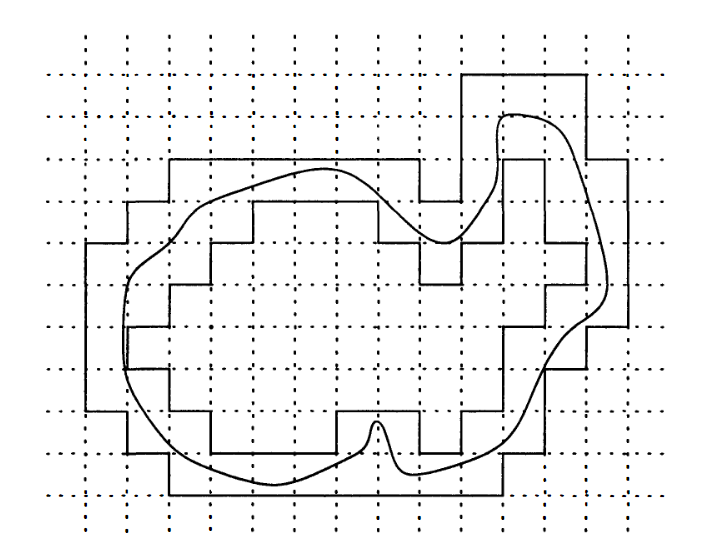

本章我们继续研究测度空间上的积分，首先我们讨论一点关于函数序列不同收敛模式的联系，然后我们将给出高维积分的两个基本定理，即 Fubini 定理和积分换元公式。

# Section 1: 收敛模式

给定一个函数序列 $(f_{n})$，我们可以从多个不同角度来说明 $(f_{n})$ 收敛于 $f$ 是什么意思：我们有逐点收敛和一致收敛，如果其定义域具有测度，那么我们还可以有几乎处处收敛和 $L^{1}$ 收敛等。显然，一致收敛蕴含逐点收敛，后者又蕴含了几乎处处收敛，但这三者都不蕴含 $L^{1}$ 收敛，反之也一样。

另一边，如果 $f_{n}$ 收敛于 $f$ a.e.，并且 $|f_{n}|\leq g \in L^{1}(X,\mu)$，那么根据控制收敛定理，$f_{n}$ 按 $L^{1}$ 度量收敛于 $f$. 反之，我们也可以证明，如果 $f_{n}$ 按 $L^{1}$ 度量收敛于 $f$，那么存在一个子序列使其几乎处处收敛于 $f$.

在测度空间中，还有一种常用的收敛概念如下：

**定义 22.1.1** 依测度 Cauchy（Cauchy in measure），依测度收敛（convergence in measure）

设 $(X,\mathcal{M},\mu)$ 是测度空间，$f_{n}\colon X\to \mathbb{C}$ 是可测的，称 $(f_{n})$ 是**依测度 Cauchy 的**，如果对任意 $\varepsilon>0$ 有

$$
\lim_{ n,m \to \infty } \mu(\{ x \in X \mid |f_{n}(x)-f_{m}(x)|\geq\varepsilon \})=0
$$

设 $f\colon X\to \mathbb{C}$ 是可测的，称 $(f_{n})$ **依测度收敛于** $f$，如果对任意 $\varepsilon>0$ 有

$$
\lim_{ n \to \infty } \mu(\{ x \in X \mid |f_{n}(x)-f(x)|\geq\varepsilon \})=0
$$

换句话说，如果 $f_{n}$ 依测度收敛于 $f$，那么对于 a.e. $x$，都有 $|f_{n}(x)-f(x)|<\varepsilon$.

下面我们来研究依测度收敛与其它收敛模式的联系。

**定理 22.1.2**

设 $(X,\mathcal{M},\mu)$ 是测度空间，$f_{n},f$ 是可测的，如果 $(f_{n})$ 按 $L^{1}$ 度量收敛于 $f$，那么 $(f_{n})$ 依测度收敛于 $f$.

**证明**

设 $E_{n,\varepsilon}=\{ x \mid |f_{n}(x)-f(x)|\geq\varepsilon \}$，则

$$
\int |f_{n}-f|\geq \int_{E_{n,\varepsilon}}|f_{n}-f|\geq \varepsilon \mu(E_{n,\varepsilon})
$$

由于 $\lim_{ n \to \infty }\int|f_{n}-f|=0$，故 $\lim_{ n \to \infty }\mu(E_{n,\varepsilon})=0$，即证。

对于实数序列，我们知道 Cauchy 序列一定收敛，在这里也有类似的结论。

**定理 22.1.3**

设 $(X,\mathcal{M},\mu)$ 是测度空间，如果 $(f_{n})$ 是依测度 Cauchy 的，那么存在可测函数 $f$ 使得 $(f_{n})$ 依测度收敛于 $f$，并且存在子序列 $(f_{n_{j}})$ 使其逐点收敛于 $f$ a.e. 此外，如果 $(f_{n})$ 也依测度收敛于 $g$，那么 $f=g$ a.e.

**证明**

由于 $f_{n}$ 是依测度 Cauchy 的，故可以取子序列 $g_{j}=f_{n_{j}}$ 使得如果 $E_{j}=\{ x \mid |g_{j}(x)-g_{j+1}(x)|\geq 2^{-j} \}$，那么 $\mu(E_{j})\leq 2^{-j}$. 令 $F_{k}=\bigcup_{j=k}^{\infty}E_{j}$，那么 $\mu(F_{k})\leq \sum_{j=k}^{\infty}2^{-j}=2^{1-k}$，并且如果 $x \not\in F_{k}$，对任意 $i\geq j\geq k$ 有

$$
|g_{j}(x)-g_{i}(x)|\leq \sum_{l=j}^{i-1} |g_{l}(x)-g_{l+1}(x)|\leq \sum_{l=j}^{i-1} 2^{-l}< 2^{1-j}
$$

故 $(g_{j})$ 在 $F_{k}^{c}$ 上是逐点 Cauchy 的。令 $F=\bigcap_{k=1}^{\infty}F_{k}$，则 $\mu(F)=0$，那么如果我们定义

$$
f(x)=\begin{cases}
\lim_{ j \to \infty } g_{j}(x) &, x \in F^{c} \\
0 &, x \in F
\end{cases}
$$

那么 $f$ 是可测的，并且 $g_{j}$ 收敛于 $f$ a.e. 此外，上面的讨论表明对任意 $x \not\in F_{k}$ 有 $|g_{j}(x)-f(x)|\leq 2^{1-j}$，由于 $\lim_{ k \to \infty }\mu(F_{k})=0$，故 $(g_{j})$ 依测度收敛于 $f$. 又因为

$$
\{ x \mid |f_{n}(x)-f(x)|\geq\varepsilon \}\subset \{ x \mid |f_{n}(x)-g_{j}(x)|\geq\varepsilon / 2, |g_{j}(x)-f(x)|\geq\varepsilon / 2 \}
$$

右边的集合在 $n,j\to \infty$ 时测度趋于 $0$，从而 $f_{n}$ 依测度收敛于 $f$.

类似地，如果 $f_{n}$ 依测度收敛于 $g$，由于

$$
\{ x \mid |f(x)-g(x)|\geq\varepsilon \}\subset \{ x \mid |f(x)-f_{n}(x)|\geq\varepsilon / 2,|f_{n}(x)-g(x)|\geq \varepsilon / 2 \}
$$

右边的集合在 $n\to \infty$ 时测度趋于 $0$，因而 $f=g$ a.e.

结合上述两个定理，我们就有推论：

**定理 22.1.4**

设 $(X,\mathcal{M},\mu)$ 是测度空间，$f_{n},f$ 是可测的，如果 $(f_{n})$ 按 $L^{1}$ 度量收敛于 $f$，那么存在子序列 $(f_{n_{j}})$ 使其逐点收敛于 $f$ a.e.

如果 $f_{n}$ 收敛于 $f$ a.e.，并不一定有 $f_{n}$ 依测度收敛于 $f$，然而，如果我们限定在某个有限测度空间上，那么我们可以得到一个强得多的结论。

**定理 22.1.5** Egoroff 定理

设 $(X,\mathcal{M},\mu)$ 是测度空间，$\mu(X)<+\infty$，$f_{n},f$ 是可测的，且 $(f_{n})$ 逐点收敛于 $f$ a.e.，那么对任意 $\varepsilon>0$，存在 $E \in \mathcal{M}$ 使得 $\mu(E)<\varepsilon$，并且 $(f_{n})$ 在 $E^{c}$ 上一致收敛于 $f$.

**证明**

通过去除一个零测集，我们可以假设 $\lim_{ n \to \infty }f_{n}(x)=f$. 令

$$
E_{n}(k)=\bigcup_{m=n}^{\infty} \left\{  x \mid |f_{m}(x)-f(x)|\geq \dfrac{1}{k}  \right\}
$$

于是对任意 $n$ 有 $E_{n}(k)\supset E_{n+1}(k)$，并且 $\bigcap_{n=1}^{\infty}E_{n}(k)=\varnothing$，由于 $\mu(X)<+\infty$，故 $\lim_{ n \to \infty }\mu(E_{n}(k))=0$.

任取 $\varepsilon>0$ 和 $k$，存在 $n_{k}$ 使得 $\mu(E_{n_{k}}(k))<\varepsilon 2^{-k}$，令 $E=\bigcup_{k=1}^{\infty}E_{n_{k}}(k)$，则 $\mu(E)<\varepsilon$，并且对任意 $x \in E^{c}$ 和 $n>n_{k}$ 有 $|f_{n}(x)-f(x)|< \dfrac{1}{k}$，即 $f_{n}$ 在 $E^{c}$ 上一致收敛于 $f$.

Egoroff 定理中的收敛模式通常被称为**几乎一致收敛**，不难证明以下结论：

**定理 22.1.6**

设 $(X,\mathcal{M},\mu)$ 是测度空间，$f_{n},f$ 是可测的，如果 $f_{n}$ 几乎一致收敛于 $f$，那么 $f_{n}$ 收敛于 $f$ a.e. 且 $f_{n}$ 依测度收敛于 $f$.

**证明**

对任意 $n$，存在 $E_{n}$ 使得 $\mu(E_{n})< \dfrac{1}{n}$ 且 $f_{k}$ 在 $E_{n}^{c}$ 上一致收敛于 $f$，令 $E=\bigcap_{n=1}^{\infty}E_{n}$，则 $\mu(E)=0$，并且 $f_{k}$ 在 $E^{c}$ 上逐点收敛于 $f$，即 $f_{k}$ 收敛于 $f$ a.e.

任取 $\varepsilon>0$ 和 $\delta>0$，存在 $E$ 使得 $\mu(E)<\delta$ 且 $f_{k}$ 在 $E^{c}$ 上一致收敛于 $f$，即存在 $N$ 使得对任意 $k>N$ 和 $x \in E^{c}$ 有 $|f_{k}(x)-f(x)|<\varepsilon$，于是

$$
\{ x \mid |f_{k}(x)-f(x)|\geq\varepsilon \}\subset E
$$

从而 $\mu(\{ x \mid |f_{k}(x)-f(x)|\geq\varepsilon \})<\delta$，即 $f_{k}$ 依测度收敛于 $f$.

Egoroff 定理有一个重要的推论，如下所示：

**定理 22.1.7** Lusin 定理

设实数 $a<b$，如果 $f\colon [a,b]\to \mathbb{C}$ 是 Lebesgue-Stieltjes 可测的，那么对任意 $\varepsilon>0$，存在紧致集 $K \subset[a,b]$ 使得 $\mu([a,b]\setminus K)<\varepsilon$ 且 $f|_{K}$ 是连续的。

首先我们需要一个引理：

**定理 22.1.8** Borel-Cantelli 引理

设 $(X,\mathcal{M},\mu)$ 是测度空间，$(E_{n})_{n=0}^{\infty}$ 是可测集，并且 $\sum_{n=0}^{\infty}\mu(E_{n})<+\infty$，那么几乎每一个 $x \in X$ 都只属于有限个 $E_{n}$.

**证明**

考虑函数 $f=\sum_{n=0}^{\infty}\chi_{E_{n}}$，则 $\int f=\sum_{n=0}^{\infty}\mu(E_{n})<+\infty$，由定理 21.3.8 知 $\mu(\{ x \mid f(x)=+\infty \})=0$，即属于无限个 $E_{n}$ 的点构成的集合具有测度零，从而几乎每个点都只属于有限个 $E_{n}$.

**证明**（22.1.7）

取全集 $X=[a,b]$，存在简单函数 $(\phi_{n})$ 逐点收敛于 $f$，根据定理 21.4.10 的证明，我们可以构造连续函数 $g_{k}$ 使得 $\mu(\{ x \mid \phi_{k}(x)\neq g_{k}(x) \})<2^{-k}$.

取 $E_{k}=\{ x \mid \phi_{k}(x)\neq g_{k}(x) \}$，则 $\sum_{k=1}^{\infty}\mu(E_{k})<1<+\infty$，故除了某个零测集 $N$ 外，对每个 $x \in N^{c}$ 存在 $K$ 使得对任意 $k>K$ 有 $\phi_{k}(x)=g_{k}(x)$，故 $g_{k}$ 在 $N^{c}$ 上逐点收敛于 $f$，即 $g_{k}$ 收敛于 $f$ a.e.

根据 Egoroff 定理，对任意 $\varepsilon>0$，存在 $F$ 使得 $\mu(F)<\varepsilon / 2$ 且 $g_{k}$ 在 $F^{c}$ 上一致收敛于 $f$，从而 $f$ 在 $F^{c}$ 上连续。根据定理 20.4.5，取开集 $U\supset F$ 使得 $\mu(U)<\mu(F)+\varepsilon / 2<\varepsilon$，于是 $U^{c}$ 是紧致集，并且 $f$ 在 $U^{c}\subset F^{c}$ 上连续，这就完成了证明。

Lusin 定理表明，一个 Lebesgue 可测的函数几乎就是一个连续函数。

# Section 2: 乘积测度

给定两个测度空间 $(X,\mathcal{M},\mu),(Y,\mathcal{N},\nu)$，我们之前已经讨论过了 $X\times Y$ 上的 $\sigma$-代数 $\mathcal{M}\otimes \mathcal{N}$，现在，我们就要在 $\mathcal{M}\otimes \mathcal{N}$ 上构造一个测度，即 $\mu$ 和 $\nu$ 的乘积。

首先，我们从外测度开始，那么我们需要找到一个代数和预测度以使用 Caratheodory 扩张定理。我们首先考虑由 $A \in \mathcal{M}$ 和 $B \in \mathcal{N}$ 构成的**长方形** $A\times B$，显然我们有

$$
\begin{gather}
(A\times B)\cap(C\times D)=(A\cap C)\times(B\cap D) \\
(A\times B)^{c}=(A\times B^{c})\cup(A^{c}\times B)\cup(A^{c}\times B^{c})
\end{gather}
$$

因此长方形的有限无交并构成的集合 $\mathcal{A}$ 是一个代数，并且显然 $\mathcal{A}$ 生成的 $\sigma$-代数是 $\mathcal{M}\otimes \mathcal{N}$.

设 $A\times B$ 是至多可数个长方形 $A_{j}\times B_{j}$ 的无交并，那么对任意 $x \in X$ 和 $y \in Y$ 有

$$
\chi_{A}(x)\chi_{B}(y)=\chi_{A\times B}(x,y)=\sum_{j} \chi_{A_{j}\times B_{j}}(x,y)=\sum_{j} \chi_{A_{j}}(x)\chi_{B_{j}}(y)
$$

上式对 $x$ 积分得

$$
\mu(A)\chi_{B}(y)=\int \sum_{j}\chi_{A_{j}}(x)\chi_{B_{j}}(y)\mathrm{d} \mu(x)=\sum_{j} \mu(A_{j})\chi_{B_{j}}(y)
$$

再对 $y$ 积分得

$$
\mu(A)\nu(B)=\sum_{j} \mu(A_{j})\nu(B_{j})
$$

因此，如果 $E \in \mathcal{A}$ 是长方形 $(A_{j}\times B_{j})_{j=1}^{n}$ 的无交并，并且我们令

$$
\pi(E)=\sum_{j=1}^{n} \mu(A_{j})\nu(B_{j}) \quad (0\cdot \infty=0)
$$

那么 $\pi$ 就是 $\mathcal{A}$ 上的预测度。根据 Caratheodory 扩张定理，$\pi$ 生成了 $X\times Y$ 上的一个外测度，并且在 $\mathcal{M}\otimes \mathcal{N}$ 上的限制就是一个测度，我们称之为 $\mu$ 和 $\nu$ 的**乘积**。

**定义 22.2.1** 乘积测度（product measure）

设 $(X,\mathcal{M},\mu),(Y,\mathcal{N},\nu)$ 是测度空间，任取 $E \in \mathcal{A}$，定义为

$$
\pi(E)=\sum_{j=1}^{n} \mu(A_{j})\nu(B_{j}) \quad (0\cdot \infty=0)
$$

的预测度 $\pi$ 在 $\mathcal{M}\otimes \mathcal{N}$ 上的扩张称为 $\mu$ 和 $\nu$ 的**乘积测度**，记作 $\mu \times \nu$.

显然，如果 $\mu$ 和 $\nu$ 都是 $\sigma$-有限的，那么 $\mu \times \nu$ 也是 $\sigma$-有限的：设 $X=\bigcup_{j=1}^{\infty}A_{j},Y=\bigcup_{j=1}^{\infty}B_{j}$，其中 $\mu(A_{j})<+\infty,\nu(B_{j})<+\infty$，那么 $X\times Y=\bigcup_{j,k}(A_{j}\times B_{k})$，其中 $\mu \times \nu(A_{j}\times B_{k})=\mu(A_{j})\nu(B_{k})<+\infty$. 在这种情况下，根据 Caratheodory 扩张定理，$\mu \times \nu$ 就是 $\pi$ 在 $\mathcal{M}\otimes \mathcal{N}$ 上的唯一扩张。

同样的构造对任意有限个空间成立：设 $(X_{j},\mathcal{M}_{j},\mu_{j})$ 是测度空间，$1\leq j\leq n$，一个长方形就是集合 $A_{1}\times\dots \times A_{n},A_{j}\in \mathcal{M}_{j}$，在长方形的有限无交并构成的代数上可以定义预测度

$$
\pi(E)=\sum_{j} \mu_{1}(A_{1j})\dots \mu_{n}(A_{nj})
$$

然后利用 Caratheodory 扩张定理将 $\pi$ 扩张为 $\bigotimes_{j=1}^{n}\mathcal{M}_{j}$ 上的乘积测度 $\mu_{1}\times\dots \times \mu_{n}$. 此外，如果每个 $\mu_{j}$ 都是 $\sigma$-有限的，那么该乘积测度就是 $\pi$ 的唯一扩张。

在本节中，为了简单起见，我们只考虑两个测度的乘积，不过，所有关于两个测度的结论都可以按以下定理递归地推广至 $n$ 个测度的乘积：

**定理 22.2.2**

设 $(X_{j},\mathcal{M}_{j},\mu_{j}),j=1,2,3$ 是测度空间，则 $\bigotimes_{j=1}^{3}\mathcal{M}_{j}=(\mathcal{M}_{1}\otimes \mathcal{M}_{2})\otimes \mathcal{M}_{3}$，并且如果每个 $\mu_{j}$ 是 $\sigma$-有限的，那么 $\mu_{1}\times \mu_{2}\times \mu_{3}=(\mu_{1}\times \mu_{2})\times \mu_{3}$.

**证明**

$\bigotimes_{j=1}^{3}\mathcal{M}_{j}$ 由 $A_{1}\times A_{2}\times A_{3},A_{j}\in \mathcal{M}_{j}$ 生成，而 $(\mathcal{M}_{1}\otimes \mathcal{M}_{2})\otimes \mathcal{M}_{3}$ 由 $B\times A_{3},B \in \mathcal{M}_{1}\otimes \mathcal{M}_{2},A_{3}\in \mathcal{M}_{3}$ 生成，显然左边包含于右边，现在设 $\mathcal{C}=\{ B \mid B\times A_{3} \in\mathcal{M}_{1}\otimes \mathcal{M}_{2}\otimes \mathcal{M}_{3} \}$，我们要证 $\mathcal{C}$ 是 $\sigma$-代数。

显然 $\varnothing \in \mathcal{C}$，设 $(B_{j})$ 是 $\mathcal{C}$ 中不交的集合，则

$$
\left( \bigcup_{j=1}^{\infty} B_{j} \right) \times A_{3}=\bigcup_{j=1}^{\infty} (B_{j}\times A_{3}) \in \mathcal{M}_{1}\otimes \mathcal{M}_{2}\otimes \mathcal{M}_{3}
$$

故 $\mathcal{C}$ 对可数交封闭。设 $B \in \mathcal{C}$，则

$$
B^{c}\times A_{3}=(X_{1}\times X_{2}\times A_{3})\setminus(B\times A_{3}) \in\mathcal{M}_{1}\otimes \mathcal{M}_{2}\otimes \mathcal{M}_{3}
$$

从而 $\mathcal{C}$ 对补集封闭，因此 $\mathcal{C}$ 是一个包含所有 $A_{1}\times A_{2}$ 的 $\sigma$-代数，从而也包含 $\mathcal{M}_{1}\otimes \mathcal{M}_{2}$，于是 $B\times A_{3}\in\mathcal{M}_{1}\otimes \mathcal{M}_{2}\otimes \mathcal{M}_{3}$，即证。

由于 $\mu_{1}\times \mu_{2}\times \mu_{3}$ 和 $(\mu_{1}\times \mu_{2})\times \mu_{3}$ 在 $\mathcal{A}$ 上相等，由 Caratheodory 扩张定理与 $\mu_{j}$ 的 $\sigma$-有限性，这两者是相等的。

现在我们回到两个空间的乘积上，我们来看定义在 $X\times Y$ 上的函数。

**定义 22.2.3** 切片（section）

设 $X,Y$ 是两个集合，$E \subset X\times Y$，对任意 $x \in X$ 和 $y \in Y$，定义 $E$ 的 $x$**-切片**和 $y$**-切片**为

$$
E_{x}=\{ y \in Y \mid (x,y) \in E \},E^{y}=\{ x \in X \mid (x,y) \in E \}
$$

设函数 $f$ 定义在 $X\times Y$ 上，定义 $f$ 的 $x$**-切片**和 $y$**-切片**为函数

$$
f_{x}(y)=f(x,y),f^{y}(x)=f(x,y)
$$

显然，我们有 $(\chi_{E})_{x}=\chi_{E_{x}},(\chi_{E})^{y}=\chi_{E^{y}}$.

**定理 22.2.4**

设 $(X,\mathcal{M},\mu),(Y,\mathcal{N},\nu)$ 是测度空间，则：

1. 如果 $E \in \mathcal{M}\otimes \mathcal{N}$，那么 $E_{x}\in \mathcal{N}$ 且 $E^{y}\in \mathcal{M}$
2. 如果函数 $f$ 是 $\mathcal{M}\otimes \mathcal{N}$-可测的，那么 $f_{x}$ 是 $\mathcal{N}$-可测的，并且 $f^{y}$ 是 $\mathcal{M}$-可测的。

**证明**

设 $\mathcal{R}=\{ E \mid E_{x}\in \mathcal{N},E^{y}\in \mathcal{M} \}$，由于 $\left( \bigcup_{j=1}^{\infty}E_{j} \right)_{x}=\bigcup_{j=1}^{\infty}(E_{j})_{x}$，并且 $(E^{c})_{x}=(E_{x})^{c}$，对 $y$-切片同理，故 $\mathcal{R}$ 是一个 $\sigma$-代数，并且其包含了所有的长方形 $A\times B$，因而 $\mathcal{R}$ 包含了 $\mathcal{M}\otimes \mathcal{N}$，即证。

由于 $(f_{x})^{-1}[B]=(f^{-1}[B])_{x},(f^{y})^{-1}[B]=(f^{-1}[B])^{y}$，故由 1 得 $f_{x}$ 是 $\mathcal{N}$-可测的，$f^{y}$ 是 $\mathcal{M}$-可测的。

在我们给出本节的主定理前，我们首先需要一个引理。

**定义 22.2.5** 单调类（monotone class）

设 $X$ 是一个集合，称 $\mathcal{C}\subset \mathscr{P}(X)$ 是一个**单调类**，如果：

1. 设 $E_{n}\in \mathcal{C}$ 且 $E_{0}\subset E_{1}\subset\cdots$，则 $\bigcup_{n=0}^{\infty}E_{n}\in \mathcal{C}$
2. 设 $E_{n}\in \mathcal{C}$ 且 $E_{0}\supset E_{1}\supset\cdots$，则 $\bigcap_{n=0}^{\infty}E_{n}\in \mathcal{C}$

显然每个 $\sigma$-代数都是单调类。此外，任意个单调类的交仍然是单调类，因此存在一个最小的包含 $\mathcal{E}\subset \mathscr{P}(X)$ 的单调类，称为 $\mathcal{E}$ **生成**的单调类。

**定理 22.2.6** 单调类引理（monotone class lemma）

设 $X$ 是一个集合，$\mathcal{A}\subset \mathscr{P}(X)$ 是一个代数，其生成的单调类为 $\mathcal{C}$，$\sigma$-代数为 $\mathcal{M}$，则 $\mathcal{C}=\mathcal{M}$.

**证明**

由于 $\mathcal{M}$ 是一个单调类，故 $\mathcal{C}\subset \mathcal{M}$. 下面我们要证 $\mathcal{C}$ 是一个 $\sigma$-代数，从而 $\mathcal{M}\subset \mathcal{C}$. 任取 $E \in \mathcal{C}$，设

$$
\mathcal{C}(E)=\{ F \in \mathcal{C}\mid E\setminus F,F\setminus E,E\cap F \in \mathcal{C} \}
$$

显然 $\varnothing,E \in \mathcal{C}(E)$，并且 $E \in \mathcal{C}(F)$ 当且仅当 $F \in \mathcal{C}(E)$，设 $F_{n}\in \mathcal{C}(E)$，$F_{0}\subset F_{1}\subset\cdots$，则

$$
\begin{gather}
E\setminus \bigcup_{n=0}^{\infty} F_{n}=\bigcap_{n=0}^{\infty} (E\setminus F_{n})\in \mathcal{C},\left( \bigcup_{n=0}^{\infty} F_{n} \right)\setminus E=\bigcup_{n=0}^{\infty} (F_{n}\setminus E) \in \mathcal{C} \\
E\cap \left( \bigcup_{n=0}^{\infty} F_{n} \right)=\bigcup_{n=0}^{\infty} (E\cap F_{n}) \in \mathcal{C}
\end{gather}
$$

因此 $\bigcup_{n=0}^{\infty}F_{n}\in \mathcal{C}(E)$，对交集同理，故 $\mathcal{C}(E)$ 是一个单调类。$\mathcal{A}$ 是一个代数，故如果 $E \in \mathcal{A}$，那么对任意 $F \in \mathcal{A}$ 都有 $F \in \mathcal{C}(E)$，从而 $\mathcal{A}\subset \mathcal{C}(E)$，进而 $\mathcal{C}\subset \mathcal{C}(E)$. 因此，对任意 $F \in \mathcal{C}$ 和 $E \in \mathcal{A}$，都有 $F \in \mathcal{C}(E)$，即 $E \in \mathcal{C}(F)$，从而 $\mathcal{A}\subset \mathcal{C}(F)$，进而 $\mathcal{C}\subset \mathcal{C}(F)$.

根据上面的讨论，我们知道对任意 $E,F \in \mathcal{C}$，都有 $E \in \mathcal{C}(F)$，即 $E\setminus F,F\setminus E,E\cap F \in \mathcal{C}$，又 $X \in \mathcal{A}\subset \mathcal{C}$，故 $\mathcal{C}$ 是一个代数。设 $A_{n}\in \mathcal{C}$，令 $B_{n}=\bigcup_{j=0}^{n}A_{j}$，则每个 $B_{n}\in \mathcal{C}$，且 $B_{0}\subset B_{1}\subset\cdots$，从而 $\bigcup_{n=0}^{\infty}B_{n}\in \mathcal{C}$，即 $\bigcup_{n=0}^{\infty}A_{n}\in \mathcal{C}$，故 $\mathcal{C}$ 是一个 $\sigma$-代数，这就完成了证明。

现在我们给出本节的主要结果，它将 $X\times Y$ 上的积分与 $X$ 和 $Y$ 上的积分联系起来。

**引理 22.2.7**

设 $(X,\mathcal{M},\mu),(Y,\mathcal{N},\nu)$ 是 $\sigma$-有限的测度空间，如果 $E \in \mathcal{M}\otimes \mathcal{N}$，那么函数 $x\mapsto \nu(E_{x})$ 和 $y\mapsto \mu(E^{y})$ 分别是 $\mathcal{M}$-可测的和 $\mathcal{N}$-可测的，并且

$$
\mu \times \nu(E)=\int_{X} \nu(E_{x})\mathrm{d} \mu(x)=\int_{Y} \mu(E^{y})\mathrm{d} \nu(y)
$$

**证明**

首先假设 $\mu$ 和 $\nu$ 是有限的，令 $\mathcal{C}$ 表示所有使得定理成立的 $E \in \mathcal{M}\otimes \mathcal{N}$ 构成的集合。设 $E=A\times B$，则 $\nu(E_{x})=\chi_{A}(x)\nu(B)$，$\mu(E^{y})=\mu(A)\chi_{B}(y)$，因此 $E \in \mathcal{C}$. 根据测度的可加性，如果 $E$ 是有限个长方形的无交并，那么 $E \in \mathcal{C}$，根据单调类引理，我们只需证明 $\mathcal{C}$ 是一个单调类即可。

设 $E_{n}\in \mathcal{C},E_{0}\subset E_{1}\subset\cdots$，并且 $E=\bigcup_{n=0}^{\infty}E_{n}$，那么函数 $f_{n}(y)=\mu((E_{n})^{y})$ 单调递增并且逐点收敛于 $f(y)=\mu(E^{y})$，因此由单调收敛定理得

$$
\int_{Y} \mu(E^{y})\mathrm{d} \nu(y)=\lim_{ n \to \infty } \int_{Y} \mu((E_{n})^{y})\mathrm{d} \nu(y)=\lim_{ n \to \infty } \mu \times \nu(E_{n})=\mu \times \nu(E)
$$

同理可得 $\int_{X}\nu(E_{x})\mathrm{d}\mu(x)=\mu \times \nu(E)$，因此 $E \in \mathcal{C}$. 类似地，设 $E_{0}\supset E_{1}\supset\cdots$，$E=\bigcap_{n=0}^{\infty}E_{n}$，则函数 $y\mapsto \mu((E_{0})^{y})$ 是可积的（因为 $\mu(X),\nu(Y)<+\infty$），并且从上方控制所有 $f_{n}(y)=\mu((E_{n})^{y})$，因此由控制收敛定理可得 $\int_{Y}\mu(E^{y})\mathrm{d}\nu(y)=\mu \times \nu(E)$，从而 $E \in \mathcal{C}$，因此 $\mathcal{C}$ 是一个由长方形的无交并生成的单调类，从而是一个包含 $\mathcal{M}\otimes \mathcal{N}$ 的 $\sigma$-代数。

现在设 $\mu$ 和 $\nu$ 是 $\sigma$-有限的，则 $X=\bigcup_{n=0}^{\infty}A_{n},Y=\bigcup_{n=0}^{\infty}B_{n}$，其中 $\mu(A_{n})<+\infty,\nu(B_{n})<+\infty$，令 $X_{n}=\bigcup_{j=0}^{\infty}A_{j},Y_{n}=\bigcup_{j=0}^{\infty}B_{j}$，则 $X_{0}\subset X_{1}\subset\cdots$，$Y_{0}\subset Y_{1}\subset\cdots$，并且每个 $\mu(X_{j})<+\infty,\nu(Y_{j})<+\infty$. 设 $E \in \mathcal{M}\otimes \mathcal{N}$，对每个 $E\cap(X_{j}\times Y_{j})$ 应用有限测度的结论，则有

$$
\begin{align}
\mu \times \nu(E\cap(X_{j}\times Y_{j}))&=\int_{X}\chi_{X_{j}}(x)\nu(E_{x}\cap Y_{j})\mathrm{d} \mu(x) \\
&=\int_{Y}\mu(E^{y}\cap X_{j})\chi_{Y_{j}}(y)\mathrm{d} \nu(y)
\end{align}
$$

再应用单调收敛定理就完成了证明。

**定理 22.2.8** Fubini-Tonelli 定理

设 $(X,\mathcal{M},\mu),(Y,\mathcal{N},\nu)$ 是 $\sigma$-有限的测度空间，则有：

1. 如果 $f\colon X\times Y\to[0,+\infty]$ 是可测的，那么函数 $g(x)=\int_{Y}f_{x}\mathrm{d}\nu$ 和 $h(y)=\int_{X}f^{y}\mathrm{d}\mu$ 都是可测的，并且 $$
\int f \mathrm{d} (\mu \times \nu)=\int g \mathrm{d} \mu=\int h \mathrm{d} \nu
$$
2. 如果 $f \in L^{1}(X\times Y,\mu \times \nu)$，那么对 a.e. $x,y$，$f_{x}\in L^{1}(Y,\nu)$，$f^{y}\in L^{1}(X,\mu)$，于是几乎处处有定义的函数 $g(x)=\int_{Y}f_{x}\mathrm{d}\nu$ 和 $h(y)=\int_{X}f^{y}\mathrm{d}\mu$ 都是可积的，并且同样有 $$
\int f \mathrm{d} (\mu \times \nu)=\int g\mathrm{d} \mu=\int h \mathrm{d} \nu
$$

**证明**

(1). 当 $f=\chi_{E}$ 时，根据引理 22.2.7 可知定理成立，从而根据可加性，定理对简单函数成立。现在设 $f$ 是可测的，那么存在简单函数 $f_{n}$ 单调递增且收敛于 $f$，于是根据单调收敛定理，其对应的 $g_{n}$ 和 $h_{n}$ 收敛于 $g$ 和 $h$，并且

$$
\begin{gather}
\int g \mathrm{d} \mu=\lim_{ n \to \infty } \int g_{n}\mathrm{d} \mu=\lim_{ n \to \infty } \int f_{n} \mathrm{d} (\mu \times \nu)=\int f \mathrm{d} (\mu \times \nu) \\
\int h \mathrm{d} \nu=\lim_{ n \to \infty } \int h_{n}\mathrm{d} \nu=\lim_{ n \to \infty } \int f_{n} \mathrm{d} (\mu \times \nu)=\int f \mathrm{d} (\mu \times \nu)
\end{gather}
$$

即证。

(2). 1 的证明表明，如果 $f\colon X\times Y\to[0,+\infty]$ 是可测的，并且 $\int f\mathrm{d}(\mu \times \nu)<+\infty$，那么 $\int g\mathrm{d}\mu<+\infty,\int h\mathrm{d}\nu<+\infty$，即 $g<+\infty,h<+\infty$ a.e.，这就是说如果 $f\in L^{1}(X\times Y,\mu \times \nu)$，那么对 a.e. $x,y$，$f_{x}$ 和 $f^{y}$ 都是可积的。于是，将第一部分的结论应用到 $f$ 的实部和虚部的正数部分和负数部分就完成了证明。

简单来说，Fubini-Tonelli 定理表明，如果 $f$ 是可积的，那么除了一个零测集以外，我们可以将一个重积分写成一个累次积分：

$$
\begin{align}
\int f\mathrm{d} (\mu \times \nu)=\iint f(x,y) \mathrm{d} \mu(x)\mathrm{d} \nu(y)=\iint f(x,y)\mathrm{d} \nu(y)\mathrm{d} \mu(x)
\end{align}
$$

注意，上述定理的两个部分通常是依次使用的。例如，假设我们要计算一个重积分 $\int f\mathrm{d}(\mu \times \nu)$，那么我们首先对非负函数 $|f|$ 应用第一部分以计算 $\int|f|\mathrm{d}(\mu \times \nu)$，只有当这个非负积分的值是有限的时候，我们才可以应用第二部分以计算该积分的值。

此外，如果我们把 $\mu$ 和 $\nu$ 都取为计数测度，那么上述定理就退化为了无穷级数的 Fubini 定理（7.3.3）。

下面，我们考虑将 Fubini-Tonelli 定理扩展到完备测度上。然而，即使 $\mu$ 和 $\nu$ 是完备的，$\mu \times \nu$ 在大多数情况下都不是完备的：设 $A \in \mathcal{M}$ 满足 $\mu(A)=0$，并且 $\mathcal{N}\neq \mathscr{P}(Y)$，取 $E \in \mathscr{P}(Y)\setminus \mathcal{N}$，那么 $E \not\in \mathcal{M}\otimes \mathcal{N}$，然而 $A\times E\subset A\times Y$，且 $\mu \times \nu(A\times Y)=0$. 因此，要证明完备测度上的 Fubini-Tonelli 定理，我们需要做更多的工作。

**定理 22.2.9** Fubini-Tonelli 定理

设 $(X,\mathcal{M},\mu),(Y,\mathcal{N},\nu)$ 是完备且 $\sigma$-有限的测度空间，$(X\times Y,\mathcal{L},\lambda)$ 是 $(X\times Y,\mathcal{M}\otimes \mathcal{N},\mu \times \nu)$ 的完备化，则有：

1. 如果 $f\colon X\times Y\to[0,+\infty]$ 是 $\mathcal{L}$-可测的，那么对 a.e. $x,y$，函数 $f_{x}$ 是 $\mathcal{N}$-可测的，$f^{y}$ 是 $\mathcal{M}$-可测的，并且函数 $g(x)=\int f_{x}\mathrm{d}\nu$ 是 $\mathcal{M}$-可测的，$h(y)=\int f^{y}\mathrm{d}\mu$ 是 $\mathcal{N}$-可测的，并且有 $$
\int f \mathrm{d} \lambda=\int g \mathrm{d} \mu=\int h \mathrm{d} \nu
$$
2. 如果 $f \in L^{1}(\mathcal{L},\lambda)$，那么对 a.e. $x,y$，函数 $f_{x}$ 和 $f^{y}$ 是可积的，并且函数 $g(x)=\int f_{x}\mathrm{d}\nu$ 和 $h(y)=\int f^{y}\mathrm{d}\mu$ 也是可积的，并且有 $$
\int f \mathrm{d} \lambda=\int g \mathrm{d} \mu=\int h \mathrm{d} \nu
$$

**证明**

设 $E \in \mathcal{M}\otimes \mathcal{N}$ 满足 $\mu \times \nu(E)=0$，由引理 22.2.7 知

$$
\mu \times \nu(E)=\int \nu(E_{x})\mathrm{d} \mu(x)=\int \mu(E^{y})\mathrm{d} \nu(y)=0
$$

从而对于 a.e. $x,y$，有 $\nu(E_{x})=0,\mu(E^{y})=0$.

设 $f$ 是 $\mathcal{L}$-可测的，并且 $f=0$ $\lambda$-a.e.，根据定理 21.2.6，存在 $\mathcal{M}\otimes \mathcal{N}$-可测的函数 $\hat{f}$ 使得 $\hat{f}=f$ $\lambda$-a.e.，即 $\hat{f}=0$ $\lambda$-a.e.，由于 $\mu,\nu$ 是完备的，故 $\hat{f}_{x}=0$ $\mu$-a.e.，$\hat{f}^{y}=0$ $\nu$-a.e.，并且 $f_{x}=\hat{f}_{x}$ a.e.，$f^{y}=\hat{f}^{y}$ a.e.，故 $f_{x},f^{y}$ 是可积的 a.e.，并且 $\int f_{x}\mathrm{d}\nu=0,\int f^{y}\mathrm{d}\mu=0$ a.e.

(1). 设 $f$ 是 $\mathcal{L}$-可测的，$f=\hat{f}$ $\lambda$-a.e.，则 $f-\hat{f}=0$ $\lambda$-a.e.，从而 $f_{x}-\hat{f}_{x}$ 是可测的 a.e.，又由于 $\hat{f}_{x}$ 是可测的（由定理 22.2.8），故 $f_{x}$ 是可测的 a.e.，同理 $f^{y}$ 是可测的 a.e.

此外，$g(x)=\int f_{x}\mathrm{d}\nu=\int \hat{f}_{x}\mathrm{d}\nu$ 是可测的，同理 $h$ 是可测的，并且

$$
\int f\mathrm{d} \lambda=\int \hat{f}\mathrm{d} (\mu \times \nu)=\int g\mathrm{d} \mu=\int h\mathrm{d} \nu
$$

(2). 设 $f \in L^{1}(\mathcal{L},\lambda)$，$f=\hat{f}$ $\lambda$-a.e.，则 $f_{x}-\hat{f}_{x}$ 是可积的 a.e.，又 $\hat{f}_{x}\in L^{1}(Y,\nu)$，故 $f_{x}$ 是可积的 a.e.，同理 $f^{y}$ 是可积的 a.e.

此外，$g(x)=\int f_{x}\mathrm{d}\nu=\int \hat{f}_{x}\mathrm{d}\nu$ 是可积的，同理 $h$ 是可积的，并且有

$$
\int f\mathrm{d} \lambda=\int \hat{f}\mathrm{d} (\mu \times \nu)=\int g\mathrm{d} \mu=\int h\mathrm{d} \nu
$$

这就完成了证明。

这一定理是我们后续做多重 Lebesgue 积分的基础。

最后，我们来证明一个人们常说的断言：函数的积分等于它图像下的面积。

**定理 22.2.10**

设 $(X,\mathcal{M},\mu)$ 是一个 $\sigma$-有限的测度空间，$f\colon X\to[0,+\infty]$ 是可测的，令

$$
G_{f}=\{ (x,y) \in X\times[0,+\infty] \mid 0\leq y\leq f(x) \}
$$

则 $G_{f}\in\mathcal{M}\otimes \mathcal{B}_{\mathbb{R}}$，并且 $\mu \times m(G_{f})=\int f\mathrm{d}\mu$.

**证明**

设 $F(x,y)=f(x)-y$，则 $F$ 是函数 $(x,y)\mapsto(f(x),y)$ 和 $(a,b)\mapsto a-b$ 的复合，故 $F$ 是可测的，并且 $G_{f}=F^{-1}[0,+\infty]\cap(X\times[0,+\infty])$ 是可测的。根据 Fubini-Tonelli 定理，我们就有

$$
\mu \times m(G_{f})=\int_{G_{f}} \mathrm{d} (\mu \times m)=\int_{X} \int_{0}^{f(x)} \mathrm{d} y\mathrm{d} \mu(x)=\int f \mathrm{d} \mu
$$

# Section 3: $n$ 维 Lebesgue 积分

$n$ 维 Euclidean 空间 $\mathbb{R}^{n}$ 上的 **Lebesgue 测度**是 $\mathcal{L}\otimes\dots \otimes \mathcal{L}$ 上的乘积测度 $m\times\dots \times m$ 的完备化，记作 $m^{n}$，其定义域，称为 **Lebesgue 可测集**，记作 $\mathcal{L}^{n}$. 在不会引起歧义的情况下，我们可以把 $m^{n}$ 写成 $m$，有时我们也称 $m^{n}$ 在 $\mathcal{B}_{\mathbb{R}^{n}}$ 上的限制为 Lebesgue 测度。此外，我们通常把一维 Lebesgue 积分写成 $\int_{a}^{b}f(x)\mathrm{d}x$.

首先，我们来将一维 Lebesgue 测度的性质推广至 $n$ 维，对于一个长方形 $E=E_{1}\times\dots \times E_{n}$，我们称各 $E_{j}\subset \mathbb{R}$ 为 $E$ 的**边**。

**定理 22.3.1**

设 $E \in \mathcal{L}^{n}$，则

$$
\begin{align}
m(E)&=\inf \{ m(U) \mid U\supset E,U\text{是开集} \} \\
&=\sup \{ m(K) \mid K\subset E,K\text{是紧致集} \}
\end{align}
$$

并且 $E=V\setminus N_{1}=H\cup N_{2}$，其中 $V$ 是一个 $G_{\delta}$ 集，$H$ 是一个 $F_{\sigma}$ 集，$m(N_{1})=m(N_{2})=0$.

此外，如果 $m(E)<+\infty$，那么对任意 $\varepsilon>0$，存在不相交的长方形 $R_{1},\dots,R_{n}$，其各边是开区间，使得 $m\left( E\Delta \bigcup_{j=1}^{n}R_{j} \right)<\varepsilon$.

**证明**

根据乘积测度的定义，存在长方形 $(T_{j})_{j=1}^{\infty}$ 使得 $E\subset \bigcup_{j=1}^{\infty}T_{j}$ 并且 $m\left( \bigcup_{j=1}^{\infty}T_{j} \right)\leq m(E)+\varepsilon$. 对 $T_{j}$ 的每个边应用定理 20.4.5，我们可以找到开集 $U_{j}\supset T_{j}$ 使得 $m(U_{j})\leq m(T_{j})+\varepsilon 2^{-j}$，令 $U=\bigcup_{j=1}^{\infty}U_{j}$ 是开集，则 $m(U)\leq \sum_{j=1}^{\infty}m(U_{j})\leq m(E)+2\varepsilon$，这就证明了第一个等式。第二个等式和 $E=V\setminus N_{1}=H\cup N_{2}$ 的证明与定理 20.4.5 和 20.4.6 是几乎相同的（只需将 $\mathbb{R}=\bigcup_{j=-\infty}^{\infty}(j,j+1]$ 改成 $\mathbb{R}^{n}=\bigcup_{j=1}^{\infty}X_{j}$ 即可，因为 $m$ 显然是 $\sigma$-有限的）。

最后，由于 $m(E)<+\infty$，我们可以使 $m(U_{j})<+\infty$，和在定理 20.4.7 的证明中一样，我们可以取 $V_{j}\subset U_{j}$ 使得 $V_{j}$ 的边是开区间的有限并，且 $m(V_{j})\geq m(U_{j})-\varepsilon 2^{-j}$，由于 $\lim_{ j \to \infty }m(U_{j})=0$，故当 $n$ 足够大时有

$$
\begin{gather}
m\left( E \setminus \bigcup_{j=1}^{n} V_{j} \right)\leq m\left( \bigcup_{j=1}^{n} U_{j}\setminus V_{j} \right)+m\left( \bigcup_{j=n+1}^{\infty} U_{j} \right)<2\varepsilon \\
m\left( \bigcup_{j=1}^{n} V_{j} \setminus E \right)\leq m\left( \bigcup_{j=1}^{\infty} U_{j} \setminus E \right)<2\varepsilon
\end{gather}
$$

于是 $m\left( E\Delta \bigcup_{j=1}^{n}V_{j} \right)<4\varepsilon$，这就完成了证明。

**定理 22.3.2**

设 $f \in L^{1}(\mathbb{R}^{n},m),\varepsilon>0$，则存在简单函数 $\phi=\sum_{j=1}^{n}a_{j}\chi_{R_{j}}$，其中 $R_{j}$ 的边是开区间的有限并，使得 $\lVert f-\phi \rVert_{1}<\varepsilon$. 此外，还存在一个支撑在有界集上的连续函数 $g$ 使得 $\lVert f-g \rVert_{1}<\varepsilon$.

**证明**

与定理 21.4.10 一样，首先用简单函数 $\psi$ 逼近 $f$，然后应用 22.3.1 以使用 $\phi=\sum_{j=1}^{n}a_{j}\chi_{R_{j}}$ 来逼近 $\psi$，最后，利用 21.4.10 中定义的函数 $g$ 来逼近 $\chi_{R}$，其中 $R=(a_{1},b_{1})\times\dots \times (a_{n},b_{n})$：

$$
G(x_{1},\dots,x_{n})= \dfrac{1}{n} (g_{1}(x_{1})+\dots+g_{n}(x_{n}))
$$

$G$ 在 $[a_{1}+\delta,b_{1}-\delta]\times\dots \times[a_{n}+\delta,b_{n}-\delta]$ 上为 $1$，在 $R$ 以外为 $0$，其余位置是线性的，当 $\delta$ 足够小时，我们可以使 $\lVert f-g \rVert_{1}<\varepsilon$.

**定理 22.3.3**

设 $a \in \mathbb{R}$，平移算子 $\tau_{a}\colon \mathbb{R}^{n}\to \mathbb{R}^{n}$ 定义为 $\tau_{a}(x)=x+a$，则：

1. 如果 $E \in \mathcal{L}^{n}$，则 $\tau_{a}[E]\in \mathcal{L}^{n}$，且 $m(\tau_{a}[E])=m(E)$
2. 如果 $f\colon \mathbb{R}^{n}\to \mathbb{C}$ 是 Lebesgue 可测的，则 $f\circ \tau_{a}$ 也是 Lebesgue 可测的，并且如果 $f\geq 0$ 或者 $f \in L^{1}(\mathbb{R}^{n},m)$，则 $\int(f\circ\tau_{a})\mathrm{d}m=\int f\mathrm{d}m$

**证明**

由于 $\tau_{a}$ 和其逆 $\tau_{a}^{-1}=\tau_{-a}$ 都是连续的，故它们保持 Borel 集不变。设 $E$ 是一个长方形，那么根据一维的结论，$m(\tau_{a}[E])=m(E)$，由于 $\mathcal{B}_{\mathbb{R}^{n}}$ 是由长方形的有限并生成的，故由 Caratheodory 扩张定理的唯一性部分，对任意 Borel 集 $E$ 都有 $m(\tau_{a}[E])=m(E)$. 特别地，上式对于零测集也成立，故对于 Lebesgue 可测集成立。

设 $f$ 是 Lebesgue 可测的，$B \in \mathcal{B}_{\mathbb{C}}$，则 $f^{-1}[B]=E\cup N$，其中 $E$ 是 Borel 集，$m(N)=0$，而 $\tau_{a}^{-1}[E]$ 是 Borel 集，$m(\tau_{a}^{-1}[N])=m(N)=0$，从而 $(f\circ\tau_{a})^{-1}[B] \in \mathcal{L}^{n}$，即 $f\circ \tau_{a}$ 是 Lebesgue 可测的。

当 $f=\chi_{E}$ 时，$\int(f\circ \tau_{a})=\int f$ 退化为 $m(\tau_{-a}[E])=m(E)$，从而等式对简单函数成立，利用单调收敛定理可得等式对非负函数成立，再将函数分解为正数部分和负数部分可得等式对任意可积函数成立。

现在我们回过头来，研究一下 Lebesgue 测度与传统的体积理论的关联，我们称 $Q \in \mathbb{R}^{n}$ 是一个**立方体**，如果 $Q$ 是 $n$ 个闭区间的乘积，并且 $Q$ 的边长度都相等。

对于 $k\geq 0$，我们令 $\mathcal{Q}_{k}$ 表示所有边长为 $2^{-k}$，并且顶点位于 $(2^{-k}\mathbb{Z})^{n}$ 内的立方体，即 $\prod_{j=1}^{n}[a_{j},b_{j}]\in \mathcal{Q}_{k}$ 当且仅当 $2^{k}a_{j},2^{k}b_{j}$ 是整数，并且对任意 $j$ 有 $b_{j}-a_{j}=2^{-k}$. 注意，从 $\mathcal{Q}_{k}$ 到 $\mathcal{Q}_{k+1}$，每个立方体都被切分成了相同的 $2^{n}$ 块。

设 $E\subset \mathbb{R}^{n}$，我们可以用越来越小的立方体去近似 $E$，即

$$
\underline{A}(E,k)=\bigcup \{ Q \in \mathcal{Q}_{k} \mid Q \subset E \}, \overline{A}(E,k)=\bigcup \{ Q \in \mathcal{Q}_{k} \mid Q\cap E \neq \varnothing \}
$$

$\underline{A}(E,k)$ 和 $\overline{A}(E,k)$ 的体积（或者测度）就是 $2^{-nk}$ 乘以立方体的数量，我们把它记作 $m(\underline{A}(E,k))$ 和 $m(\overline{A}(E,k))$.

显然，随着 $k\to \infty$，$m(\underline{A}(E,k))$ 单调递增，而 $m(\overline{A}(E,k))$ 单调递减，因此它们有极限，我们给它一个定义：

**定义 22.3.4** Jordan 容度（Jordan content）

设 $E \subset \mathbb{R}^{n}$，定义 $E$ 的**内容度**和**外容度**为

$$
\underline{\kappa}(E)=\lim_{ k \to \infty } m(\underline{A}(E,k)),\overline{\kappa}(E)=\lim_{ k \to \infty } m(\overline{A}(E,k))
$$

如果 $\underline{\kappa}(E)=\overline{\kappa}(E)$，则称 $\kappa(E)=\underline{\kappa}(E)$ 为 $E$ 的 **Jordan 容度**。

事实上，Jordan 容度是用长方体 $\prod_{j=1}^{n}[a_{j},b_{j}]$ 定义的，即 $Q$ 的边长可以不相等，但是结果是相同的。此外，我们可以利用 Jordan 容度建立一个 $n$ 维的 Riemann 积分理论，其主要思想是将 $\mathbb{R}^{n}$ 切分为类似于 $\mathcal{Q}_{k}$ 的网格，然后在每个长方体内定义函数的上和与下和，以此得到函数的上积分与下积分。不过我们现在已经有了 Lebesgue 积分，因此 Riemann 积分就不再必要了。

我们令

$$
\underline{A}(E)=\bigcup_{k=0}^{\infty} \underline{A}(E,k),\overline{A}(E)=\bigcup_{k=0}^{\infty} \overline{A}(E,k)
$$

那么 $\underline{A}(E)\subset E\subset  \overline{A}(E)$，$\underline{A}(E),\overline{A}(E)$ 都是 Borel 集，并且 $\underline{\kappa}(E)=m(\underline{A}(E))$，$\overline{\kappa}(E)=m(\overline{A}(E))$，因此 $E$ 存在 Jordan 容度当且仅当 $m(\overline{A}(E)\setminus  \underline{A}(E))=0$，即 $E$ 是 Lebesgue 可测的，并且 $m(E)=\kappa(E)$.

为了进一步研究 Lebesgue 测度与 Jordan 容度的关联，我们给出以下引理：

**引理 22.3.5**

如果 $U\subset \mathbb{R}^{n}$ 是开集，那么 $U=\underline{A}(U)$，并且 $U$ 是立方体的可数并，其中各立方体的内部是不相交的。

**证明**

任取 $x \in U$，令 $\delta=\inf\{ \lVert y-x \rVert \mid y \not\in U \}>0$，如果 $Q \in \mathcal{Q}_{k}$ 包含 $x$，那么每个 $y \in Q$ 与 $x$ 之间的距离最多就是 $2^{-k}\sqrt{ n }$，因此当 $k$ 足够大时，可以使 $2^{-k}\sqrt{ n }<\delta$，这时就有 $Q\subset U$，于是 $x \in \underline{A}(U,k)\subset  \underline{A}(U)$，根据内容度的定义，对任意 $k$ 都有 $\underline{A}(U,k)\subset U$，故 $\underline{A}(U)\subset U$，即证。

对于第二个结论，我们有

$$
U=\underline{A}(U)=\underline{A}(U,0)\cup \bigcup_{k=1}^{\infty} (\underline{A}(U,k)\setminus  \underline{A}(U,k-1))
$$

$\underline{A}(U,0)$ 是 $\mathcal{Q}_{0}$ 中立方体的可数并，$\underline{A}(U,k)\setminus  \underline{A}(U,k-1)$ 的闭包是 $\mathcal{Q}_{k}$ 中立方体的可数并，它们的内部都不相交，这就完成了证明。

上述引理表明，开集的 Lebesgue 测度就等于它的内容度。另一边，设 $K$ 是一个紧致集，我们首先取一个大的立方体 $Q_{0}$ 使得 $K\subset \mathrm{Int}(Q_{0})$，于是对任意 $Q \in \mathcal{Q}_{k},Q\subset Q_{0}$，那么或者 $Q\cap K\neq \varnothing$，或者 $Q\subset Q_{0}\setminus K$，因此我们有

$$
m(\overline{A}(K,k))+m(\underline{A}(Q_{0}\setminus K,k))=m(Q_{0})
$$

令 $k\to \infty$，我们有 $\overline{\kappa}(K)+\underline{\kappa}(Q_{0}\setminus K)=m(Q_{0})$，而 $Q_{0}\setminus K$ 由开集 $\mathrm{Int}(Q_{0})\setminus K$ 和 $Q_{0}$ 的边界（具有容度零）构成，故 $\underline{\kappa}(Q_{0}\setminus K)=m(Q_{0}\setminus K)$，从而 $m(K)=\overline{\kappa}(K)$，即紧致集的 Lebesgue 测度等于它的外容度。

结合定理 22.3.1 与上述结果，我们就可以说明 Lebesgue 测度与 Jordan 容度的区别：$E$ 的 Jordan 容度可以通过使用立方体的有限并集，从内部和从外部近似得到，而 $E$ 的 Lebesgue 测度则包含两个过程：首先用开集从外部近似 $E$ 或者用紧致集从内部近似 $E$，然后用立方体的有限并集从内部近似开集，或者从外部近似紧致集。Lebesgue 可测集正是这些内部和外部近似的极限相等的集合，即外测度等于内测度。

下面，我们来考虑 $\mathbb{R}^{n}$ 上的线性映射对 Lebesgue 积分的影响，准确地说，是 $\mathbb{R}^{n}$ 上的可逆线性映射，其构成的集合记作 $GL(n,\mathbb{R})$，通常称为**一般线性群**。根据线性代数中的结论，每个可逆的线性映射总可以分解为三类基本线性映射的复合：

$$
\begin{gather}
T_{1}(x_{1},\dots,x_{n})=(x_{1},\dots,cx_{j},\dots,x_{n}),c\neq 0 \\
T_{2}(x_{1},\dots,x_{n})=(x_{1},\dots,x_{j}+cx_{k},\dots,x_{n}),j\neq k \\
T_{3}(x_{1},\dots,x_{n})=(x_{1},\dots,x_{k},\dots,x_{j},\dots,x_{n}),j<k
\end{gather}
$$

这三者的行列式分别为 $\det T_{1}=c,\det T_{2}=1,\det T_{3}=-1$.

**定理 22.3.6**

设 $T \in GL(n,\mathbb{R})$，如果 $f\colon \mathbb{R}^{n}\to \mathbb{C}$ 是 Lebesgue 可测的，那么 $f\circ T$ 也是 Lebesgue 可测的，并且如果 $f\geq 0$ 或者 $f \in L^{1}(\mathbb{R}^{n},m)$，则

$$
\int f\mathrm{d} m = |\det T| \int f\circ T \mathrm{d} m
$$

**证明**

首先设 $f$ 是 Borel 可测的，由于 $T$ 是连续的，故 $f\circ T$ 也是 Borel 可测的。假设定理对线性映射 $T$ 和 $S$ 成立，那么我们有

$$
\begin{align}
&\int f\mathrm{d} m=|\det T|\int f\circ T\mathrm{d} m \\
&= |\det T||\det S| \int f\circ T\circ S\mathrm{d} m=|\det TS| \int f\circ T\circ S\mathrm{d} m
\end{align}
$$

因此我们只需证明定理对 $T_{1},T_{2},T_{3}$ 成立即可。但这实际上就是 Fubini-Tonelli 定理的简单应用：对于 $T_{3}$，交换 $x_{j}$ 与 $x_{k}$ 的积分顺序，对于 $T_{1}$ 和 $T_{2}$，我们首先对 $x_{j}$ 积分，然后使用一维的公式

$$
\int f(x)\mathrm{d} x=|c|\int f(cx)\mathrm{d} x, \int f(x)\mathrm{d} x=\int f(x+a)\mathrm{d} x
$$

即证。现在设 $E$ 是一个 Borel 集，由于 $T^{-1}$ 是连续的，故 $T[E]$ 也是 Borel 集，对 $f=\chi_{T[E]}$ 应用已有的结论就有 $m(T[E])=|\det T|m(E)$，从而 $T$ 和 $T^{-1}$ 保持 Lebesgue 零测集不变，进而保持 $\mathcal{L}^{n}$ 不变。

因此，如果 $f$ 是 Lebesgue 可测的，那么 $f\circ T$ 也是 Lebesgue 可测的，并且定理对特征函数 $\chi_{E},E \in \mathcal{L}^{n}$ 成立，从而对所有非负可测与可积函数成立。

由以上定理我们得到推论：

**定理 22.3.7**

Lebesgue 测度在正交变换下保持不变。

下面我们要把定理 22.3.6 推广到可微函数。根据微分学的理论，如果一个函数 $G$ 在 $x_{0}$ 处可微，那么 $G$ 在 $x_{0}$ 附近就近似为一个平移加一个线性映射：

$$
G(x)\approx G(x_{0})+G'(x_{0})(x-x_{0})
$$

那么在 $x_{0}$ 的一个邻域内，我们就近似有

$$
\int f(x)\mathrm{d} m \approx \int f\circ G(x) |\det G'(x)|\mathrm{d} m
$$

将这些邻域相加，我们就可以得到一个定理 13.2.9 的扩展，即积分换元法。下面我们来把这个思想严格化。

**定义 22.3.8** 微分同胚（diffeomorphism）

设 $\Omega \subset \mathbb{R}^{n}$ 是开集，称 $G\colon \Omega\to \mathbb{R}^{n}$ 是一个 $C^{1}$ **微分同胚**，如果 $G$ 是一个 $C^{1}$ 连续的单射，并且对任意 $x \in\Omega$ 都有 $G'(x)$ 可逆。

根据反函数定理，我们知道 $G^{-1}\colon G[\Omega]\to\Omega$ 也是一个 $C^{1}$ 微分同胚，并且 $(G^{-1})'(x)=G'(G^{-1}(x))^{-1}$ 对任意 $x \in G[\Omega]$ 成立。

**定理 22.3.9** 积分换元公式（substitution formula）

设 $\Omega \subset \mathbb{R}^{n}$ 是开集，$G\colon \Omega\to \mathbb{R}^{n}$ 是一个 $C^{1}$ 微分同胚，如果 $f\colon G[\Omega]\to \mathbb{C}$ 是 Lebesgue 可测的，那么 $f\circ G$ 也是 Lebesgue 可测的，并且如果 $f\geq 0$ 或者 $f \in L^{1}(G[\Omega],m)$，那么

$$
\int_{G[\Omega]} f(x)\mathrm{d} m= \int_{\Omega} f\circ G(x)|\det G'(x)| \mathrm{d} m
$$

**证明**

我们只需对 Borel 可测的函数 $f$ 证明即可。由于 $G$ 和 $G^{-1}$ 都是连续的，故 $f\circ G$ 是 Borel 可测的。在本证明中，我们取以下范数：

$$
\lVert x \rVert =\sup_{1\leq j\leq n}|x_{j}|, \lVert T \rVert =\sup_{1\leq i\leq n} \sum_{j=1}^{n} |T_{ij}|
$$

则我们有 $\lVert Tx \rVert\leq \lVert T \rVert\lVert x \rVert$，并且 $\{ x \mid \lVert x-a \rVert\leq h \}$ 是以 $a$ 为中心，$2h$ 为边长的立方体。

设 $Q \subset\Omega$ 是一个立方体，设 $Q=\{ x \mid \lVert x-a \rVert\leq h \}$，根据中值定理，我们有 $\displaystyle G_{j}(x)-G_{j}(a)=\sum_{j=1}^{n}(x_{j}-a_{j})\dfrac{ \partial G }{ \partial x_{j} }(y)$，其中 $y$ 位于 $x$ 与 $a$ 为端点的线段上，从而我们有 $\lVert G(x)-G(a) \rVert\leq h \sup_{y \in Q} \lVert G'(y) \rVert$，即 $G[Q]$ 包含于一个边长为 $h \sup_{y \in Q}\lVert G'(y) \rVert$ 的立方体内，因此根据定理 22.3.6，$m(G[Q])\leq(\sup_{y \in Q}\lVert G'(y) \rVert)^{n}m(Q)$. 设 $T \in GL(n,\mathbb{R})$，对 $T^{-1}\circ G$ 重复上述讨论，则我们有

$$
\begin{align}
m(G[Q]) &= |\det T| m(T^{-1}[G[Q]]) \\
&\leq |\det T| (\sup_{y \in Q}\lVert T^{-1}G'(y) \rVert )^{n}m(Q)
\end{align}
$$

由于 $G'$ 是在 $y$ 处连续，故对任意 $\varepsilon>0$，都存在 $\delta>0$ 使得对任意 $\lVert z-y \rVert<\delta$ 的 $z \in Q$ 有 $\lVert G'(z)^{-1}G'(y) \rVert^{n}<1+\varepsilon$. 现在我们将 $Q$ 划分为立方体 $Q_{1},\dots,Q_{n}$，其中各立方体的内部不相交，其边长小于 $\delta$，并且其中心为 $x_{1},\dots,x_{n}$，则我们有

$$
\begin{align}
m(G[Q]) &\leq \sum_{j=1}^{n} m(G[Q_{j}]) \\
&\leq \sum_{j=1}^{n} |\det G'(x_{j})| (\sup_{y \in Q_{j}}\lVert G'(x_{j})^{-1} G'(y) \rVert )^{n} m(Q_{j}) \\
&\leq (1+\varepsilon) \sum_{j=1}^{n} |\det G'(x_{j})| m(Q_{j}) \\
&= (1+\varepsilon) \int \sum_{j=1}^{n} |\det G'(x_{j})| \chi_{Q_{j}} \mathrm{d} m
\end{align}
$$

由于 $G'$ 是连续的，故当 $\delta\to 0$ 时 $\sum_{j=1}^{n} |\det G'(x_{j})| \chi_{Q_{j}}$ 收敛于 $|\det G'(x)|\chi_{Q}$，因此，令 $\varepsilon\to 0,\delta\to 0$，我们有

$$
m(G[Q])\leq \int_{Q} |\det G'(x)|\mathrm{d} m
$$

如果 $U\subset\Omega$ 是开集，根据引理 22.3.5，$U$ 可以写成 $\bigcup_{j=1}^{\infty}Q_{j}$，其中各立方体的内部不相交，由于立方体的边界具有测度零，故

$$
m(G[U])\leq \sum_{j=1}^{\infty} m(G[Q_{j}])\leq \sum_{j=1}^{\infty} \int_{Q_{j}}|\det G'(x)|\mathrm{d} m=\int_{U} |\det G'(x)|\mathrm{d} m
$$

进一步，如果 $E\subset\Omega$ 是一个 Borel 集并且具有有限测度，根据定理 22.3.1，存在开集 $\Omega \supset U_{1}\supset U_{2}\supset\cdots$ 使得 $\mu(U_{j})<+\infty$，$E\subset \bigcap_{j=1}^{\infty}U_{j}$，并且 $\mu\left( \bigcap_{j=1}^{\infty}U_{j}\setminus E \right)=0$，因此根据控制收敛定理有

$$
\begin{align}
m(G[E])&\leq m\left( G\left[ \bigcup_{j=1}^{\infty} U_{j} \right] \right) = \lim_{ j \to \infty } m(G[U_{j}]) \\
&\leq \lim_{ j \to \infty } \int_{U_{j}}|\det G'(x)|\mathrm{d} m= \int_{E}|\det G'(x)|\mathrm{d} m
\end{align}
$$

最后，由于 $m$ 是 $\sigma$-有限的，故对每个 $E_{j}=E\cap X_{j}$ 应用有限测度的结论，再应用单调收敛定理即得 $m(G[E])\leq \int_{E}|\det G'(x)|\mathrm{d}m$.

设 $f=\sum_{j=1}^{n}a_{j}\chi_{E_{j}}$ 是 $G[\Omega]$ 上的一个非负简单函数，我们有

$$
\begin{align}
\int_{G[\Omega]} f\mathrm{d} m=\sum_{j=1}^{n} a_{j}m(E_{j}) &\leq \sum_{j=1}^{n} a_{j} \int_{G^{-1}[E_{j}]}|\det G'(x)|\mathrm{d} m \\
&= \int_{\Omega} f\circ G(x)|\det G'(x)|\mathrm{d} m
\end{align}
$$

根据单调收敛定理即得对任意非负可测函数 $f$ 都有

$$
\int_{G[\Omega]}f\mathrm{d} m\leq \int_{\Omega} f\circ G(x)|\det G'(x)|\mathrm{d} m
$$

将 $f$ 替换为 $f\circ G$，将 $G$ 替换为 $G^{-1}$，按同样的方法可得

$$
\begin{align}
& \int_{\Omega} f\circ G(x)|\det G'(x)|\mathrm{d} m \\
&\leq \int_{G[\Omega]} f\circ G\circ G^{-1}(x)|\det G'(G^{-1}(x))||\det (G^{-1})'(x)|\mathrm{d} m=\int_{G[\Omega]}f\mathrm{d} m
\end{align}
$$

这就对非负可测函数证明了定理，作为它的自然推论（参考 22.3.6），我们就证明了 $f$ 可积的情况以及 $f$ 是 Lebesgue 可测函数的情况。

# Section 4: 极坐标系

除了直角坐标系以外，我们最常用的坐标系统就是极坐标系，包括二维的极坐标（$x=r\cos\theta,y=r\sin\theta$）和三维的球坐标（$x=r\sin \phi \cos\theta$，$y=r\sin \phi \sin \theta$，$z=r\cos \phi$）。应用积分换元公式，我们就可以把一个直角坐标系下的积分转换为极坐标系，然而，对于高维的极坐标系，其转换公式变得越来越复杂，并不适合直接使用。对于大部分情况，我们实际上只需要将 Lebesgue 测度分解为一个“距离测度” $r^{n-1}\mathrm{d}r$ 和一个“球面测度”（在二维是 $\mathrm{d}\theta$，三维是 $\sin \phi \mathrm{d}\theta \mathrm{d}\phi$）的乘积即可。

我们构造球面测度的动机来源于平面几何：考虑一个圆心角为 $\theta$，半径为 $r$ 的扇形 $S_{\theta}$，其面积为 $m(S_{\theta})=\dfrac{1}{2}r^{2}\theta$，现在我们就可以将 $\theta$ 用面积 $m(S_{\theta})$ 来表示，从而我们就可以用它来定义角测度。在高维空间中也是一样的：我们将使用单位球的扇面来定义其对应的球面测度。

令 $S^{n-1}=\{ x \in \mathbb{R}^{n} \mid \lVert x \rVert=1 \}$ 表示单位球面，对任意 $x \in \mathbb{R}^{n}\setminus\{ 0 \}$，我们可以将其分解为一个距离坐标和一个角度坐标：

$$
r=\lVert x \rVert \in(0,+\infty) , x'= \dfrac{x}{\lVert x \rVert } \in S^{n-1}
$$

于是定义为 $\Phi(x)=(r,x')$ 的函数 $\Phi\colon \mathbb{R}^{n}\setminus\{ 0 \}\to(0,+\infty)\times S^{n-1}$ 就是一个连续的双射，其逆映射 $\Phi^{-1}(r,x')=rx'$ 也是连续的。

我们定义 $(0,+\infty)\times S^{n-1}$ 上的 Borel 测度为 $m_{*}(E)=m(\Phi^{-1}[E])$，此外，我们定义 $(0,+\infty)$ 上的测度 $\rho$ 为 $\rho(E)=\int_{E}r^{n-1}\mathrm{d}r$.

**定理 22.4.1**

存在唯一的 $S^{n-1}$ 上的 Borel 测度 $\sigma$ 使得 $m_{*}=\rho \times\sigma$. 如果 $f\colon \mathbb{R}^{n}\to \mathbb{C}$ 是 Borel 可测的，并且 $f\geq 0$ 或者 $f \in L^{1}(\mathbb{R}^{n},m)$，那么

$$
\int_{\mathbb{R}^{n}} f(x)\mathrm{d} m=\int_{0}^{\infty} \int_{S^{n-1}} f(rx')r^{n-1} \mathrm{d} \sigma(x') \mathrm{d} r
$$

**证明**

当 $f=\chi_{\Phi^{-1}[E]}$ 时，上述等式就退化为

$$
m(\Phi^{-1}[E])=m_{*}(E)=\int_{0}^{\infty}\int_{S^{n-1}} \chi_{E} r^{n-1} \mathrm{d} \sigma(x') \mathrm{d} r=\rho \times\sigma(E)
$$

根据简单函数-非负函数-可积函数的常规论述，我们就可以证明最终的结论。因此，现在我们只需构造测度 $\sigma$ 即可。

设 $E \subset S^{n-1}$ 是一个 Borel 集，任取 $a>0$，令

$$
E_{a}=\Phi^{-1}[(0,a]\times E]=\{ rx' \mid 0<r\leq a,x' \in E \}
$$

在积分等式中取 $f=\chi_{E_{1}}$，则有

$$
m(E_{1})=\int_{0}^{1} \int_{E} r^{n-1}\mathrm{d} \sigma(x') \mathrm{d} r=\sigma(E) \int_{0}^{1}r^{n-1}\mathrm{d} r=\dfrac{\sigma(E)}{n}
$$

要使等式对任意 $f$ 都成立，我们就需要定义 $\sigma(E)=n\cdot m(E_{1})$. 下面我们验证 $\sigma$ 是一个测度。由于 $\Phi^{-1}$ 是连续的，故函数 $E\mapsto E_{1}$ 保持 Borel 集不变，并且与并集、交集、补集可交换，因此 $\sigma$ 是一个 Borel 测度。此外，$E_{a}$ 是 $E_{1}$ 在线性映射 $x\mapsto ax$ 下的像，故 $m(E_{a})=a^{n}m(E_{1})$，从而有

$$
\begin{align}
m_{*}((a,b]\times E)&=m(E_{b}\setminus E_{a})= \dfrac{b^{n}-a^{n}}{n}\sigma(E) \\
&= \sigma(E) \int_{a}^{b} r^{n-1}\mathrm{d} r=\rho \times\sigma((a,b]\times E)
\end{align}
$$

固定 $E \in \mathcal{B}_{S^{n-1}}$，令 $\mathcal{A}_{E}$ 表示所有 $(a,b]\times E$ 的有限无交并构成的代数，其生成的 $\sigma$-代数为 $\mathcal{M}_{E}=\{ A\times E \mid A \in \mathcal{B}_{(0,+\infty)} \}$，由于 $m_{*}=\rho \times\sigma$ 在 $\mathcal{A}_{E}$ 上成立，由 Caratheodory 扩张定理的唯一性部分，$m_{*}=\rho \times\sigma$ 在 $\mathcal{M}_{E}$ 上成立。由于 $\bigcup \{ \mathcal{M}_{E} \mid E \in \mathcal{B}_{S^{n-1}} \}$ 生成的 $\sigma$-代数为 $\mathcal{B}_{(0,+\infty)}\otimes \mathcal{B}_{S^{n-1}}$，而 $m_{*}=\rho \times\sigma$ 在 Borel 长方形上成立，再次利用 Caratheodory 扩张定理，其在 $\mathcal{B}_{(0,+\infty)}\otimes \mathcal{B}_{S^{n-1}}$ 也成立，这就完成了证明。

当然，通过考虑 $\sigma$ 的完备化，我们可以将上述定理推广至 Lebesgue 可测函数，其证明过程可参考 22.3.6. 此外，我们还可以得到以下推论：

**定理 22.4.2**

如果 $f\colon \mathbb{R}^{n}\to \mathbb{C}$ 是 Lebesgue 可测的，$f\geq 0$ 或者 $f \in L^{1}(\mathbb{R}^{n},m)$，并且存在 $g\colon (0,+\infty)\to \mathbb{C}$ 使得 $f(x)=g(\lVert x \rVert)$，那么

$$
\int_{\mathbb{R}^{n}} f(x)\mathrm{d} m=\sigma(S^{n-1}) \int_{0}^{\infty} g(r)r^{n-1}\mathrm{d} r
$$

**定理 22.4.3**

设 $R>0,C>0$，$B=\{ x \in \mathbb{R}^{n} \mid \lVert x \rVert<R \}$，$f\colon \mathbb{R}^{n}\to \mathbb{C}$ 是 Lebesgue 可测的，则：

1. 如果存在 $a<n$ 使得 $\lvert f(x) \rvert\leq C\lVert x \rVert^{-a},x \in B$，那么 $f \in L^{1}(B,m)$，反之，如果 $\lvert f(x) \rvert\geq C\lVert x \rVert^{-n},x \in B$，那么 $f\not\in L^{1}(B,m)$
2. 如果存在 $a>n$ 使得 $\lvert f(x) \rvert\leq C\lVert x \rVert^{-a},x \in B^{c}$，那么 $f \in L^{1}(B^{c},m)$，反之，如果 $\lvert f(x) \rvert\geq C\lVert x \rVert^{-n},x \in B^{c}$，那么 $f \not\in L^{1}(B^{c},m)$

**证明**

将 $f=\lVert x \rVert^{-a}\chi_{B},a<n$ 应用于定理 22.4.2，则有

$$
\int_{B} \lVert x \rVert ^{-a}\mathrm{d} m=\sigma(S^{n-1})\int_{0}^{R} r^{n-a-1}\mathrm{d} r=\sigma(S^{n-1}) \left. \dfrac{r^{n-a}}{n-a} \right| _{0}^{R}
$$

于是 $\int|f|<+\infty$，从而 $f \in L^{1}(B,m)$，反之，当 $a=n$ 时，$\int |f|=+\infty$，从而 $f \not\in L^{1}(B,m)$. 对于 2 同理。

下面我们来计算 $\sigma(S^{n-1})$，我们需要一个工具，即 $\Gamma$ 函数。首先我们需要一个引理：

**引理 22.4.4**

设 $z \in \mathbb{C}$，当 $\mathrm{Re}\ z>0$ 时，有

$$
\int_{0}^{\infty} |t^{z-1}|e^{-t} \mathrm{d} t<+\infty
$$

**证明**

由于 $|t^{z-1}|=|t^{\mathrm{Re}\ z-1} t^{i \mathrm{Im}\ z}|=t^{\mathrm{Re}\ z-1}$，故 $|t^{z-1}|e^{-t}\leq t^{\mathrm{Re}\ z-1}$，由于对任意 $a>-1$ 都有 $\int_{0}^{1}t^{a}\mathrm{d}t<+\infty$，故 $\int_{0}^{1}|t^{z-1}|e^{-t}\mathrm{d}t<+\infty$.

当 $t\geq 1$ 时，我们有 $t^{\mathrm{Re}\ z-1}e^{-t}\leq C_{z}e^{-t / 2}$，其中 $C_{z}$ 是 $t^{\mathrm{Re}\ z-1}e^{-t / 2}$ 在 $t\geq 1$ 处的最大值，由于 $\int_{1}^{\infty}e^{-t / 2}\mathrm{d}t<+\infty$，故 $\int_{1}^{\infty}|t^{z-1}|e^{-t}\mathrm{d}t<+\infty$，从而我们有 $\int_{0}^{\infty}|t^{z-1}|e^{-t}\mathrm{d}t<+\infty$.

**定义 22.4.5** $\Gamma$ 函数

定义函数 $\Gamma\colon \{ z \in \mathbb{C} \mid \mathrm{Re}\ z>0 \}\to \mathbb{C}$ 为

$$
\Gamma(z)=\int_{0}^{\infty} t^{z-1}e^{-t}\mathrm{d} t
$$

$\Gamma$ 函数最初的来源就是它作为阶乘函数 $n!$ 的一个延拓，即以下性质：

**定理 22.4.6**

对任意 $z \in \mathbb{C},\mathrm{Re}\ z>0$ 有

$$
\Gamma(z+1)=z\Gamma(z)
$$

**证明**

根据分部积分法，我们有

$$
\int_{\varepsilon}^{M}t^{z}e^{-t}\mathrm{d} t=\left. -t^{z}e^{-t} \right|_{t=\varepsilon}^{M} + z \int_{\varepsilon}^{M} t^{z-1}e^{-t}\mathrm{d} t
$$

令 $\varepsilon\to 0,M\to +\infty$，即得 $\Gamma(z+1)=z\Gamma(z)$.

利用这个递推式，我们就可以将 $\Gamma$ 函数的定义域扩展至 $\mathrm{Re}\ z\leq 0$ 的部分：只需定义 $\Gamma(z)= \dfrac{\Gamma(z+1)}{z}$ 即可，最终我们可以得到一个定义在 $\{ z \in \mathbb{C} \mid z\neq 0,-1,-2,\dots \}$ 上的函数。此外，由于 $\Gamma(1)=1$，故对于自然数 $n$ 有 $\Gamma(n+1)=n!$.

为了计算 $\sigma(S^{n-1})$，我们还需要一个引理，以及一个事实：$\sigma(S^{1})=2\pi$，即单位圆的周长为 $2\pi$，这可以通过对 $\dfrac{1}{\sqrt{ 1-x^{2} }}$ 积分得到。

**引理 22.4.7**

设 $a>0$，则有

$$
\int_{\mathbb{R}^{n}} \exp(-a \lVert x \rVert ^{2})\mathrm{d} m= \left( \dfrac{\pi}{a} \right)^{n / 2}
$$

**证明**

我们将上述积分记作 $I_{n}$，则根据定理 22.4.2 得

$$
I_{2}=2\pi \int_{0}^{\infty} r e^{-ar^{2}}\mathrm{d} r=\left. - \dfrac{\pi}{a} e^{-ar^{2}} \right|_{r=0}^{\infty}= \dfrac{\pi}{a} 
$$

由于 $\lVert x \rVert^{2}=\sum_{j=1}^{n}|x_{j}|^{2}$，故 $\exp(-a\lVert x \rVert^{2})=\prod_{j=1}^{n}\exp(-a|x_{j}|^{2})$，使用 Fubini-Tonelli 定理分别对每个分量积分就有 $I_{n}=(I_{1})^{n}$，特别地，我们有 $I_{2}=(I_{1})^{2}= \dfrac{\pi}{a}$，从而 $I_{n}=\left( \dfrac{\pi}{a} \right)^{n / 2}$.

**定理 22.4.8**

设整数 $n\geq 1$，则有 $\sigma(S^{n-1})= \dfrac{2 \pi^{n / 2}}{\Gamma(n / 2)}$.

**证明**

根据引理 22.4.7，我们有

$$
\begin{align}
\pi^{n / 2}&= \int_{\mathbb{R}^{n}} \exp(-\lVert x \rVert ^{2})\mathrm{d} m= \sigma(S^{n-1})\int_{0}^{\infty}r^{n-1}e^{-r^{2}}\mathrm{d} r \\
&= \dfrac{\sigma(S^{n-1})}{2} \int_{0}^{\infty} s^{n / 2 -1}e^{-s} \mathrm{d} s= \dfrac{\sigma(S^{n-1})}{2}\Gamma\left( \dfrac{n}{2} \right)
\end{align}
$$

作为上述定理的一个推论，我们可以求出单位球的体积：

**定理 22.4.9**

设 $B^{n}=\{ x \in \mathbb{R}^{n} \mid \lVert x \rVert\leq 1 \}$，则 $m(B^{n})= \dfrac{\pi^{n / 2}}{\Gamma(n / 2 + 1)}$.

**证明**

根据 $\sigma$ 的定义，我们有

$$
m(B^{n})= \dfrac{\sigma(S^{n-1})}{n}= \dfrac{\pi^{n / 2}}{(n / 2) \Gamma(n / 2)}= \dfrac{\pi^{n / 2}}{\Gamma(n / 2+1)}
$$

特别地，在二维平面上，单位圆盘 $B^{2}$ 的面积为 $m(B^{2})=\pi$. 对于奇数维球体的体积，我们可以用下面的公式来计算：

**定理 22.4.10**

设整数 $n\geq 0$，则有 $\Gamma\left( n + \dfrac{1}{2} \right)=\left( n- \dfrac{1}{2} \right)\left( n - \dfrac{3}{2} \right)\cdots \left( \dfrac{1}{2} \right)\sqrt{ \pi }$.

**证明**

根据定理 22.4.6，我们有 $\Gamma\left( n + \dfrac{1}{2} \right)=\left( n- \dfrac{1}{2} \right)\cdots \left( \dfrac{1}{2} \right)\Gamma\left( \dfrac{1}{2} \right)$，并且

$$
\Gamma(1 / 2)=\int_{0}^{\infty}t^{-1 / 2}e^{-t}\mathrm{d} t=2 \int_{0}^{\infty} e^{-r^{2}}\mathrm{d} r=\int_{-\infty}^{\infty} e^{-r^{2}}\mathrm{d} r=\sqrt{ \pi }
$$

于是我们就有 $m(B^{3})= \dfrac{4}{3}\pi$，又由于 $B_{r}^{3}=\{ x \in \mathbb{R}^{3} \mid \lVert x \rVert\leq r \}$ 是 $B^{3}$ 在线性映射 $x\mapsto rx$ 下的像，故 $m(B_{r}^{3})=r^{3}m(B^{3})=\dfrac{4}{3}\pi r^{3}$，即得三维空间中球体的体积公式。一般地，我们有 $m(B_{r}^{n})=r^{n}m(B^{n})$.

最后，我们给出完整的极坐标系转换公式。

**定理 22.4.11**

定义 $G\colon \mathbb{R}^{n}\to \mathbb{R}^{n}$ 为 $G(r,\phi_{1},\dots,\phi_{n-2},\theta)=(x_{1},\dots,x_{n})$，其中

$$
\begin{gather}
x_{1}=r\cos \phi_{1},x_{2}=r\sin \phi_{1}\cos \phi_{2},x_{3}=r\sin \phi_{1}\sin \phi_{2}\cos \phi_{3},\dots \\
x_{n-1}=r\sin \phi_{1}\cdots \sin \phi_{n-2}\cos\theta,x_{n}=r\sin \phi_{1}\cdots \sin \phi_{n-2}\sin\theta
\end{gather}
$$

那么：

1. $G$ 是一个满射，并且 $\lVert G(r,\phi_{1},\dots,\phi_{n-2},\theta) \rVert=|r|$
2. $\det G'(r,\phi_{1},\dots,\phi_{n-2},\theta)=r^{n-1}\sin^{n-2}\phi_{1}\sin^{n-3}\phi_{2}\cdots \sin \phi_{n-2}$
3. 令 $\Omega=(0,+\infty)\times(0,\pi)^{n-2}\times(0,2\pi)$，则 $G|_{\Omega}$ 是一个 $C^{1}$ 微分同胚，并且 $m(\mathbb{R}^{n}\setminus G[\Omega])=0$
4. 令 $F(\phi_{1},\dots,\phi_{n-2},\theta)=G(1,\phi_{1},\dots,\phi_{n-2},\theta)$，$\Omega'=(0,\pi)^{n-2}\times(0,2\pi)$，则 $(F|_{\Omega'})^{-1}$ 在 $S^{n-1}$ 上定义了一个坐标系统（除了一个 $\sigma$-零测集），并且有 $$
\sigma(E)=\int_{(F|_{\Omega'})^{-1}[E]} \sin^{n-2}\phi_{1}\sin^{n-3}\phi_{2}\cdots \sin \phi_{n-2} \mathrm{d} \phi_{1} \mathrm{d} \phi_{2} \cdots \mathrm{d} \phi_{n-2} \mathrm{d} \theta
$$

**证明**

$\lVert G \rVert=|r|$ 是显然的：考虑 $\lVert G \rVert^{2}$，然后使用 $\sin^{2}\phi+\cos^{2}\phi=1$ 合并即可。设 $x \in \mathbb{R}^{n}$，如果 $\lVert x \rVert=0$，那么取 $r=0$ 即可，如果 $\lVert x \rVert>0$，令 $r=\lVert x \rVert$，然后将 $x$ 投影到 $e_{1}$ 方向上，得到 $x_{1}=r\cos \phi_{1}$，下面，将 $x-x_{1}e_{1}$ 投影到 $e_{2}$ 方向上，得到 $x_{2}=r\sin \phi_{1}\cos \phi_{2}$，以此类推。因此，$G$ 是一个满射。

对于 $\det G'(r,\phi_{1},\dots,\phi_{n-2},\theta)$，考虑各列 $\dfrac{ \partial G }{ \partial r },\dfrac{ \partial G }{ \partial \phi_{1} },\dots,\dfrac{ \partial G }{ \partial \phi_{n-2} },\dfrac{ \partial G }{ \partial \theta }$，其中 $r$ 作为因子出现在后 $n-1$ 列中，$\sin \phi_{1}$ 作为因子出现在后 $n-2$ 列中，等等，最后，$\sin \phi_{n-2}$ 出现在最后一列，因此我们有

$$
\det G'(r,\phi_{1},\dots,\phi_{n-2},\theta)=r^{n-1}\sin^{n-2}\phi_{1}\cdots \sin \phi_{n-2} \det H
$$

其中 $H$ 的各行为

$$
\begin{align}
H_{k}=(&\sin \phi_{1}\sin \phi_{2}\cdots\cos \phi_{k}, \\
&\cos \phi_{1}\sin \phi_{2}\cdots\cos \phi_{k}, \\
&\cos \phi_{2}\sin \phi_{3}\cdots\cos \phi_{k}, \\
&\dots \\
&\cos \phi_{k-1}\cos \phi_{k}, \\
&-\sin \phi_{k},0,\dots,0) \\
H_{n}=(&\sin \phi_{1}\sin \phi_{2}\cdots\sin \phi_{n-1}, \\
&\cos \phi_{1}\sin \phi_{2}\cdots\sin \phi_{n-1}, \\
&\cos \phi_{2}\sin \phi_{3}\cdots\sin \phi_{n-1}, \\
&\dots \\
&\cos \phi_{n-2}\sin \phi_{n-1}, \\
&\cos \phi_{n-1})
\end{align}
$$

其中 $\phi_{n-1}=\theta$. 显然每一行都有 $\lVert H_{k} \rVert^{2}=1$，设 $j<k<n$，则有

$$
\begin{align}
H_{j}\cdot H_{k}&=\sin^{2}\phi_{1}\cdots \sin^{2}\phi_{j-1}\cos \phi_{j}\sin \phi_{j}\cdots\sin \phi_{k-1}\cos \phi_{k} \\
&+\cos^{2}\phi_{1}\cdots \sin^{2}\phi_{j-1}\cos \phi_{j}\sin \phi_{j}\cdots\sin \phi_{k-1}\cos \phi_{k} \\
&+\cos^{2}\phi_{2}\cdots\sin^{2}\phi_{j-1}\cos \phi_{j}\sin \phi_{j}\cdots\sin \phi_{k-1}\cos \phi_{k} \\
&+\cdots \\
&+\cos^{2}\phi_{j-1}\cos \phi_{j}\sin \phi_{j}\cdots\sin \phi_{k-1}\cos \phi_{k} \\
&-\sin \phi_{j}\cos \phi_{j}\sin \phi_{j+1}\cdots\sin \phi_{k-1}\cos \phi_{k} \\
&=0 \\
H_{k}\cdot H_{n}&=\sin^{2}\phi_{1}\cdots\sin^{2}\phi_{k-1}\cos \phi_{k}\sin \phi_{k}\cdots\sin \phi_{n-1} \\
&+\cos^{2}\phi_{1}\cdots\sin^{2}\phi_{k-1}\cos \phi_{k}\sin \phi_{k}\cdots\sin \phi_{n-1} \\
&+\cos^{2}\phi_{2}\cdots\sin^{2}\phi_{k-1}\cos \phi_{k}\sin \phi_{k}\cdots\sin \phi_{n-1} \\
&+\cdots \\
&+\cos^{2}\phi_{k-1}\cos \phi_{k}\sin \phi_{k}\cdots\sin \phi_{n-1} \\
&-\sin \phi_{k}\cos \phi_{k}\sin \phi_{k+1}\cdots\sin \phi_{n-1} \\
&=0
\end{align}
$$

因此 $H$ 是一个正交矩阵，从而有 $\det H=1$，即证。

设 $G(r,\phi_{1},\dots,\phi_{n-2},\theta)=G(r',\phi_{1}',\dots,\phi_{n-2}',\theta')$，其中自变量都属于 $\Omega$，由 $\lVert G \rVert=r$ 知 $r=r'$，由 $x_{1}=x_{1}'$ 知 $\phi_{1}=\phi_{1}'\in(0,\pi)$，以此类推，一直到 $\phi_{n-2}=\phi_{n-2}'$，最后，由 $x_{n-1}=x_{n-1}',x_{n}=x_{n}'$ 得 $\theta=\theta'$，因此 $G|_{\Omega}$ 是单射，偏导数连续，并且在 $\Omega$ 上 $\det G'(r,\phi_{1},\dots,\phi_{n-2},\theta)\neq 0$，故 $G|_{\Omega}$ 是一个 $C^{1}$ 微分同胚。

此外，$\mathbb{R}^{n}\setminus G[\Omega]$ 包含 $\{ 0 \}$ 和 $\mathbb{R}^{n}$ 中的低维流形，其测度均为零：以 $\mathbb{R}^{n-1}\times \{ 0 \}$ 为例，由乘积测度的定义，我们有

$$
m^{n}(\mathbb{R}^{n-1}\times \{ 0 \})=m^{n-1}(\mathbb{R}^{n-1})m(\{ 0 \})=0
$$

因此 $m(\mathbb{R}^{n}\setminus G[\Omega])=0$.

仿照 3 中的论证，我们可以证明 $F|_{\Omega'}$ 是一个 $C^{1}$ 微分同胚，此外，$S^{n-1}\setminus F[\Omega']$ 包含 $S^{n-1}$ 中的低维流形，因此 $\sigma(S^{n-1}\setminus F[\Omega'])=0$，从而 $(F|_{\Omega'})^{-1}$ 给出了 $S^{n-1}$ 上的一个坐标系统。

最后，设 $E\subset S^{n-1}$ 是一个 Borel 集，$A=(a,b]\times E$，则

$$
\begin{align}
m_{*}(A)&=\int_{a}^{b} \int_{E} r^{n-1} \mathrm{d} \sigma(x')\mathrm{d} r \\
&=\int_{a}^{b}\int_{(F|_{\Omega'})^{-1}[E]} r^{n-1}\sin^{n-2}\phi_{1}\cdots\sin \phi_{n-2} \mathrm{d} \phi_{1}\cdots\mathrm{d} \phi_{n-2}\mathrm{d} \theta \mathrm{d} r
\end{align}
$$

比较两边即得 $\sigma(E)=\int_{(F|_{\Omega'})^{-1}[E]} \sin^{n-2}\phi_{1}\cdots \sin \phi_{n-2} \mathrm{d} \phi_{1}  \cdots \mathrm{d} \phi_{n-2} \mathrm{d} \theta$.