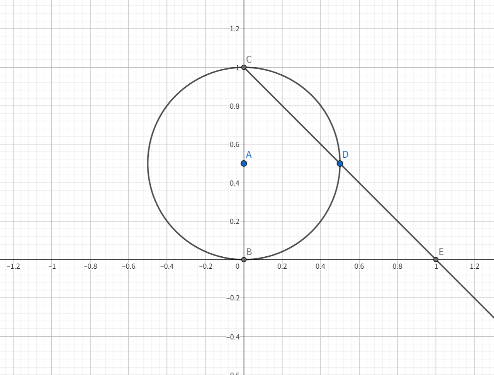

极限、收敛性与连续性是分析中最重要的概念之一，因此把各种不同的收敛概念统一到同一个框架下是有用的（我们已在一致收敛理论中看到了这一点）。其中一种这样的框架是度量空间，它与常见的 Euclidean 空间的区别并不大，我们可以轻易地从 Euclidean 空间迁移到度量空间上去。然而，度量空间的概念还是不够宽泛，因为一些非常常见的收敛性（例如逐点收敛）都无法描述，因此，一个更灵活的框架，即拓扑空间，是我们所需要的。

# Section 1: 可数公理与分离公理

我们在第 15a 章中已经简要介绍了拓扑空间，下面我们就从拓扑空间的生成开始讲起。

设 $\mathcal{T}_{1},\mathcal{T}_{2}$ 是 $X$ 上的两个拓扑，如果 $\mathcal{T}_{1}\subset \mathcal{T}_{2}$，那么我们就称 $\mathcal{T}_{1}$ 比 $\mathcal{T}_{2}$ **更弱**，$\mathcal{T}_{2}$ 比 $\mathcal{T}_{1}$ **更强**。显然，$X$ 上的平凡拓扑 $\{ \varnothing,X \}$ 是最弱的，而离散拓扑 $\mathscr{P}(X)$ 是最强的。对于 $\mathcal{E}\subset \mathscr{P}(X)$，存在一个包含 $\mathcal{E}$ 的最弱的拓扑，也就是所有包含 $\mathcal{E}$ 的拓扑的交集，这就是 $\mathcal{E}$ **生成**的拓扑。

**定义 25.1.1** 生成（generate）

设 $X$ 是一个集合，$\mathcal{E}\subset \mathscr{P}(X)$，则 $\mathcal{E}$ **生成**的拓扑为

$$
\mathcal{T}(\mathcal{E})=\bigcap \{ \mathcal{T} \mid \mathcal{E}\subset \mathcal{T}, \mathcal{T}\text{是} X\text{上的拓扑} \}
$$

$\mathcal{E}$ 也称为 $\mathcal{T}(\mathcal{E})$ 的**子基**。

**定义 25.1.2** 邻域基（neighborhood base）

设 $(X,\mathcal{T})$ 是拓扑空间，$x \in X$ 的一个**邻域基**是集族 $\mathcal{N}\subset \mathcal{T}$ 使得

1. 对任意 $V \in \mathcal{N}$ 有 $x \in V$
2. 如果 $U \in \mathcal{T}$ 且 $x \in U$，那么存在 $V \in \mathcal{N}$ 使得 $V\subset U$

例如，度量空间中一点 $x$ 处的所有开球 $B(x,r)$ 构成的集合就是 $x$ 的一个邻域基。

**定义 25.1.3** 基（base）

设 $(X,\mathcal{T})$ 是拓扑空间，集族 $\mathcal{B}$ 是一个**基**，如果它包含每个点的一个邻域基。

根据上一个例子，所有开球就构成了度量空间的一个基。

**定理 25.1.4**

设 $(X,\mathcal{T})$ 是拓扑空间，$\mathcal{E}\subset \mathcal{T}$，则 $\mathcal{E}$ 是一个基当且仅当任意非空开集都是 $\mathcal{E}$ 中元素的并集。

**证明**

如果 $\mathcal{E}$ 是一个基，那么对任意 $U \in \mathcal{T},U\neq \varnothing$ 和 $x \in U$，都有 $V_{x} \in \mathcal{E}$ 使得 $V_{x}\subset U$ 且 $x \in V_{x}$，于是 $U=\bigcup_{x \in U}V_{x}$. 反之，如果任意非空开集都是 $\mathcal{E}$ 中元素的并集，考虑集族 $\{ V \in \mathcal{E} \mid x \in V \}$，如果 $U \in \mathcal{T},x \in U$，那么 $U=\bigcup_{\alpha}V_{\alpha}$，于是存在 $V \in \{ V \in \mathcal{E} \mid x \in V \}$ 使得 $V\subset U$，故 $\mathcal{E}$ 是一个基。

**定理 25.1.5**

设 $\mathcal{E}\subset \mathscr{P}(X)$，则 $\mathcal{E}$ 是 $X$ 上某个拓扑的基当且仅当以下命题成立：

1. 每个 $x \in X$ 都属于某个 $V \in \mathcal{E}$
2. 如果 $U,V \in \mathcal{E}$ 且 $x \in U\cap V$，则存在 $W \in \mathcal{E}$ 使得 $x \in W\subset U\cap V$

**证明**

如果 $\mathcal{E}$ 是一个拓扑的基，那么 1 显然成立，并且如果 $U,V$ 是开集，那么 $U\cap V$ 也是开集，根据邻域基的定义知存在这样的 $W$.

反之，令

$$
\mathcal{T}=\{ U\subset X \mid \forall x \in U \exists V \in \mathcal{E} (x \in V \subset U) \}
$$

则由 1 得 $\varnothing,X \in \mathcal{T}$，并且 $\mathcal{T}$ 显然对并集封闭。设 $U_{1},U_{2}\in \mathcal{T}$ 且 $x \in U_{1}\cap U_{2}$，则存在 $V_{1},V_{2}\in \mathcal{E}$ 使得 $x \in V_{1}\subset U_{1},x \in V_{2}\subset U_{2}$，根据 2 得存在 $W \in \mathcal{E},W\subset V_{1}\cap V_{2}$ 使得 $x \in W\subset U_{1}\cap U_{2}$，因此 $\mathcal{T}$ 对有限交封闭，因而是一个拓扑，并且 $\mathcal{E}$ 是 $\mathcal{T}$ 的一个基。

现在我们就可以描述 $\mathcal{T}(\mathcal{E})$ 的形象了。

**定理 25.1.6**

设 $\mathcal{E}\subset \mathscr{P}(X)$，则 $\mathcal{T}(\mathcal{E})$ 包含 $\varnothing,X$，以及 $\mathcal{E}$ 中元素的有限交的并集。

**证明**

$\mathcal{E}$ 中元素的有限交构成的集合加上 $X$ 满足 25.1.5 中的条件，因此是 $X$ 上拓扑的一个基，从而根据 25.1.4，$\mathcal{E}$ 中元素的有限交的并集加上 $\varnothing$ 就构成了一个拓扑 $\mathcal{T}\subset \mathcal{T}(\mathcal{E})$，根据 $\mathcal{T}(\mathcal{E})$ 的最小性可知 $\mathcal{T}=\mathcal{T}(\mathcal{E})$.

我们可以将 $\mathcal{T}(\mathcal{E})$ 的简单性与 $\mathcal{E}$ 生成的 $\sigma$-代数进行比较，这种简单性的来源就是拓扑只要求对有限交封闭，而非 $\sigma$-代数中的可数交。

拓扑空间可以描述的对象非常广泛，但对于分析学来说，我们关注的只是其中的一部分，也就是所谓的**可数公理**与**分离公理**。

**定义 25.1.7** 可数公理（axioms of countability）

称拓扑空间 $(X,\mathcal{T})$ 是**第一可数的**，或者满足**第一可数公理**，如果每一点都有一个可数的邻域基。称其是**第二可数的**，或者满足**第二可数公理**，如果它有一个可数的基。

注意，如果 $(X,\mathcal{T})$ 是第一可数的，那么我们可以取一个递减的可数邻域基 $\{ U_{j} \}_{j=1}^{\infty},U_{j}\supset U_{j+1}$：任取邻域基 $\{ V_{j} \}$，然后令 $U_{k}=\bigcap_{j=1}^{k}V_{j}$ 即可。

任意度量空间都是第一可数的，取 $\{ B(x,q) \},q \in \mathbb{Q}_{>0}$ 即可，此外，我们还有：

**定理 25.1.8**

度量空间 $(X,d)$ 是第二可数的当且仅当 $X$ 是可分的。

**证明**

设 $X$ 是可分的，则其存在一个可数稠密子集 $C$，令

$$
\mathcal{B}=\{ B(x,r) \mid x \in C,r \in \mathbb{Q}_{>0} \}
$$

则 $\mathcal{B}$ 是可数的，并且对任意 $x$ 和开集 $x \in U$，存在开球 $B(x,r)\subset U$，由于 $C$ 是稠密的，故存在 $c \in C$ 使得 $d(x,c)<r / 2$ 以及 $q \in \mathbb{Q}_{>0}$ 使得 $d(x,c)<q<r / 2$，于是 $x \in B(c,q)\subset B(x,r)$，故 $\mathcal{B}$ 是一个基。

反之，设 $\mathcal{B}$ 是一个可数基，对任意 $U \in \mathcal{B}$，取 $x_{U}\in U$，设

$$
C=\{ x_{U} \mid U \in \mathcal{B} \}
$$

则 $C\subset X$ 是可数的，并且 $(\overline{C})^{c}$ 是一个开集，并且不包含任何 $U \in \mathcal{B}$，根据 25.1.4 得 $(\overline{C})^{c}=\varnothing$，从而 $\overline{C}=X$，即 $C$ 是稠密的。

上述定理的后半部分证明可以直接迁移到一般的拓扑空间上，从而我们得到了一个稍微广义一些的结论：

**定理 25.1.9**

任何第二可数的拓扑空间都是可分的。

可数公理的重要性来源于它与序列极限的交互上，特别地，我们有如下定理：

**定理 25.1.10**

如果 $(X,\mathcal{T})$ 是第一可数的，$A\subset X$，那么 $x \in \overline{A}$ 当且仅当存在 $A$ 中的序列 $(x_{n})$ 收敛于 $x$.

**证明**

设 $\{ U_{j} \},U_{j}\supset U_{j+1}$ 是 $x$ 的可数邻域基，如果 $x \in \overline{A}$，那么对任意 $j$，都存在 $x_{j} \in A\cap U_{j}$，故对任意 $x$ 的邻域 $V$，存在 $x \in U_{J}\subset V$，并且对任意 $j>J$ 有 $x_{j} \in U_{J}\subset V$，因此 $(x_{j})$ 收敛于 $x$.

如果 $x \not\in \overline{A}$，那么 $(\overline{A})^{c}$ 是 $x$ 的一个邻域，但它不包含任何 $x_{j}$，因此 $x$ 不是 $(x_{j})$ 的极限。

接下来，我们来介绍分离公理，它描述了两个点 $x\neq y$ 可以如何被开集或闭集所分离。

**定义 25.1.11** 分离公理（separation axioms）

设 $(X,\mathcal{T})$ 是拓扑空间，如果它满足公理 $T_{j}$，我们就称 $(X,\mathcal{T})$ 是一个 $T_{j}$ 空间：

- $T_{0}$：如果 $x\neq y$，那么存在一个开集包含 $x$ 但不包含 $y$，或者一个开集包含 $y$ 但不包含 $x$
- $T_{1}$：如果 $x\neq y$，那么存在一个开集包含 $y$ 但不包含 $x$
- $T_{2}$：如果 $x\neq y$，那么存在不相交的开集 $U,V$ 使得 $x \in U$ 且 $y \in V$
- $T_{3}$：$X$ 是一个 $T_{1}$ 空间，并且对任意闭集 $A\subset X$ 和 $x \in A^{c}$ 有不相交的开集 $U,V$ 使得 $x \in U$ 且 $A\subset V$
- $T_{4}$：$X$ 是一个 $T_{1}$ 空间，并且对任意不相交的闭集 $A,B\subset X$ 有不相交的开集 $U,V$ 使得 $A\subset U$ 且 $B\subset V$

$T_{2}$ 空间称为 **Hausdorff 空间**，$T_{3}$ 空间称为**正则空间**（regular），$T_{4}$ 空间称为**正规空间**（normal）。

下面的定理显示了蕴含链 $T_{4}\implies T_{3}\implies T_{2}$.

**定理 25.1.12**

拓扑空间 $(X,\mathcal{T})$ 是 $T_{1}$ 的当且仅当对任意 $x \in X$，$\{ x \}$ 是闭集。

**证明**

如果 $X$ 是 $T_{1}$ 空间且 $x \in X$，那么对任意 $y\neq x$ 都有开集 $V_{y}$ 包含 $y$ 但不包含 $x$，因此 $\{ x \}^{c}=\bigcup_{y\neq x}V_{y}$ 是开集，从而 $\{ x \}$ 是闭集。反之，若 $\{ x \}$ 是闭集，那么 $\{ x \}^{c}$ 是一个开集，并且包含所有 $y\neq x$，因此 $X$ 是 $T_{1}$ 的。

**定理 25.1.13**

任意度量空间都是正规的。

**证明**

设 $(X,d)$ 是度量空间，设 $x\neq y$，则开集 $B\left( y, \dfrac{d(x,y)}{2} \right)$ 包含 $y$ 但不包含 $x$，故 $X$ 是 $T_{1}$ 的。设 $A,B\subset X$ 是不相交的闭集，定义

$$
d(x,A)=\inf_{y \in A} d(x,y)
$$

令 $U=\{ x \mid d(x,A)<d(x,B) \}$，由于 $A\cap B=\varnothing$，故 $A\subset U$，下面我们要证 $U$ 是开集。考虑 $U^{c}$ 中的收敛序列 $(x_{n})$，其极限为 $x$，则对任意 $n$ 有 $d(x_{n},A)\geq d(x_{n},B)$，只要我们证明 $\lim_{ n \to \infty }d(x_{n},A)=d(x,A)$，即得 $d(x,A)\geq d(x,B)$，因此 $U^{c}$ 是闭集，即 $U$ 是开集。

对任意 $a \in A$，我们有

$$
d(x_{n},a)\leq d(x_{n},x)+d(x,a)
$$

取下确界，则有

$$
d(x_{n},A)=\inf_{a \in A} d(x_{n},a)\leq d(x_{n},x)+\inf_{a \in A} d(x,a)=d(x_{n},x)+d(x,A)
$$

交换 $x_{n}$ 与 $x$，也有类似的不等式成立，因此

$$
|d(x_{n},A)-d(x,A)|\leq d(x_{n},x)
$$

由于 $\lim_{ n \to \infty }d(x_{n},x)=0$，故 $\lim_{ n \to \infty }d(x_{n},A)=d(x,A)$，从而 $U$ 是开集。同理，$V=\{ x \mid d(x,A)>d(x,B) \}$ 是包含 $B$ 的开集，并且 $U\cap V=\varnothing$，这就完成了证明。

在分析学中，我们遇到的大多数拓扑空间都是 Hausdorff 的，或者经过简单的调整后是 Hausdorff 的（例如所有可积函数构成的空间，当我们将 a.e. 相等作为等价关系模去后就变成了一个度量空间）。

# Section 2: 连续函数

拓扑空间的定义天然地适合连续性的定义，事实上，当我们考虑两个拓扑空间之间的函数时，我们通常总是考虑它们之间的连续函数。我们将从拓扑空间 $X$ 到 $Y$ 的连续函数构成的集合记作 $C(X,Y)$.

**定理 25.2.1**

设 $X,Y$ 是拓扑空间，如果 $Y$ 上的拓扑由 $\mathcal{E}\subset \mathscr{P}(Y)$ 生成，那么函数 $f\colon X\to Y$ 是连续的当且仅当对任意 $V \in \mathcal{E}$，$f^{-1}[V]$ 是开集。

**证明**

根据定理 25.1.6，$Y$ 中的开集是 $\mathcal{E}$ 的有限交的并集，又因为 $f^{-1}$ 与交集和并集交换，这一等价性就是显然的了。

**定义 25.2.2** 同胚（homeomorphism），嵌入（embedding）

设 $X,Y$ 是拓扑空间，如果 $f\colon X\to Y$ 是双射并且 $f$ 和 $f^{-1}$ 都是连续的，则称 $f$ 是一个**同胚**，并称 $X,Y$ 是**同胚的**。

如果 $f\colon X\to Y$ 是单射但不是满射，并且 $f\colon X\to f[X]$ 是一个同胚（$f[X]$ 上的拓扑取为关于 $Y$ 的相对拓扑），那么 $f$ 称为一个**嵌入**。

显然，同胚 $f\colon X\to Y$ 给出了 $X$ 和 $Y$ 上开集的一一对应，因此，两个同胚的拓扑空间其拓扑性质是一致的。这也是代数拓扑学研究的主要问题，即同胚下的拓扑不变量。

**定义 25.2.3** 弱拓扑（weak topology）

设 $X$ 是一个集合，$\{ f_{\alpha} \}_{\alpha \in A}$ 是一族 $X$ 到拓扑空间 $Y_{\alpha}$ 的函数，$X$ 上使得各 $f_{\alpha}$ 都连续的最弱的拓扑称为由 $\{ f_{\alpha} \}_{\alpha \in A}$ 生成的**弱拓扑**，也就是由以下集合生成的拓扑：

$$
\{ f_{\alpha}^{-1}[U_{\alpha}] \mid \alpha \in A,U_{\alpha}\subset Y_{\alpha} \text{是开集} \}
$$

在弱拓扑中最重要的就是乘积拓扑，定义如下：

**定义 25.2.4** 乘积拓扑（product topology）

设 $\{ X_{\alpha} \}_{\alpha \in A}$ 是一族拓扑空间，$X=\prod_{\alpha \in A}X_{\alpha}$，$X$ 上的**乘积拓扑**定义为投影函数 $\{ \pi_{\alpha} \}_{\alpha \in A}$ 生成的弱拓扑，也就是由以下集合生成的拓扑：

$$
\{ \pi_{\alpha}^{-1}[U_{\alpha}] \mid \alpha \in A,U_{\alpha}\subset X_{\alpha} \text{是开集} \}
$$

当我们在处理乘积集合 $\prod_{\alpha \in A}X_{\alpha}$ 时，如果没有特殊指定，我们总是将其上的拓扑取为乘积拓扑。根据定理 25.1.5，$X$ 上的乘积拓扑的一个基就是 $\pi_{\alpha}^{-1}[U_{\alpha}]$ 的有限交构成的集合，这些集合也可以写成 $\prod_{\alpha \in A}U_{\alpha}$，其中除了有限个项以外都有 $U_{\alpha}=X_{\alpha}$.

**定理 25.2.5**

设 $\{ X_{\alpha} \}_{\alpha \in A}$ 是一族拓扑空间，如果每个 $X_{\alpha}$ 都是 Hausdorff 的，那么 $X=\prod_{\alpha \in A}X_{\alpha}$ 也是 Hausdorff 的。

**证明**

设 $x,y \in X,x\neq y$，那么存在 $\alpha$ 使得 $\pi_{\alpha}(x)\neq \pi_{\alpha}(y)$，设 $U,V$ 是 $X_{\alpha}$ 中不相交的开集，$\pi_{\alpha}(x)\in U,\pi_{\alpha}(y)\in V$，则 $\pi_{\alpha}^{-1}[U],\pi_{\alpha}^{-1}[V]$ 是 $X$ 中不相交的开集，并且 $x \in \pi_{\alpha}^{-1}[U],y \in \pi_{\alpha}^{-1}[V]$，故 $X$ 是 Hausdorff 的。

**定理 25.2.6**

设 $X$ 和 $\{ Y_{\alpha} \}_{\alpha \in A}$ 都是拓扑空间，$Y=\prod_{\alpha \in A}Y_{\alpha}$，则 $f\colon X\to Y$ 是连续的当且仅当对任意 $\alpha \in A$，函数 $\pi_{\alpha}\circ f$ 是连续的。

**证明**

如果每个 $\pi_{\alpha}\circ f$ 是连续的，那么对任意开集 $U_{\alpha}\subset Y_{\alpha}$ 有 $f^{-1}[\pi_{\alpha}^{-1}[U_{\alpha}]]$ 是开集，根据定理 25.2.1，$f$ 是连续的。反之是显然的。

如果 $X_{\alpha}$ 都等于某个集合 $X$，那么乘积集合 $\prod_{\alpha \in A}X_{\alpha}$ 就等于 $A$ 到 $X$ 的函数构成的集合 $X^{A}$，并且下面的定理表明，$X^{A}$ 上的乘积拓扑就是逐点收敛拓扑。

**定理 25.2.7**

设 $X$ 是一个拓扑空间，$A\neq \varnothing$，$(f_{n})$ 是 $X^{A}$ 中的序列，则 $(f_{n})$ 依乘积拓扑收敛于 $f \in X^{A}$ 当且仅当 $(f_{n})$ 逐点收敛于 $f$.

**证明**

对任意 $k\geq 1$，$U_{j}$ 是 $f(\alpha_{j})$ 的邻域，集合

$$
N(U_{1},\dots,U_{k})=\bigcap_{j=1}^{k} \pi_{\alpha_{j}}^{-1}[U_{j}]=\{ g \in X^{A} \mid g(\alpha_{j}) \in U_{j}, 1\leq j\leq k \}
$$

构成了 $f$ 的一个邻域基。如果 $f_{n}$ 逐点收敛于 $f$，那么存在 $N_{j}$ 使得对任意 $n>N_{j}$ 有 $f_{n}(\alpha_{j})\in U_{j}$，故对任意 $n>\max_{j} N_{j}$ 有 $f_{n}\in N(U_{1},\dots,U_{k})$，从而 $f_{n}$ 依乘积拓扑收敛于 $f$.

反之，如果 $f_{n}$ 依乘积拓扑收敛于 $f$，$\alpha \in A$，设 $U$ 是 $f(\alpha)$ 的邻域，则存在 $N$ 使得对任意 $n>N$ 有 $f_{n} \in N(U)$，即 $f_{n}(\alpha)\in U$，从而 $\lim_{ n \to \infty }f_{n}(\alpha)=f(\alpha)$，即 $f_{n}$ 逐点收敛于 $f$.

拓扑空间 $X$ 上的实值或复值函数是我们研究的重点。设 $\mathbb{F}$ 是 $\mathbb{R}$ 或 $\mathbb{C}$，对任意集合 $X$，我们定义 $B(X,\mathbb{F})$ 是 $X$ 到 $\mathbb{F}$ 的有界函数构成的集合，为 $X$ 赋予一个拓扑结构，那么我们就有 $C(X,\mathbb{F})$ 为 $X$ 到 $\mathbb{F}$ 的连续函数构成的集合，并且我们还有

$$
C_{b}(X,\mathbb{F})=B(X,\mathbb{F})\cap C(X,\mathbb{F})
$$

是 $X$ 到 $\mathbb{F}$ 的有界连续函数构成的集合。当 $\mathbb{F}=\mathbb{C}$ 时，我们通常省略 $\mathbb{C}$，而直接写成 $B(X),C(X),C_{b}(X)$. 根据加法和乘法的连续性，$C(X)$ 和 $C_{b}(X)$ 都是复向量空间。

如果 $f \in B(X)$，其一致范数定义为

$$
\lVert f \rVert _{\infty}=\sup_{x \in X} |f(x)|
$$

显然 $d_{\infty}(f,g)=\lVert f-g \rVert_{\infty}$ 是 $B(X)$ 上的度量，并且依 $d_{\infty}$ 收敛就等价于一致收敛。此外，我们还有：

**定理 25.2.8**

设 $X$ 是拓扑空间，则 $B(X)$ 在一致度量下是完备的，并且 $C_{b}(X)$ 是 $B(X)$ 的一个闭子空间（从而是完备的）。

该定理的证明参考 16.3.2，注意在证明中我们没有用到 $X$ 的拓扑性质，为 $X$ 赋予拓扑只是为了保证 $C_{b}(X)$ 有定义。

给定一个拓扑空间 $X$，其上的连续函数 $C(X)$ 有可能只包含了常值函数（当 $X$ 上的拓扑是平凡拓扑时是这样），但这甚至当 $X$ 是正则空间时也会发生。不过，当 $X$ 是正规空间时，我们可以保证存在非平凡的连续函数，下面我们就来证明这一点。

**引理 25.2.9**

设 $X$ 是正规空间，$A,B\subset X$ 是不相交的闭集，令

$$
\Delta=\{ k 2^{-n} \mid n\geq 1,0<k<2^{n} \}
$$

则存在开集族 $\{ U_{r} \}_{r \in\Delta}$ 使得对任意 $r$ 有 $A\subset U_{r}\subset B^{c}$ 且对任意 $r<s$ 有 $\overline{U}_{r}\subset U_{s}$.

**证明**

根据正规性，存在不相交的开集 $V,W$ 使得 $A\subset V,B\subset W$，令 $U_{1 / 2}=V$，由于 $W^{c}$ 是闭集，故

$$
A\subset U_{1 / 2}\subset  \overline{U}_{1 / 2}\subset W^{c}\subset B^{c}
$$

下面我们使用归纳法来构造 $U_{r}$. 假设我们已经有了 $U_{r},r=k 2^{-n}$，其中 $0<k<2^{n},1\leq n\leq N-1$，现在我们要构造 $U_{r},r=(2j+1)2^{-N}$，其中 $0\leq j<2^{N-1}$.

设 $\overline{U}_{0}=A,U_{1}=B^{c}$，则 $\overline{U}_{j 2^{1-N}}$ 和 $U_{(j+1)2^{1-N}}^{c}$ 是不相交的闭集，则我们可以取开集 $U_{r}$ 使得

$$
A\subset  \overline{U}_{j 2^{1-N}}\subset U_{r}\subset  \overline{U}_{r} \subset U_{(j+1)2^{1-N}}^{c} \subset B^{c}
$$

这样构成的 $\{ U_{r} \}$ 满足条件，即证。

上述证明中 $U_{r}$ 的构造过程是一个二分的过程：首先是 $U_{1 / 2}$，然后是 $U_{1 / 4},U_{1 / 2},U_{3 / 4}$，再之后是 $U_{1 / 8},U_{1 / 4},U_{3 / 8},\dots$，每增加一个 $U_{r}$，我们都要应用一次正规性。

**引理 25.2.10**

$\mathbb{R}$ 上的标准拓扑可以由 $(a,+\infty),a \in \mathbb{R}$ 和 $(-\infty,b),b \in \mathbb{R}$ 生成。

**证明**

根据定理 25.1.7，$\mathcal{E}$ 生成的拓扑包含 $\mathcal{E}$ 的有限交的并集，又由于 $\mathbb{R}$ 上的开集可以写成可数个开区间的并，且 $(a,b)=(a,+\infty)\cap(-\infty,b)$，这就完成了证明。

**定理 25.2.11** Urysohn 引理

设 $X$ 是正规空间，$A,B\subset X$ 是不相交的闭集，则存在 $f \in C(X,[0,1])$ 使得 $f|_{A}=0$ 且 $f|_{B}=1$.

**证明**

设 $\{ U_{r} \}_{r \in\Delta}$ 为引理 25.2.9 所示，令 $U_{1}=X$，对任意 $x \in X$，定义

$$
f(x)= \inf\{ r \mid x \in U_{r} \}
$$

由于 $A\subset U_{r}\subset B^{c}$，我们就有 $f|_{A}=0,f|_{B}=1$，并且 $0\leq f\leq 1$，下面我们要证 $f$ 是连续的。

设 $\alpha \in \mathbb{R}$，我们有 $f(x)<\alpha$ 当且仅当存在 $r<\alpha$ 使得 $x \in U_{r}$，因此 $f^{-1}[(-\infty,\alpha)]=\bigcup_{r<\alpha}U_{r}$ 是开集。另一边，我们有 $f(x)>\alpha$ 当且仅当存在 $r>\alpha$ 使得 $x \in U_{r}^{c}$，当且仅当存在 $r>s>\alpha$ 使得 $x \in (\overline{U}_{s})^{c}$，从而 $f^{-1}[(\alpha,+\infty)]=\bigcup_{s>\alpha}(\overline{U}_{s})^{c}$ 是开集，由于 $\mathbb{R}$ 上的拓扑可以由射线生成，故 $f$ 是连续的。

上述定理有一个非常简单的几何解释：取 $X=\mathbb{R}^{2}$，那么每个 $U_{r}$ 可以看作由曲线围成的区域，其边界 $\partial U_{r}$ 就可以看作 $f$ 的等值线。

**定理 25.2.12** Tietze 扩张定理（Tietze extension theorem）

设 $X$ 是正规空间，$A\subset X$ 是闭集，$f \in C(A,[a,b])$，那么存在 $F \in C(X,[a,b])$ 使得 $F|_{A}=f$.

**证明**

通过将 $f$ 替换为 $\dfrac{f-a}{b-a}$，我们可以假设 $f \in C(A,[0,1])$. 我们断言存在 $X$ 上的连续函数序列 $g_{n}$ 使得在 $X$ 上有 $0\leq g_{n}\leq 2^{n-1} / 3^{n}$ 且在 $A$ 上有 $0\leq f-\sum_{j=1}^{n}g_{j}\leq (2 / 3)^{n}$.

首先，令 $B=f^{-1}[[0,1 / 3]],C=f^{-1}[[2 / 3,1]]$，它们是 $A$ 的闭子集，从而也是 $X$ 的闭子集，根据 Urysohn 引理知存在连续函数 $g_{1}\colon X\to[0, 1 / 3]$ 使得 $g_{1}|_{B}=0,g_{1}|_{C}=1 / 3$，于是在 $A$ 上有 $0\leq f-g_{1}\leq 2 / 3$.

假设我们已经有了 $g_{1},\dots,g_{n-1}$，根据上面的论述，存在连续函数 $g_{n}\colon X\to[0,2^{n-1} / 3^{n}]$ 使得在 $f-\sum_{j=1}^{n-1}g_{j}\leq 2^{n-1} / 3^{n}$ 时有 $g_{n}=0$，而在 $f-\sum_{j=1}^{n-1}g_{j}\geq (2 / 3)^{n}$ 时有 $g_{n}= 2^{n-1} / 3^{n}$，这就完成了 $g_{n}$ 的构造。

令 $F=\sum_{j=1}^{\infty}g_{j}$，由于 $\lVert g_{n} \rVert_{\infty}=2^{n-1} / 3^{n}$，故 $\sum_{j=1}^{\infty}g_{j}$ 一致收敛于 $F$，从而 $F$ 是连续的，并且有 $F|_{A}=f$，即证。

作为上述定理的一个推论，我们可以将 $f$ 的值域扩展到 $\mathbb{C}$ 上。

**定理 25.2.13**

设 $X$ 是正规空间，$A\subset X$ 是闭集，$f \in C(A)$，则存在 $F \in C(X)$ 使得 $F|_{A}=f$.

**证明**

通过考虑实部和虚部，我们可以假设 $f$ 是实值函数。令 $g= \dfrac{f}{1+|f|}$，则 $g \in C(A,(-1,1))$，考虑 $\dfrac{g+1}{2}\in C(A,[0,1))$，由于 $[0,1 / 3],[2 / 3,1)$ 都是 $[0,1)$ 中的闭集（取关于 $\mathbb{R}$ 的相对拓扑），故仿照 25.2.11 中的构造，存在 $G \in C(X,[-1,1])$ 使得 $G|_{A}=g$.

令 $B=G^{-1}[\{ -1,1 \}]$，根据 Urysohn 引理，存在 $h \in C(X,[0,1])$ 使得 $h|_{A}=1,h|_{B}=0$，于是在 $A$ 上有 $hG=G$，在 $X$ 上有 $|hG|<1$，从而 $F= \dfrac{hG}{1-|hG|}$ 就是所求的函数。

事实上，上面两个定理完全确定了一个正规空间，如下所示：

**定理 25.2.14**

拓扑空间 $X$ 是正规的当且仅当 Urysohn 引理的结论成立，当且仅当 Tietze 扩张定理的结论成立。

**证明**

正规性推出后面两个结论我们已经证明了。如果 Urysohn 引理的结论成立，设 $A,B$ 是不相交的闭集，取 $f \in C(X,[0,1])$ 使得 $f|_{A}=0,f|_{B}=1$，则 $f^{-1}[(-\infty,1 / 2)]$ 和 $f^{-1}[(1 / 2,+\infty)]$ 就是不相交的包含 $A,B$ 的开集，即 $X$ 是正规的。

如果 Tietze 扩张定理的结论成立，定义

$$
f(x)=\begin{cases}
0 &, x \in A \\
1 &, x \in B
\end{cases}
$$

由于 $A,B$ 是闭集，故 $A\cup B$ 也是闭集，由于 $A\cap B=\varnothing$，故 $A,B$ 在 $A\cup B$ 的相对拓扑中是开集，故 $f$ 是连续的，应用 Tietze 扩张，得到 $F \in C(X,[0,1])$ 使得 $F|_{A\cup B}=f$，于是 $F^{-1}[(-\infty,1 / 2)]$ 和 $F^{-1}[(1 / 2,+\infty)]$ 就是不相交的包含 $A,B$ 的开集，这就完成了证明。

关于使用连续函数进行延拓，我们还可以得到另一个分离公理。

**定义 25.2.15** 完全正则的（completely regular）

称拓扑空间 $(X,\mathcal{T})$ 是**完全正则的**，如果 $X$ 是 $T_{1}$ 空间，并且对任意闭集 $A\subset X$ 和 $x \in A^{c}$，存在 $f \in C(X,[0,1])$ 使得 $f(x)=1$ 且 $f|_{A}=0$. 完全正则空间也称为 **Tychonoff 空间**或者 $T_{3 \frac{1}{2}}$ 空间。

最后一个术语是合理的，因为我们可以取 $U=f^{-1}[(-\infty,1 / 2)]$ 和 $V=f^{-1}[(1 / 2,+\infty)]$，从而完全正则空间是 $T_{3}$ 空间，而 Urysohn 引理则表明 $T_{4}$ 空间是完全正则的，因此完全正则空间的分离性介于 $T_{3}$ 和 $T_{4}$ 之间。

**定理 25.2.16**

如果 $(X,\mathcal{T})$ 是完全正则的，那么 $\mathcal{T}$ 是 $C(X)$ 生成的弱拓扑。

**证明**

设 $C(X)$ 生成的弱拓扑为 $\mathcal{T}'$，它由

$$
\{ f^{-1}[V] \mid f\colon X\to \mathbb{C}\text{连续},V\subset \mathbb{C}\text{是开集} \}
$$

生成，因此 $\mathcal{T}'\subset \mathcal{T}$.

设 $U \in \mathcal{T}$，则 $U^{c}$ 是闭集，因此对任意 $x \in U$ 都有 $f_{x} \in C(X,[0,1])$ 使得 $f_{x}(x)=1$ 且 $f_{x}|_{U^{c}}=0$，于是 $U=\bigcup_{x \in U}f_{x}^{-1}[\{ 0 \}^{c}]$，于是 $\mathcal{T}\subset \mathcal{T}'$，这就完成了证明。

# Section 3: 网

与度量空间不同，在拓扑空间中，序列并没有很大的用处，参考 25.1.10，如果 $X$ 不是第一可数的，那么存在 $x \in \overline{A}$ 使得它不是某个序列的极限。这种现象出现的原因是序列的指标集 $\mathbb{N}$ 不足以编码拓扑空间中的许多概念，特别是不可数的那些，因此，一个序列的推广概念就是我们需要的。事实上，有两种等价的推广：一个称为**滤子**，另一个则是我们下面要介绍的**网**。

**定义 25.3.1** 有向集（directed set），网（net）

二元组 $(A,\preceq)$ 是一个**有向集**，如果有：

- 自反性：$\alpha\preceq\alpha$
- 传递性：$\alpha\preceq\beta,\beta\preceq\gamma\implies\alpha\preceq\gamma$
- 有向性：对任意 $\alpha,\beta \in A$，存在 $\gamma \in A$ 使得 $\alpha\preceq\gamma,\beta\preceq\gamma$

集合 $X$ 上的一个**网**是从有向集 $A$ 到 $X$ 的函数 $\alpha\mapsto x_{\alpha}$，记作 $\langle x_{\alpha} \rangle_{\alpha \in A}$，也称 $\langle x_{\alpha} \rangle$ 由 $A$ 定向。

注意，有向集上的关系 $\preceq$ 不是一个偏序，因为它不满足反对称性。一些常见的有向集如下：

- 自然数集 $\mathbb{N}$，其中 $m\preceq n$ 如果 $m\leq n$
- $\mathbb{R}\setminus\{ a \}$，其中 $x\preceq y$ 如果 $|x-a|\geq |y-a|$
- $[a,b]$ 上的划分 $\mathbf{P}$ 的集合，其中 $\mathbf{P}\preceq \mathbf{Q}$ 如果 $\max_{J \in \mathbf{P}}|J|\geq \max_{J \in \mathbf{Q}}|J|$
- 拓扑空间上一点 $x$ 的邻域构成的集合 $\mathcal{N}$，其中 $U\preceq V$ 如果 $U\supset V$（我们称 $\mathcal{N}$ 由反向包含所定向）
- 两个有向集的直积 $A\times B$，其中 $(\alpha,\beta)\preceq(\alpha',\beta')$ 如果 $\alpha\preceq\alpha'$ 且 $\beta\preceq\beta'$（如果没有特别指明，我们总是取该关系作为直积上的定向）

前三个例子来源于初等分析：显然，由 $\mathbb{N}$ 定向的网就是一个序列，第二个例子来源于实函数的极限，第三个则来源于 Riemann 积分的上下和。

作为序列的推广，我们也可以来讨论网的收敛性。

**定义 25.3.2** 极限（limit），聚点（cluster point）

设 $X$ 是拓扑空间，$E\subset X$，称 $\langle x_{\alpha} \rangle_{\alpha \in A}$ **最终在** $E$ **中**，如果存在 $\alpha_{0}\in A$ 使得对任意 $\alpha\succeq\alpha_{0}$ 有 $x_{\alpha}\in E$；称 $\langle x_{\alpha} \rangle$ **经常在** $E$ **中**，如果对任意 $\alpha \in A$ 都存在 $\beta\succeq\alpha$ 使得 $x_{\beta}\in E$；称 $\langle x_{\alpha} \rangle$ **收敛于** $x \in X$，如果对任意 $x$ 的邻域 $U$，$\langle x_{\alpha} \rangle$ 都是最终在 $U$ 中的，记作 $x_{\alpha}\to x$，也称 $x$ 是 $\langle x_{\alpha} \rangle$ 的一个**极限**；称 $x \in X$ 是 $\langle x_{\alpha} \rangle$ 的一个**聚点**，如果对任意 $x$ 的邻域 $U$，$\langle x_{\alpha} \rangle$ 都是经常在 $U$ 中的。

以下性质表明了网是一个合适的对序列的推广。

**定理 25.3.3**

设 $X$ 是拓扑空间，$E\subset X$，$x \in X$，则 $x \in \overline{E}$ 当且仅当存在 $E$ 中的网 $\langle x_{\alpha} \rangle$ 收敛于 $x$，并且 $x$ 是 $E$ 的聚点当且仅当存在 $E\setminus\{ x \}$ 中的网 $\langle x_{\alpha} \rangle$ 收敛于 $x$.

**证明**

设 $x \in \overline{E}$，设 $\mathcal{N}$ 是 $x$ 的邻域构成的集合，由反向包含所定向，对任意 $U\in \mathcal{N}$，取 $x_{U}\in U\cap E$，则 $x_{U}\to x$. 反之，设 $x_{\alpha}\to x$，则对任意 $x$ 的邻域 $U$，都存在 $x_{\alpha}\in U$，即 $E\cap U\neq \varnothing$，故 $x \in \overline{E}$. 对于聚点同理。

**定理 25.3.4**

设 $X,Y$ 是拓扑空间，$f\colon X\to Y$，则 $f$ 在 $x \in X$ 处连续当且仅当对任意收敛于 $x$ 的网 $\langle x_{\alpha} \rangle$ 有 $\langle f(x_{\alpha}) \rangle$ 收敛于 $f(x)$.

**证明**

设 $f$ 在 $x$ 处连续，$V$ 是 $f(x)$ 的邻域，则 $f^{-1}[V]$ 就是 $x$ 的邻域，由于 $x_{\alpha}\to x$，故存在 $\alpha_{0}$ 使得对任意 $\alpha\succeq\alpha_{0}$ 有 $x_{\alpha}\in f^{-1}[V]$，即 $f(x_{\alpha})\in V$，故 $f(x_{\alpha})\to f(x)$.

反之，设 $f$ 在 $x$ 处不连续，则存在 $f(x)$ 的邻域 $V$ 使得对任意 $x$ 的邻域 $U$ 有 $f[U] \not\subset V$，即存在 $x_{U}\in U$ 使得 $f(x_{U})\not\in V$，于是 $x_{U}\to x$ 但 $f(x_{U}) \not\to f(x)$.

**定义 25.3.5** 子网（subnet）

设 $A,B$ 是有向集，$X$ 上的网 $\langle y_{\beta} \rangle_{\beta \in B}$ 是 $\langle x_{\alpha} \rangle_{\alpha \in A}$ 的一个**子网**，如果存在 $B$ 到 $A$ 的函数 $\beta\mapsto\alpha_{\beta}$ 使得：

1. 对任意 $\alpha_{0}\in A$，存在 $\beta_{0}\in B$ 使得对任意 $\beta\succeq\beta_{0}$ 有 $\alpha_{\beta}\succeq\alpha_{0}$
2. $y_{\beta}=x_{\alpha_{\beta}}$

根据子网的性质 1，我们可以立即得到：$\langle x_{\alpha} \rangle$ 收敛于 $x$，当且仅当它的所有子网都收敛于 $x$.

注意，我们用了“子网”这个名称，是因为它的作用与子序列是相同的，但与子序列不同的是，函数 $\beta\mapsto\alpha_{\beta}$ 不一定是单射，这就是说，由 $\mathbb{N}$ 所定向的网（序列）的子网不一定是它的子序列。

**定理 25.3.6**

设 $\langle x_{\alpha} \rangle_{\alpha \in A}$ 是拓扑空间 $X$ 上的网，则 $x \in X$ 是 $\langle x_{\alpha} \rangle$ 的一个聚点当且仅当存在 $\langle x_{\alpha} \rangle$ 的子网收敛于 $x$.

**证明**

如果子网 $\langle y_{\beta} \rangle=\langle x_{\alpha_{\beta}} \rangle$ 收敛于 $x$ 且 $U$ 是 $x$ 的邻域，取 $\beta_{1}\in B$ 使得对任意 $\beta\succeq\beta_{1}$ 有 $y_{\beta}\in U$，再取 $\alpha \in A$，则存在 $\beta_{2}\in B$ 使得对任意 $\beta\succeq\beta_{2}$ 有 $\alpha_{\beta}\succeq\alpha$，则存在 $\beta\succeq\beta_{1},\beta\succeq\beta_{2}$ 使得 $x_{\alpha_{\beta}}\in U$，因此 $\langle x_{\alpha} \rangle$ 在 $U$ 中经常出现，从而 $x$ 是一个聚点。

现设 $x$ 是一个聚点，设 $\mathcal{N}$ 是 $x$ 的邻域构成的集合，并且为 $\mathcal{N}\times A$ 赋予定向 $(U,\alpha)\preceq(U',\alpha')$ 如果 $U\supset U'$ 且 $\alpha\preceq\alpha'$. 对任意 $(U,\gamma)\in \mathcal{N}\times A$，我们可以选取 $\alpha_{(U,\gamma)}\succeq\gamma$ 且 $x_{\alpha_{(U,\gamma)}}\in U$，则当 $(U',\gamma')\succeq(U,\gamma)$ 时我们有 $\alpha_{(U',\gamma')}\succeq\gamma'\succeq\gamma$ 且 $x_{\alpha_{(U',\gamma')}}\in U'\subset U$，因此 $\langle x_{\alpha_{(U,\gamma)}} \rangle$ 是一个子网，并且其收敛于 $x$.

**定理 25.3.7**

拓扑空间 $X$ 是 Hausdorff 的当且仅当 $X$ 上的网至多有一个极限。

**证明**

设 $X$ 是 Hausdorff 的，$\langle x_{\alpha} \rangle$ 收敛于 $x$ 和 $y$，假设 $x\neq y$，那么存在不相交的开集 $U,V$ 使得 $x \in U,y \in V$，则存在 $\alpha_{0}$ 使得对任意 $\alpha\succeq\alpha_{0}$ 有 $x_{\alpha} \in U\cap V=\varnothing$，矛盾，因此 $x=y$.

反之，假设 $X$ 不是 Hausdorff 的，那么存在 $x\neq y$ 无法用不相交的开集分离，考虑 $x,y$ 的邻域构成的集合 $\mathcal{N}_{x}\times \mathcal{N}_{y}$，取通常的反向包含以及乘积定向，对任意 $(U,V)\in \mathcal{N}_{x}\times \mathcal{N}_{y}$，取 $x_{(U,V)} \in U\cap V$，则 $\langle x_{(U,V)} \rangle$ 收敛于 $x$ 和 $y$，这与极限的唯一性矛盾。

**定理 25.3.8**

设 $X$ 上的拓扑是由一族函数 $\mathcal{F}$ 生成的弱拓扑，那么 $\langle x_{\alpha} \rangle$ 收敛于 $x \in X$ 当且仅当对任意 $f \in \mathcal{F}$，$\langle f(x_{\alpha}) \rangle$ 收敛于 $f(x)$.

**证明**

设 $x_{\alpha}\to x$，由于在弱拓扑下所有 $f$ 都是连续的，故 $f(x_{\alpha})\to f(x)$. 反之，对任意 $f$ 和 $f(x)$ 的邻域 $V$，存在 $\alpha_{0}$ 使得对任意 $\alpha\succeq\alpha_{0}$ 有 $f(x_{\alpha})\in V$，即 $x_{\alpha}\in f^{-1}[V]$，又由于 $x$ 的邻域 $U$ 可以写成 $f^{-1}[V]$ 的有限交的并集，因此根据有向性，存在 $\alpha_{1}$ 使得对任意 $\alpha\succeq\alpha_{1}$ 有 $x_{\alpha}\in U$，即 $x_{\alpha}\to x$.

特别地，如果我们取 $X=\prod_{i \in I}X_{i}$，那么 $\langle x_{\alpha} \rangle$ 收敛于 $x$ 当且仅当对任意 $i \in I$，$\pi_{i}(x_{\alpha})\to \pi_{i}(x)$，也就是说，乘积集合上元素的收敛性完全由各个分量上的收敛性决定。

# Section 4: 紧致性

我们在度量空间的研究中就多次强调过紧致性的重要性，特别地，性质“任何开覆盖都有一个有限子覆盖”允许我们将一个无限的过程转化为有限过程，而有限过程才是我们真正能够处理的。

**定义 25.4.1** 紧致的（compact），预紧致的（precompact）

设 $X$ 是拓扑空间，称 $Y\subset X$ 是**紧致的**，如果 $Y$ 在相对拓扑中是紧致的，即如果对任意 $\alpha \in A$，$V_{\alpha}\subset X$ 是开集，$Y\subset \bigcup_{\alpha \in A}V_{\alpha}$，那么存在有限集 $B\subset A$ 使得 $Y\subset \bigcup_{\alpha \in B}V_{\alpha}$. 称 $Y\subset X$ 是**预紧致的**，如果 $\overline{Y}$ 是紧致的。

上述紧致的定义是用开集来描述的，利用 De Morgan 定律，我们可以将其转化为使用闭集的描述。

**定理 25.4.2**

拓扑空间 $X$ 是紧致的当且仅当对任意一族闭子集 $\{ F_{\alpha} \}_{\alpha \in A}$，如果它满足有限交性质：对任意有限集 $B\subset A$ 有 $\bigcap_{\alpha \in B}F_{\alpha}\neq \varnothing$，那么 $\bigcap_{\alpha \in A}F_{\alpha}\neq \varnothing$.

**证明**

设 $U_{\alpha}=(F_{\alpha})^{c}$ 是开集，则 $\bigcap_{\alpha \in A}F_{\alpha}\neq \varnothing$ 当且仅当 $\bigcup_{\alpha \in A}U_{\alpha}\neq X$，并且 $\{ F_{\alpha} \}$ 具有有限交性质当且仅当对任意有限集 $B\subset A$ 有 $\bigcup_{\alpha \in B}U_{\alpha}\neq X$，于是如果 $X$ 是紧致的，那么 $\bigcap_{\alpha \in A}F_{\alpha}=\varnothing$ 蕴含 $\{ F_{\alpha} \}$ 不满足有限交性质，反之也同理。

下面我们列出一些紧致集的基本性质。

**定理 25.4.3**

紧致拓扑空间的闭子集是紧致的。

**证明**

设 $X$ 是紧致拓扑空间，$F\subset X$ 是闭集，$\{ U_{\alpha} \}_{\alpha \in A}$ 是 $F$ 的一个开覆盖，则 $\{ U_{\alpha} \}\cup \{ F^{c} \}$ 是 $X$ 的一个开覆盖，从而有一个有限子覆盖，将 $F^{c}$ 从中去除，我们就得到了 $F$ 的一个有限子覆盖。

**定理 25.4.4**

设 $X$ 是 Hausdorff 空间，$F\subset X$ 是紧致集，$x \in F^{c}$，则存在不相交的开集 $U,V$ 使得 $x \in U$ 且 $F\subset V$.

**证明**

对任意 $y \in F$，可以取开集 $V_{y}\cap U_{y}=\varnothing$ 使得 $y \in V_{y}$ 且 $x \in U_{y}$，由于 $\{ V_{y} \}$ 是 $F$ 的开覆盖，故存在有限子覆盖 $\{ V_{y_{j}} \}_{j=1}^{n}$，则 $U=\bigcap_{j=1}^{n}U_{y_{j}}$，$V=\bigcup_{j=1}^{n}V_{y_{j}}$ 就是所求的开集。

**定理 25.4.5**

Hausdorff 空间的紧致子集是闭的。

**证明**

根据定理 25.4.4，如果 $F$ 是紧致的，那么对任意 $x \in F^{c}$，存在开集 $U\subset F^{c}$ 使得 $x \in U$，因此 $F^{c}$ 是开集，从而 $F$ 是闭的。

结合定理 25.4.3 和 25.4.5，我们就有：在 Hausdorff 空间中，任意紧致集的交是紧致的，此外，在任意拓扑空间中，有限个紧致集的并也是紧致的（有限个有限子覆盖的并也是有限的）。然而，在非 Hausdorff 空间中，紧致集不一定是闭的，例如，在平凡拓扑下，每个子集都是紧致的。

**定理 25.4.6**

紧致 Hausdorff 空间是正规的。

**证明**

设 $X$ 是紧致 Hausdorff 空间，$E,F\subset X$ 是不相交的闭集，根据 25.4.4，对任意 $x \in E$ 有开集 $U_{x}\cap V_{x}=\varnothing$ 使得 $x \in U_{x}$ 且 $F\subset V_{x}$，则 $\{ U_{x} \}$ 是 $E$ 是开覆盖，根据 25.4.3，$E$ 是紧致的，故存在有限子覆盖 $\{ U_{x_{j}} \}_{j=1}^{n}$，于是 $U=\bigcup_{j=1}^{n}U_{x_{j}},V=\bigcap_{j=1}^{n}V_{x_{j}}$ 就是所求的开集。

**定理 25.4.7**

设 $X$ 是紧致拓扑空间，$f\colon X\to Y$ 是连续的，则 $f[X]$ 是紧致的。

**证明**

设 $\{ V_{\alpha} \}_{\alpha \in A}$ 是 $f[X]$ 的开覆盖，则 $\{ f^{-1}[V_{\alpha}] \}$ 是 $X$ 的开覆盖，从而存在有限子覆盖 $\{ f^{-1}[V_{\alpha}] \}_{\alpha \in B}$，于是 $\{ V_{\alpha} \}_{\alpha \in B}$ 是 $f[X]$ 的有限子覆盖。

根据这个定理，我们有推论：

**定理 25.4.8**

如果 $X$ 是紧致拓扑空间，那么 $C(X)=C_{b}(X)$.

**定理 25.4.9**

如果 $X$ 是紧致拓扑空间，$Y$ 是 Hausdorff 空间，那么任意连续双射 $f\colon X\to Y$ 都是一个同胚。

**证明**

设 $E\subset X$ 是闭集，则 $E$ 是紧致的，于是 $f[E]$ 是紧致的，又因为 $Y$ 是 Hausdorff 的，故 $f[E]$ 是闭集，因此 $f^{-1}$ 是连续的，从而 $f$ 是一个同胚。

下面我们给出 Bolzano-Weierstrass 定理在拓扑空间中的对应，当然，其中的序列都要替换为网。

**定理 25.4.10**

设 $X$ 是拓扑空间，则以下命题等价：

1. $X$ 是紧致的。
2. $X$ 上的任意网都有聚点。
3. $X$ 上的任意网都有一个收敛的子网。

**证明**

2 和 3 的等价性由定理 25.3.6 表明。如果 $X$ 是紧致的并且 $\langle x_{\alpha} \rangle_{\alpha \in A}$ 是一个网，令 $E_{\alpha}=\{ x_{\beta}\mid \beta\succeq\alpha \}$，则 $\{ E_{\alpha} \}_{\alpha \in A}$ 具有有限交性质，于是存在 $x \in X$ 使得 $x \in \bigcap_{\alpha \in A} \overline{E}_{\alpha}$，任取 $x$ 的邻域 $U$，则 $U\cap E_{\alpha}\neq \varnothing$，这表明 $\langle x_{\alpha} \rangle$ 在 $U$ 中经常出现，即 $x$ 是 $\langle x_{\alpha} \rangle$ 的聚点。

如果 $X$ 不是紧致的，令 $\{ U_{\beta} \}_{\beta \in B}$ 是 $X$ 的一个没有有限子覆盖的开覆盖，设 $\mathcal{A}$ 是 $B$ 的有限子集构成的集族，由正向包含所定向，对任意 $A \in \mathcal{A}$ 取 $x_{A}\in \left( \bigcup_{\beta \in A}U_{\beta} \right)^{c}$，则 $\langle x_{A} \rangle$ 没有聚点：设 $x \in X$，则存在 $\beta$ 使得 $x \in U_{\beta}$，则当 $A\succeq \{ \beta \}$ 时 $x_{A}\not\in U_{\beta}$，于是 $\langle x_{A} \rangle$ 不在 $U_{\beta}$ 中经常出现。

最后，我们简要介绍两个有用的与紧致性有关的概念。一个拓扑空间 $X$ 是**可数紧致的**，如果 $X$ 的可数开覆盖有有限子覆盖，$X$ 称为**序列紧致的**，如果 $X$ 中的序列有收敛的子序列。显然，紧致拓扑空间是可数紧致的，并且在度量空间中紧致性就等价于序列紧致性。另外，我们还可以知道第一可数的紧致空间是序列紧致的。然而，紧致性和序列紧致性一般来说是无关的，这同样印证了“拓扑空间中序列不是基本单位”的论断。

# Section 5: 局部紧致 Hausdorff 空间

我们已经看到，紧致空间，特别是 Hausdorff 空间上的紧致空间具有非常良好的性质。然而，我们有一个问题，那就是紧致的条件过强了，在一般的拓扑空间（特别是无限维函数空间）中，紧致性是一个非常罕见的现象，因此，我们需要将紧致的条件适当放宽，即**局部紧致性**。首先我们要扩展邻域的概念：

**定义 25.5.1** 邻域（neighborhood）

设 $X$ 是拓扑空间，$x \in X$ 的一个**邻域**是集合 $N\subset X$ 使得 $x \in \mathrm{Int}(N)$，$E\subset X$ 的一个邻域是集合 $N\subset X$ 使得 $E\subset \mathrm{Int}(N)$.

没有特殊指定时，我们通常都默认邻域是一个开集，在有可能引起歧义的地方，我们也会称其为“开邻域”以表示强调。

**定义 25.5.2** 局部紧致的（locally compact）

拓扑空间 $X$ 是**局部紧致的**，如果任意 $x \in X$ 都有一个紧致的邻域。

我们将主要考虑局部紧致的 Hausdorff 空间，简称 LCH 空间。

**定理 25.5.3**

设 $X$ 是 LCH 空间，$U\subset X$ 是开集，$x \in U$，则存在 $x$ 的紧致邻域 $N$ 使得 $N\subset U$.

**证明**

设 $F$ 是 $x$ 的紧致邻域，通过将 $U$ 替换为 $U\cap \mathrm{Int}(F)$，我们可以假设 $\overline{U}$ 是紧致的。根据定理 25.4.4，存在不相交的开集 $V,W$ 使得 $x \in V$ 且 $\partial U\subset W$，于是 $V\subset U$，并且 $\overline{V}\subset U\setminus W$ 是闭的，从而是紧致的，取 $N=\overline{V}$ 即可。

**定理 25.5.4**

设 $X$ 是 LCH 空间，$K\subset U\subset X$，其中 $K$ 是紧致的而 $U$ 是开的，那么存在预紧致的开集 $V$ 使得 $K\subset V\subset \overline{V}\subset U$.

**证明**

根据 25.5.3，对每个 $x \in K$ 都有紧致邻域 $N_{x}\subset U$，则 $\{ \mathrm{Int}(N_{x}) \}$ 构成了 $K$ 的一个开覆盖，因此有有限覆盖 $\{ \mathrm{Int}(N_{x_{j}}) \}_{j=1}^{n}$，令 $V=\bigcup_{j=1}^{n}\mathrm{Int}(N_{x_{j}})$，则 $\overline{V}=\bigcup_{j=1}^{n}N_{x_{j}}$ 是紧致的，并且 $\overline{V}\subset U$.

利用这个定理，我们可以将 Urysohn 引理和 Tietze 扩张定理推广到 LCH 空间上。

**定理 25.5.5** Urysohn 引理

设 $X$ 是 LCH 空间，$K\subset U\subset X$，其中 $K$ 是紧致的而 $U$ 是开的，那么存在 $f \in C(X,[0,1])$ 使得 $f|_{K}=1$ 且在 $U$ 的一个紧致子集外有 $f=0$.

**证明**

令 $V$ 为 25.5.4 中所示，则根据定理 25.4.6，$\overline{V}$ 是正规的，于是根据 Urysohn 引理，存在 $f \in C(\overline{V},[0,1])$ 使得 $f|_{K}=1$ 且 $f|_{\partial V}=0$，并定义在 $\overline{V}^{c}$ 上 $f=0$.

设 $E\subset[0,1]$ 是闭集，如果 $0 \not\in E$，那么 $f^{-1}[E]=(f|_{\overline{V}})^{-1}[E]$ 是闭集，如果 $0 \in E$，那么 $f^{-1}[E]=(f|_{\overline{V}})^{-1}[E\setminus \{ 0 \}]\cup f^{-1}[\{ 0 \}]$，而 $f^{-1}[\{ 0 \}]=V^{c}$ 是闭的，从而 $f^{-1}[E]$ 是闭集，故 $f \in C(X,[0,1])$.

该定理表明 LCH 空间一定是完全正则的。

**定理 25.5.6** Tietze 扩张定理

设 $X$ 是 LCH 空间，$K\subset X$ 是紧致的，如果 $f \in C(K)$，则存在 $F \in C(X)$ 使得 $F|_{K}=f$，并且 $F$ 可被取为在一个紧致集外有 $F=0$.

**证明**

根据 25.5.4，存在预紧致的开集 $V$ 使得 $K\subset V\subset \overline{V}\subset X$，则 $\overline{V}$ 是正规的，$K$ 是紧致的，从而是闭集，取 $g \in C(K)$，由于 $V$ 是开集，故 $K\cap \partial V=\varnothing$，于是可以定义

$$
f(x)=\begin{cases}
g(x) &, x \in K \\
0 &, x \in \partial V
\end{cases}
$$

任取 $E\subset f[K]\cup \{ 0 \}$ 是闭集，如果 $0\not\in E$，那么 $f^{-1}[E]=g^{-1}[E]$ 是闭集，如果 $0 \in E$，则 $f^{-1}[E]=g^{-1}[E\setminus \{ 0 \}]\cup f^{-1}[\{ 0 \}]$，而 $f^{-1}[\{ 0 \}]=g^{-1}[\{ 0 \}]\cup \partial V$ 是闭集，从而 $f \in C(K\cup \partial V)$，由于 $\partial V$ 是闭集，利用 Tietze 扩张定理，存在 $F \in C(\overline{V})$ 使得 $F|_{K\cup \partial V}=f$.

定义在 $\overline{V}^{c}$ 上 $F=0$，同理可证 $F \in C(X)$，这就完成了证明。

上述定理表明，在 LCH 空间上存在非平凡的连续函数，其在某个紧致集以外值为零。现在我们介绍一些术语：

**定义 25.5.7** 紧支撑的（compactly supported），在无穷远处消失（vanish at infinity）

设 $X$ 是拓扑空间，$f \in C(X)$，则 $f$ 的**支撑**定义为集合 $\{ x \mid f(x)\neq 0 \}$ 的闭包，记作 $\mathrm{supp}(f)$. 称 $f$ 是**紧支撑的**，如果 $\mathrm{supp}(f)$ 是紧致的，所有紧支撑的连续函数构成的集合记作 $C_{c}(X)$. 称 $f$ **在无穷远处消失**，如果对任意 $\varepsilon>0$，集合 $\{ x \mid |f(x)|\geq\varepsilon \}$ 是紧致的，所有在无穷远处消失的连续函数构成的集合记作 $C_{0}(X)$.

显然在 LCH 空间上我们有 $C_{c}(X)\subset C_{0}(X)$，并且还有 $C_{0}(X)\subset C_{b}(X)$，因为对于 $f \in C_{0}(X)$，集合 $\{ x \mid |f(x)|\geq\varepsilon \}$ 的像是紧致的（因而是有界的），而在其补集上有 $|f(x)|<\varepsilon$，从而 $f$ 是有界的。

**定理 25.5.8**

如果 $X$ 是 LCH 空间，那么在一致度量下 $C_{0}(X)$ 是 $C_{c}(X)$ 的闭包。

**证明**

如果 $C_{c}(X)$ 中的序列 $(f_{n})$ 一致收敛于 $f \in C(X)$，那么对任意 $\varepsilon>0$，存在 $n$ 使得 $\lVert f_{n}-f \rVert_{\infty}<\varepsilon$，于是当 $x \not\in \mathrm{supp}(f_{n})$ 时有 $|f(x)|<\varepsilon$，因此 $\{ x \mid |f(x)|\geq\varepsilon \}\subset \mathrm{supp}(f_{n})$ 是闭集，从而是紧致的，因此 $f \in C_{0}(X)$.

反之，设 $f \in C_{0}(X)$，对任意 $n\geq 1$ 令 $K_{n}=\{ x \mid |f(x)|\geq n^{-1} \}$ 是紧致集，根据 Urysohn 引理，存在 $g_{n}\in C_{c}(X,[0,1])$ 使得 $g_{n}|_{K_{n}}=1$，令 $f_{n}=g_{n}f$，则 $f_{n}\in C_{c}(X)$ 且 $\lVert f_{n}-f \rVert_{\infty}\leq n^{-1}$，因此 $(f_{n})$ 一致收敛于 $f$.

如果 $X$ 是一个非紧致的 LCH 空间，那么有一种方法可以将其变成一个紧致空间，这是通过加入一个“无穷远点”，并且使得 $C_{0}(X)$ 中的元素正是那些满足 $\lim_{ x \to \infty }f(x)=0$ 的函数而实现的，具体来说，就是：

**定理 25.5.9**

设 $X$ 是非紧致的 LCH 空间，$\infty \not\in X$，令 $X^{*}=X\cup \{ \infty \}$，定义其上的拓扑 $\mathcal{T}$ 为：$U \in \mathcal{T}$ 如果 $U\subset X$ 是开集或者 $\infty \in U$ 且 $U^{c}$ 是紧致集，那么 $(X^{*},\mathcal{T})$ 是一个紧致的 Hausdorff 空间，并且包含映射 $i\colon X\to X^{*}$ 是一个嵌入。此外，如果 $f \in C(X)$，则 $f$ 可以连续地扩张到 $X^{*}$ 上当且仅当 $f=g+c$，其中 $g \in C_{0}(X)$，$c \in \mathbb{C}$，此时该连续扩张由 $f(\infty)=c$ 给出。

**证明**

设 $\{ U_{\alpha} \}_{\alpha \in A}$ 是 $X^{*}$ 的一个开覆盖，则存在 $U_{\beta}$ 使得 $\infty \in U_{\beta}$，则 $(U_{\beta})^{c}$ 是一个紧致集，并且 $\{ U_{\alpha} \}_{\alpha \in A}\setminus\{ U_{\beta} \}$ 是 $(U_{\beta})^{c}$ 的开覆盖，于是存在有限子覆盖 $\{ U_{\alpha_{j}} \}_{j=1}^{n}$，从而 $\{ U_{\alpha_{j}} \}_{j=1}^{n}\cup \{ U_{\beta} \}$ 覆盖了 $X^{*}$，因此 $X^{*}$ 是紧致的。

由 $X$ 的 Hausdorff 性质，如果 $x,y \in X,x\neq y$，那么存在不相交的开集分离 $x$ 和 $y$，现设 $x\neq \infty$，设 $K\subset X$ 是 $x$ 的一个紧致邻域，则 $\infty \in K^{c}$，从而 $K^{c}\in \mathcal{T}$，又有 $x \in\mathrm{Int}(K)$，取开集为 $\mathrm{Int}(K)$ 和 $K^{c}$，即证 $X^{*}$ 是 Hausdorff 的。包含映射 $i$ 满足 $i(x)=x$，故 $i$ 是 $X\to X^{*}$ 的单射，$i[X]=X$，其逆映射 $i^{-1}\colon X\to X$ 也是连续的，故 $i$ 是一个嵌入。

如果 $f \in C(X)$ 满足 $f=g+c$，其中 $g \in C_{0}(X)$，定义

$$
\hat{f}(x)=\begin{cases}
f(x) & ,x \in X \\
c & ,x = \infty
\end{cases}
$$

如果 $x \in X$，则 $\hat{f}$ 显然连续，如果 $x=\infty$，对任意 $\varepsilon>0$，集合 $K=\{ x \mid |g(x)|=|f(x)-c|\geq\varepsilon \}$ 是紧致集，故 $\infty \in K^{c}$ 且 $K^{c} \in \mathcal{T}$，并且 $\hat{f}[K^{c}]\subset B(c,\varepsilon)$，因此 $\hat{f}$ 在 $\infty$ 处连续，于是 $\hat{f}\in C(X^{*})$.

如果 $f \in C(X)$ 可以连续扩张到 $X^{*}$ 上，设 $f(\infty)=c$，$g=f-c$，我们要证 $g \in C_{0}(X)$. 任取 $\varepsilon>0$，则 $\{ x \mid |g(x)|=|f(x)-c|<\varepsilon \}=f^{-1}[B(c,\varepsilon)]$ 是开集，并且 $\infty \in f^{-1}[B(c,\varepsilon)]$，因此 $f^{-1}[B(c,\varepsilon)]^{c}=\{ x \mid |g(x)|\geq\varepsilon \}$ 是紧致集，从而 $g \in C_{0}(X)$.

上述定理中的空间 $X^{*}$ 被称为 $X$ 的**单点紧化**或者 **Alexandroff 紧化**，它在 $\mathbb{R}^{n}$ 上有一个非常直观的对应，以 $\mathbb{R}$ 为例，其单点紧化同胚于 $\mathbb{R}^{2}$ 上的一个圆：

图中将 $E$ 点映射到 $D$ 点，将 $\infty$ 映射到 $C$ 点的映射就是一个同胚。一般地，$\mathbb{R}^{n}$ 的单点紧化同胚于 $\mathbb{R}^{n+1}$ 中的球面 $S^{n}=\{ x \in \mathbb{R}^{n+1} \mid \lVert x \rVert=1 \}$.

接下来我们考虑 $X$ 上的复值函数构成的集合 $\mathbb{C}^{X}$，它可以被赋予多种不同的拓扑，例如乘积拓扑，或者**一致收敛拓扑**，它由以下集合生成：

$$
\{ g \in \mathbb{C}^{X} \mid \sup_{x \in X} |f(x)-g(x)|< n^{-1} \}, n\geq 1,f \in \mathbb{C}^{X}
$$

一致收敛理论表明，$C(X)$ 在一致收敛拓扑下是 $\mathbb{C}^{X}$ 的一个闭子空间。介于逐点收敛和一致收敛之间的，是**紧致集上一致收敛拓扑**，它由以下集合生成：

$$
\{ g \in \mathbb{C}^{X} \mid \sup_{x \in K} |f(x)-g(x)|<n^{-1} \}, n\geq 1,f \in \mathbb{C}^{X},K\subset X\text{是紧致集}
$$

我们来研究当 $X$ 是 LCH 空间时这个拓扑的性质。

**引理 25.5.10**

设 $X$ 是 LCH 空间，$E\subset X$，则 $E$ 是闭集当且仅当对任意紧致集 $K\subset X$，$E\cap K$ 是闭集。

**证明**

如果 $E$ 是闭集，$K$ 是紧致集，那么 $K$ 是闭集，从而 $E\cap K$ 是闭集。如果 $E$ 不是闭集，取 $x \in \overline{E}\setminus E$，设 $K$ 是 $x$ 的紧致邻域，则 $x$ 是 $E\cap K$ 的附着点，但 $x \not\in E\cap K$，因此 $E\cap K$ 不是闭集。

**定理 25.5.11**

如果 $X$ 是 LCH 空间，那么 $C(X)$ 在紧致集上的一致收敛拓扑中是 $\mathbb{C}^{X}$ 的闭子集。

**证明**

设 $f \in \overline{C(X)}$，则 $f$ 在任意紧致集 $K\subset X$ 上是连续函数的一致极限，故 $f|_{K}$ 是连续的。设 $E\subset \mathbb{C}$ 是闭集，则 $(f|_{K})^{-1}[E]=f^{-1}[E]\cap K$ 是闭集，根据引理 25.5.10，$f^{-1}[E]$ 是闭集，因此 $f \in C(X)$，即证。

除了局部紧致和紧致，我们还有另一种紧致性：

**定义 25.5.12** $\sigma$-紧致（$\sigma$-compact）

拓扑空间 $X$ 是 $\sigma$**-紧致的**，如果 $X=\bigcup_{n=1}^{\infty}K_{n}$，其中 $K_{n}$ 是紧致集。

注意，$\sigma$-紧致的空间不一定是局部紧致的：如果各 $K_{n}$ 的内部不相交，那么位于 $K_{n}$ 边界上的点就没有紧致的邻域。

**定理 25.5.13**

设 $X$ 是 $\sigma$-紧致的 LCH 空间，则存在预紧致的开集序列 $(U_{n})$ 使得 $\overline{U}_{n}\subset U_{n+1}$ 且 $X=\bigcup_{n=1}^{\infty}U_{n}$.

**证明**

设 $X=\bigcup_{n=1}^{\infty}K_{n}$，其中 $K_{n}$ 是紧致的，根据 25.5.4，存在预紧致的开集 $U_{1}$ 使得 $K_{1}\subset U_{1}\subset \overline{U}_{1}\subset X$，下面递归地取 $U_{n}$ 满足 $K_{n}\cup \overline{U}_{n-1}\subset U_{n}$，则有 $\overline{U}_{n}\subset U_{n+1}$ 且 $X=\bigcup_{n=1}^{\infty}U_{n}$.

**定理 25.5.14**

设 $X$ 是 $\sigma$-紧致的 LCH 空间，$(U_{n})$ 如 25.5.13 中所示，则对任意 $f \in \mathbb{C}^{X}$，集合

$$
\{ g \in \mathbb{C}^{X} \mid \sup_{x \in \overline{U}_{n}}|f(x)-g(x)|< m^{-1} \},m,n\geq 1
$$

在紧致集上的一致收敛拓扑中构成了 $f$ 的一个邻域基，因此该拓扑是第一可数的，并且 $(f_{j})$ 在紧致集上一致收敛于 $f$ 当且仅当 $(f_{j})$ 在每个 $\overline{U}_{n}$ 上一致收敛于 $f$.

**证明**

设 $K\subset X$ 是紧致集，则 $\{ U_{n} \}$ 是 $K$ 的开覆盖，从而有有限子覆盖，于是存在 $n$ 使得 $K\subset \overline{U}_{n}$，于是

$$
\{ g \mid \sup_{x \in \overline{U}_{n}}|f(x)-g(x)|<m^{-1} \}\subset \{ g \mid \sup_{x \in K}|f(x)-g(x)|<m^{-1} \}
$$

因此 $\{ g \in \mathbb{C}^{X} \mid \sup_{x \in \overline{U}_{n}}|f(x)-g(x)|< m^{-1} \}$ 构成了 $f$ 的一个可数邻域基，从而该拓扑是第一可数的。

如果 $(f_{j})$ 在紧致集上一致收敛，由于 $\overline{U}_{n}$ 是紧致的，因此 $(f_{j})$ 在 $\overline{U}_{n}$ 上一致收敛。反之，设 $K\subset X$ 是紧致集，则存在 $n$ 使得 $K\subset \overline{U}_{n}$，由于 $(f_{j})$ 在 $\overline{U}_{n}$ 上一致收敛，故 $(f_{j})$ 在 $K$ 上一致收敛，这就完成了证明。

最后，我们再给出一个有用的概念。

**定义 25.5.15** 单位分解（partition of unity）

设 $X$ 是拓扑空间，$E\subset X$，$E$ 上的一个**单位分解**是一族 $C(X,[0,1])$ 中的函数 $\{ h_{\alpha} \}_{\alpha \in A}$ 满足：

1. 每个 $x \in X$ 都有一个邻域，在其上只有有限个 $h_{\alpha}\neq 0$
2. 对任意 $x \in E$ 有 $\sum_{\alpha \in A}h_{\alpha}(x)=1$

称一个单位分解 $\{ h_{\alpha} \}$ **从属于** $E$ 的开覆盖 $\mathcal{U}$，如果对任意 $\alpha \in A$，存在 $U \in \mathcal{U}$ 使得 $\mathrm{supp}(h_{\alpha})\subset U$.

**定理 25.5.16**

设 $X$ 是 LCH 空间，$K\subset X$ 是紧致集，$\{ U_{j} \}_{j=1}^{n}$ 是 $K$ 的一个开覆盖，则存在 $K$ 的单位分解，其从属于 $\{ U_{j} \}$，并且由紧支撑函数组成。

**证明**

根据 25.5.3，对任意 $x \in K$ 存在 $x$ 的紧致邻域 $N_{x}\subset U_{j}$，则 $\{ \mathrm{Int}(N_{x}) \}$ 是 $K$ 的开覆盖，从而存在 $x_{1},\dots,x_{m}$ 使得 $K\subset \bigcup_{k=1}^{m}N_{x_{k}}$. 令 $F_{j}$ 为包含于 $U_{j}$ 的 $N_{x_{k}}$ 的并集，则 $F_{j}\subset U_{j}$ 是紧致集，根据 Urysohn 引理，存在 $g_{j}\in C_{c}(X,[0,1])$ 使得 $g_{j}|_{F_{j}}=1$，且 $\mathrm{supp}(g_{j})\subset U_{j}$.

由于 $K\subset\bigcup_{j=1}^{n}F_{j}$，故在 $K$ 上有 $\sum_{j=1}^{n}g_{j}\geq 1$，再次应用 Urysohn 引理得到 $f \in C_{c}(X,[0,1])$ 使得 $f|_{K}=1$ 且 $\mathrm{supp}(f)\subset \left\{  x \mid \sum_{j=1}^{n}g_{j}>0  \right\}$，令 $g_{n+1}=1-f$，则在 $X$ 上有 $\sum_{j=1}^{n+1}g_{j}> 0$，再令 $h_{j}= \dfrac{g_{j}}{\sum_{k=1}^{n+1}g_{k}}$，则在 $K$ 上有 $\sum_{j=1}^{n}h_{j}=1$，并且 $\mathrm{supp}(h_{j})=\mathrm{supp}(g_{j})\subset U_{j}$.